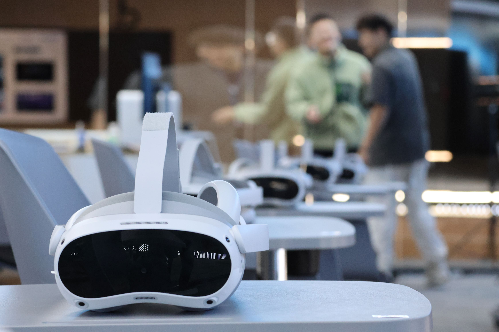
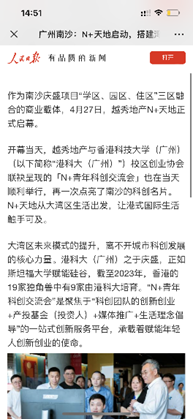
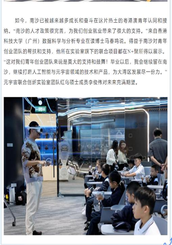
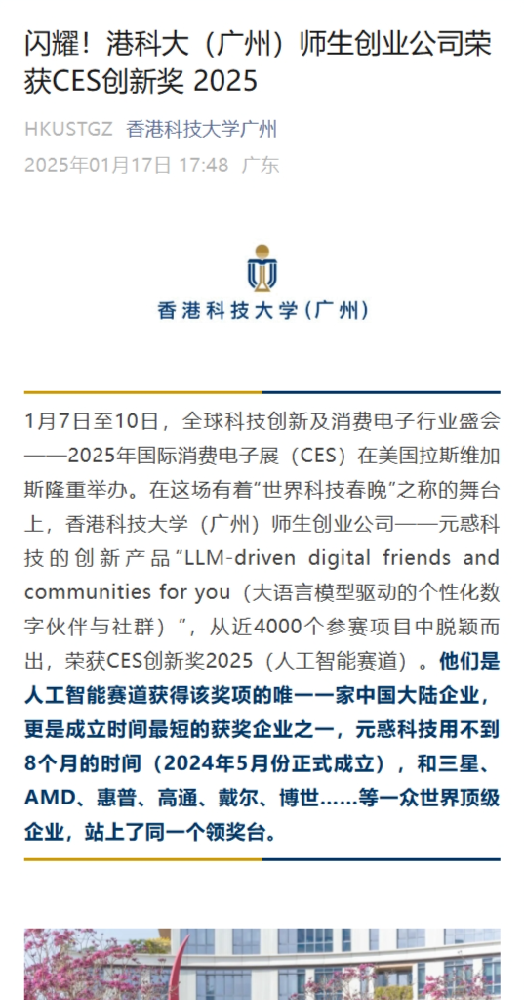

# 香港科技大学（广州）元宇宙联合创新实验室[^1]

1. 基于大规模模型智能体的数字人技术
2. 虚拟空间中的多感官人机交互技术
3. 基于人体数据实时采集的虚拟体现技术
4. 基于人工智能的元宇宙内容生成技术
5. 元宇宙教育的社会适应性研究

## 功能和产品

- ### Unity轻量级无人机仿真

  * #### VR无人机虚拟仿真和培训

    本项目基于Unity引擎开发了一个多无人机遥操作界面系统，旨在通过模拟和研究无人机的协同运输任务，解决单无人机在载重、续航和抗风能力等方面的局限性。系统实现了单无人机和多无人机的飞行控制、绳索连接的货物运输功能，并设计了用户交互界面以提升操作体验。研究中通过PID控制算法和OBI绳索解决方案，实现了稳定的飞行控制和逼真的物理模拟，并对比了单无人机与多无人机协同运输在能耗、稳定性方面的表现。此外，项目还开发了丰富的用户界面功能，包括实时数据可视化、控制信号反馈以及虚拟环境中的任务模拟，为无人机协同运输的研究和应用提供了高效、直观的实验平台。可训练用户的无人机操作能力和方向感并帮助学习无人机及其飞控知识

    [一星期用 Unity 实现四轴无人机飞行模拟_哔哩哔哩_bilibili](https://www.bilibili.com/video/BV1ja4y157JM/?spm_id_from=333.788.recommend_more_video.0&vd_source=964bbd88f350a12d2453698dd08ec8ca) 

    [两星期用 Unity 实现四轴无人机飞行模拟_哔哩哔哩_bilibili](https://www.bilibili.com/video/BV11z4y1v7w7?spm_id_from=333.788.videopod.sections&vd_source=964bbd88f350a12d2453698dd08ec8ca)  

    https://youtu.be/UpD6_7_Ckxw?si=qQFGNS5B1RbOUib6  

    [Lizhenghe-Chen/Multi-Drones-Teleoperation-Interface-Systems: Drone simulation and muli-drone collaborate transportation](https://github.com/Lizhenghe-Chen/  Multi-Drones-Teleoperation-Interface-Systems?tab=readme-ov-file)  

  * #### 虚拟现实无人机环游世界和航拍

    在上述无人机架构的基础上，使用[VR Engine | Unity](https://unity.com/solutions/vr) 框架搭建了一套基于[PICO 虚拟现实](https://www.picoxr.com/cn/) 的虚拟现实无人机遥控操作系统，同时接入Bing和Google地图（[Cesium: The Platform for 3D Geospatial](https://cesium.com/)）实现沉浸式无人机遨游的体验亦可训练用户的无人机操作能力和方向感

  * #### 虚拟现实无人机灭火

    在上述基础上，增加无人机灭火功能，探索潜在的无人机应用场景

  * #### VR多人农场经济学博弈实验
- ### VR虚拟沙盘讲解
- ### VR虚拟现实拼抢和射击训练
- ### AI全息数字人框架
- ### 多人网络框架

  * #### VR多人军事无人机活动

## 应用证明

* [元宇宙联合创新实验室-证明](./元宇宙实验室成果/元宇宙联合创新实验室-证明.pdf)
* [附件08-2023年元宇宙军事实训思政中心应用证明](./元宇宙实验室成果/附件08-2023年元宇宙军事实训思政中心应用证明.pdf)
* [附件09-2024年元宇宙军事实训思政中心应用证明](./元宇宙实验室成果/附件09-2024年元宇宙军事实训思政中心应用证明%20.pdf)
* [附件11-2023年广州番禺博萃德学校科创研学活动应用证明](./元宇宙实验室成果/附件11-2023年广州番禺博萃德学校科创研学活动应用证明.pdf)
* [附件18-2024年第二届粤港澳大湾区研究生创新创业大赛优胜奖](./元宇宙实验室成果/附件18-2024年第二届粤港澳大湾区研究生创新创业大赛优胜奖.pdf)

## 媒体曝光

|                                                                                                                                                         [南沙迎来吃喝玩乐新地标 越秀地产N+天地正式启幕_湾区_项目_广州](https://www.sohu.com/a/775055083_100283120)                                                                                                                                                         | [南沙迎来吃喝玩乐新地标 越秀地产N+天地正式启幕](https://baijiahao.baidu.com/s?id=1797666141022783828) | [让青春乐聚湾区！粤港澳大湾区（南沙）青年生活+联盟启动](https://huacheng.gz-cmc.com/pages/2024/05/12/SF119648439c062bb0b7434d0e982230.html?channel=weixin) | [这群港科广人，在元宇宙里开展爱国主义教育 – 香港科技大学（广州）](https://www.hkust-gz.edu.cn/zh/2023/10/01/%e8%bf%99%e7%be%a4%e6%b8%af%e7%a7%91%e5%b9%bf%e4%ba%ba%ef%bc%8c%e5%9c%a8%e5%85%83%e5%ae%87%e5%ae%99%e9%87%8c%e5%bc%80%e5%b1%95%e7%88%b1%e5%9b%bd%e4%b8%bb%e4%b9%89%e6%95%99%e8%82%b2/) | [“独角兽”可能就在他们之中 ](https://huacheng.gz-cmc.com/pages/2024/05/08/6ac294f971af45da880660789d0ced53.html) |
| :----------------------------------------------------------------------------------------------------------------------------------------------------------------------------------------------------------------------------------------------------------------------------------------------------------------------------------------------------------------------------------------------------------------------: | -------------------------------------------------------------------------------------------------- | ------------------------------------------------------------------------------------------------------------------------------------------------------- | ------------------------------------------------------------------------------------------------------------------------------------------------------------------------------------------------------------------------------------------------------------------------------------------------ | -------------------------------------------------------------------------------------------------------------- |
|                                                                                                                                                                                                                                                                                                                                                                            |                                                       |                                                                                                            |                                                                                                                                                                                                                                                     |                                                                   |
| [**闪耀！港科大（广州）师生创业公司荣获CES创新奖 2025**](https://mp.weixin.qq.com/s?__biz=MzkzODI5MDE2NA==&mid=2247607824&idx=1&sn=0e9235507acab6de653a4df898239b58&chksm=c330be2d471336dc0f4eba7350b72e76cce9dd81407f69dc8f5f8b9b8390539d832db4943b1b&mpshare=1&scene=2&srcid=0117QKZgWtZ0bfUMAm8joMQ9&sharer_shareinfo=300fb90ea047ecde6c7363ec98411a89&sharer_shareinfo_first=1730e0dc4febe7c5f3286973446375c0#rd) | To be continue...                                                                                  | To be continue...                                                                                                                                       | To be continue...                                                                                                                                                                                                                                                                                | To be continue...                                                                                              |
|                                                                                                                                                                                                                                                                                                                                                                            |                                                                                                    |                                                                                                                                                         |                                                                                                                                                                                                                                                                                                  |                                                                                                                |

## 论文

* [Investigating Size Congruency Between the Visual Perception of a VR Object and the Haptic Perception of Its Physical World Agent](https://arxiv.org/html/2408.08018v1)

[^1]: [Metaverse Joint Innovation Laboratory – Data Science and Analytics Thrust](https://dsa.hkust-gz.edu.cn/zh/research/labs-institutes/metaverse-joint-innovation-laboratory/)
