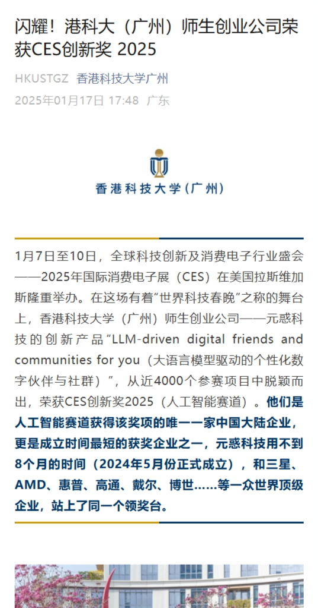

# Hong Kong University of Science and Technology Guangzhou Metaverse Joint Innovation Laboratory[^1]

1. Digital human technology based on large-scale model agents
2. Multi-sensory human-computer interaction technology in virtual spaces
3. Virtual embodiment technology based on real-time collection of human body data
4. AI-based content generation technology for the metaverse
5. Social adaptability research of metaverse education

## Functions and Products

- ### Lightweight Drone Simulation in Unity

  * #### VR Drone Virtual Simulation and Training
  * #### Virtual Reality Drone Tours and Aerial Photography
  * #### Virtual Reality Drone Firefighting
  * #### VR Multiplayer Farm Economics Game Experiment
- ### VR Virtual Sandbox Explanation
- ### VR Virtual Reality Snatch and Shooting Training
- ### AI Holographic Digital Human Framework
- ### Multiplayer Network Framework

  * #### VR Multiplayer Military Drone Activities

## Application Proofs

* [元宇宙联合创新实验室-证明](./元宇宙实验室成果/元宇宙联合创新实验室-证明.pdf)
* [附件08-2023年元宇宙军事实训思政中心应用证明](./元宇宙实验室成果/附件08-2023年元宇宙军事实训思政中心应用证明.pdf)
* [附件09-2024年元宇宙军事实训思政中心应用证明](./元宇宙实验室成果/附件09-2024年元宇宙军事实训思政中心应用证明%20.pdf)
* [附件11-2023年广州番禺博萃德学校科创研学活动应用证明](./元宇宙实验室成果/附件11-2023年广州番禺博萃德学校科创研学活动应用证明.pdf)
* [附件18-2024年第二届粤港澳大湾区研究生创新创业大赛优胜奖](./元宇宙实验室成果/附件18-2024年第二届粤港澳大湾区研究生创新创业大赛优胜奖.pdf)

## Media Reports

|                                                                                                                                                       [南沙迎来吃喝玩乐新地标 越秀地产N+天地正式启幕_湾区_项目_广州](https://www.sohu.com/a/775055083_100283120)                                                                                                                                                       | [南沙迎来吃喝玩乐新地标 越秀地产N+天地正式启幕](https://baijiahao.baidu.com/s?id=1797666141022783828) | [让青春乐聚湾区！粤港澳大湾区（南沙）青年生活+联盟启动](https://huacheng.gz-cmc.com/pages/2024/05/12/SF119648439c062bb0b7434d0e982230.html?channel=weixin) | [这群港科广人，在元宇宙里开展爱国主义教育 – 香港科技大学（广州）](https://www.hkust-gz.edu.cn/zh/2023/10/01/%e8%bf%99%e7%be%a4%e6%b8%af%e7%a7%91%e5%b9%bf%e4%ba%ba%ef%bc%8c%e5%9c%a8%e5%85%83%e5%ae%87%e5%ae%99%e9%87%8c%e5%bc%80%e5%b1%95%e7%88%b1%e5%9b%bd%e4%b8%bb%e4%b9%89%e6%95%99%e8%82%b2/) | [“独角兽”可能就在他们之中 ](https://huacheng.gz-cmc.com/pages/2024/05/08/6ac294f971af45da880660789d0ced53.html) |
| :-----------------------------------------------------------------------------------------------------------------------------------------------------------------------------------------------------------------------------------------------------------------------------------------------------------------------------------------------------------------------------------------------------------------: | -------------------------------------------------------------------------------------------------- | ------------------------------------------------------------------------------------------------------------------------------------------------------- | ------------------------------------------------------------------------------------------------------------------------------------------------------------------------------------------------------------------------------------------------------------------------------------------------ | -------------------------------------------------------------------------------------------------------------- |
|                                                                                                                                                                                                                                                                                                                                                                        |                                                       |                                                                                                            |                                                                                                                                                                                                                                                     |                                                                   |
| [**闪耀！港科大（广州）师生创业公司荣获CES创新奖 2025**](https://mp.weixin.qq.com/s?__biz=MzkzODI5MDE2NA==&mid=2247607824&idx=1&sn=0e9235507acab6de653a4df898239b58&chksm=c330be2d471336dc0f4eba7350b72e76cce9dd81407f69dc8f5f8b9b8390539d832db4943b1b&mpshare=1&scene=2&srcid=0117QKZgWtZ0bfUMAm8joMQ9&sharer_shareinfo=300fb90ea047ecde6c7363ec98411a89&sharer_shareinfo_first=1730e0dc4febe7c5f3286973446375c0#rd) | To be continue...                                                                                  | To be continue...                                                                                                                                       | To be continue...                                                                                                                                                                                                                                                                                | To be continue...                                                                                              |
|                                                                                                                                                                                                                                                                                                                                                                        |                                                                                                    |                                                                                                                                                         |                                                                                                                                                                                                                                                                                                  |                                                                                                                |

## Papers

* [Investigating Size Congruency Between the Visual Perception of a VR Object and the Haptic Perception of Its Physical World Agent](https://arxiv.org/html/2408.08018v1)

[^1]: [Metaverse Joint Innovation Laboratory – Data Science and Analytics Thrust](https://dsa.hkust-gz.edu.cn/zh/research/labs-institutes/metaverse-joint-innovation-laboratory/)
