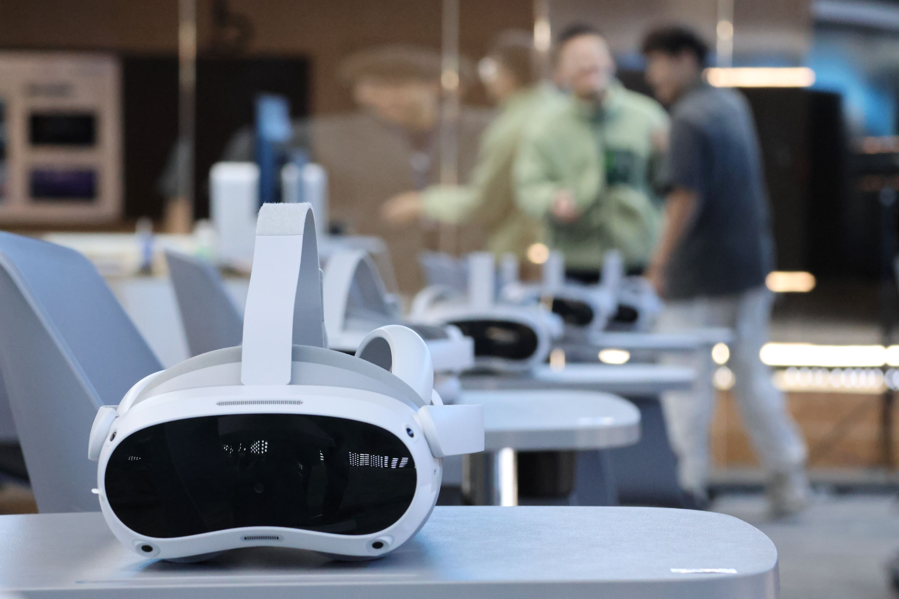
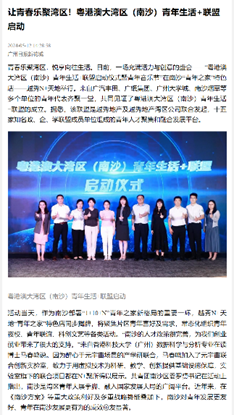
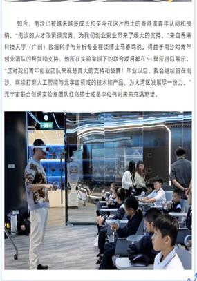
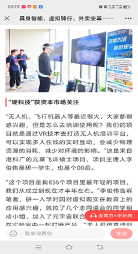

---
hide:
  - navigation
#   - toc
---
# 香港科技大学广州元宇宙联合创新实验室[^1]

1. 基于大规模模型智能体的数字人技术
2. 虚拟空间中的多感官人机交互技术
3. 基于人体数据实时采集的虚拟体现技术
4. 基于人工智能的元宇宙内容生成技术
5. 元宇宙教学的社会适应性研究

## 功能以及产品

- ### Unity轻量级无人机仿真

    * #### VR无人机虚拟仿真和培训
    * #### 虚拟现实无人机环游世界和航拍
    * #### 虚拟现实无人机灭火
    * #### VR多人农场经济学博弈实验

- ### VR虚拟沙盘讲解
- ### VR虚拟现实拼抢和射击训练
- ### AI全息数字人框架
- ### 多人网络框架

    * #### VR多人军事无人机活动

## 应用证明

* [元宇宙联合创新实验室-证明](./元宇宙实验室成果/元宇宙联合创新实验室-证明.pdf)
* [附件08-2023年元宇宙军事实训思政中心应用证明](./元宇宙实验室成果/附件08-2023年元宇宙军事实训思政中心应用证明.pdf)
* [附件09-2024年元宇宙军事实训思政中心应用证明](./元宇宙实验室成果/附件09-2024年元宇宙军事实训思政中心应用证明%20.pdf)
* [附件11-2023年广州番禺博萃德学校科创研学活动应用证明](./元宇宙实验室成果/附件11-2023年广州番禺博萃德学校科创研学活动应用证明.pdf)
* [附件18-2024年第二届粤港澳大湾区研究生创新创业大赛优胜奖](./元宇宙实验室成果/附件18-2024年第二届粤港澳大湾区研究生创新创业大赛优胜奖.pdf)

## 媒体报道

| [南沙迎来吃喝玩乐新地标 越秀地产N+天地正式启幕_湾区_项目_广州](https://www.sohu.com/a/775055083_100283120) | [南沙迎来吃喝玩乐新地标 越秀地产N+天地正式启幕](https://baijiahao.baidu.com/s?id=1797666141022783828) | [让青春乐聚湾区！粤港澳大湾区（南沙）青年生活+联盟启动](https://huacheng.gz-cmc.com/pages/2024/05/12/SF119648439c062bb0b7434d0e982230.html?channel=weixin) | [这群港科广人，在元宇宙里开展爱国主义教育 – 香港科技大学（广州）](https://www.hkust-gz.edu.cn/zh/2023/10/01/%e8%bf%99%e7%be%a4%e6%b8%af%e7%a7%91%e5%b9%bf%e4%ba%ba%ef%bc%8c%e5%9c%a8%e5%85%83%e5%ae%87%e5%ae%99%e9%87%8c%e5%bc%80%e5%b1%95%e7%88%b1%e5%9b%bd%e4%b8%bb%e4%b9%89%e6%95%99%e8%82%b2/) | [“独角兽”可能就在他们之中 ](https://huacheng.gz-cmc.com/pages/2024/05/08/6ac294f971af45da880660789d0ced53.html) |
| ------------------------------------------------------------------------------------------------------- | -------------------------------------------------------------------------------------------------- | ------------------------------------------------------------------------------------------------------------------------------------------------------- | ------------------------------------------------------------------------------------------------------------------------------------------------------------------------------------------------------------------------------------------------------------------------------------------------ | ------------------------------------------------------------------------------------------------------------- |
|                                                            |                                                       |                                                                                                            |                                                                                                                                                                                                                                                     |                                                                  |

## 论文产出

* [Investigating Size Congruency Between the Visual Perception of a VR Object and the Haptic Perception of Its Physical World Agent](https://arxiv.org/html/2408.08018v1)

[^1]: [Metaverse Joint Innovation Laboratory – Data Science and Analytics Thrust](https://dsa.hkust-gz.edu.cn/zh/research/labs-institutes/metaverse-joint-innovation-laboratory/)
