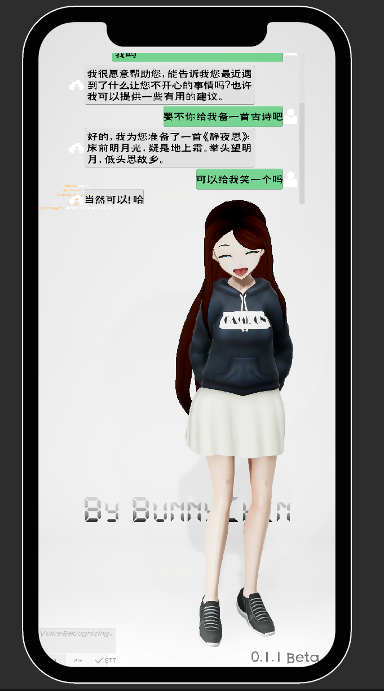

<iframe src="https://player.bilibili.com/player.html?aid=693111969&bvid=BV1i24y167rd&cid=971944957&page=1" width="100%" height="500" scrolling="no"  frameborder="no" framespacing="0" allowfullscreen="true"> </iframe>

<button class="btn" onclick="window.open('https://space.bilibili.com/34871506/channel/collectiondetail?sid=996544&ctype=0')">Watch More On Bilibili</button>
<button class="btn" onclick="window.open('https://blog.csdn.net/weixin_46146935?type=blog')">See More Dev Log On CSDN</button>

<h3>Please click the links below to play the games</h3>
<h6>WebGL dose not support mobile devices. All games should be able to run on mobile devices, but low performance and more bugs, so please try computer Browser ~ </h6>

## Metaverse Joint Innovation Laboratory
[**Working On it**](./MetaverseJointInnovationLaboratory/index.md){ .md-button }

## HKUST-GZ-Photography: For testing HDRP and other functions

[**GitHub Download**](https://github.com/Lizhenghe-Chen/HKUST-GZ-Photography){ .md-button } **Still in development(On Hold)**

It is used to test HDRP and other functions, mainly used to learn and practice photo skills and basic knowledge, interested partners can download and try

## Metaverse VR Drone Simulations

<iframe src="https://player.bilibili.com/player.html?aid=572080926&bvid=BV11z4y1v7w7&cid=1156231392&page=1" width="100%" height="500" scrolling="no"  frameborder="no" framespacing="0" allowfullscreen="true"> </iframe>

## Metahuman GPT

## Runner Game

[**Runner Game**](https://bunny-chen.itch.io/runner){ .md-button } **Still in development**

This is a game to against Fake Advertisment. You have to avoid the obstacles and it is infinite.

## Marble Battle Royal

[**Marble Battle Royal**](https://bunny-chen.itch.io/marble-battle-royal){ .md-button }  **Final Released**

the undergraduate year-end project, the multiplayer battle royale game, come and control your little ball and roll up!

## Mini Game

[**Mini Game**](./minigame/index.html){ .md-button }
simpile Modified from Unity Official miniGame, Jump and run, it is boring and with many bugs.

## Mass Hit

[**Mass Hit**](https://github.com/Lizhenghe-Chen/Personal-Unity-Small-Game--MassHit--Development/blob/master){ .md-button } **Still in development**

This game needs to control the ball to explore the task, with rich interaction mechanism, UI, physics and excellent visual effects. Because the project is huge, there is no systematic time for continuous development, so the level design and scene construction are not good, and may require multiple people to develop.
 

## Multi-Drone Simulation

[**Multi-Drone Simulation**](https://github.com/Lizhenghe-Chen/Multi-Drones-Teleoperation-Interface-Systems){ .md-button }

**Still in development**

This project is a drone based simulation framework, will develop into multiple-drone teleoperation transportation project

## Personal Animation Demo

## Desktop Audio Visualization

[**Desktop Audio Visualization**](https://github.com/Lizhenghe-Chen/Audio-visualization){ .md-button }

A simple Desktop Audio visualization

