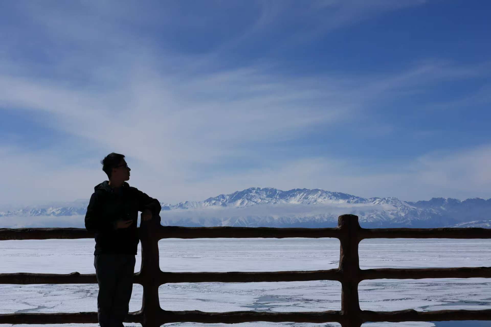

# 孤独的旅行

将这糟糕的回忆慢慢融进这片纯粹的净土之中，至于那些永远不会再度归来的美好，也一同封存起来。

<!-- more -->

一次机缘巧合的机会，在繁忙的工作日突然有了一段不得已的10天假期，这段突如其来的r让我不知所措的假期无法让我感到欣喜和激动，旅行是我立刻能够想到的方案，但没有伙伴能够在这个时候与我同行。

所以索性就大胆一点吧，去一个人到世界的边缘散散步，就当是一次一个人的朝圣，净化和放松一下身心。
