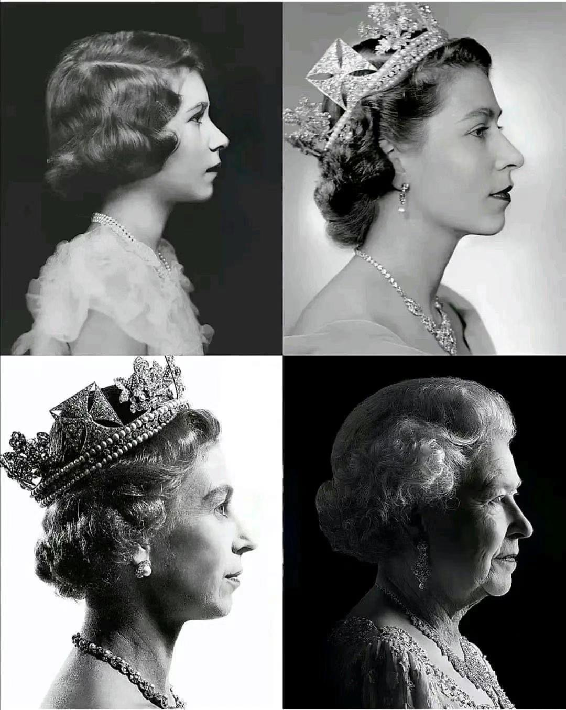

英国女王伊丽莎白二世于今日下午去世了，BBC早些时候就报道女王病情加剧了，其家人都纷纷奔赴其所在城堡，那时候我已经觉得，或许她老人家已经不行了。。。

<!-- more -->

作为96岁几近期颐的年纪，一直将英国人民团结在一起，还同时见证了15界英国首相的更替，更目睹了世界的战乱、发展、局势变迁以及兴衰，令人钦佩。今天整日都是阴雨绵绵，是颇为典型的英国天气，这无异于为女王的逝世雪上加霜，披上一层阴郁的黑纱，对于身在英国的我，倍感沉重和低落。

<!-- 温暖的屋内看着窗外的雨，忧愁和安逸激发了些许反省。感觉自己20多年来，一切都平平淡淡，一直没有什么突出的成就和成功，但却没有彻彻底底的失败，可谓高不成低不就。年轻一点的时候希望自己能成为某个技术领域的大佬，或者是成个大老板，现在越发觉得幼稚————这足以让人自卑，并对未来的未知充满恐惧。研究生即将进入一个几乎全新的旅程，对此我却毫无头绪，唯唯诺诺不确定专业是否对口，更不知这条路是否正确，通往何方，人生就是那么充满不确定和随机性。。。 -->

