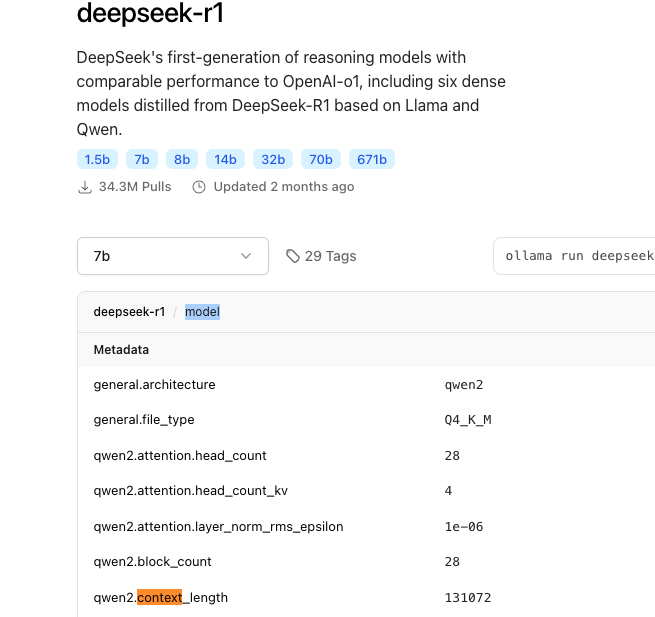
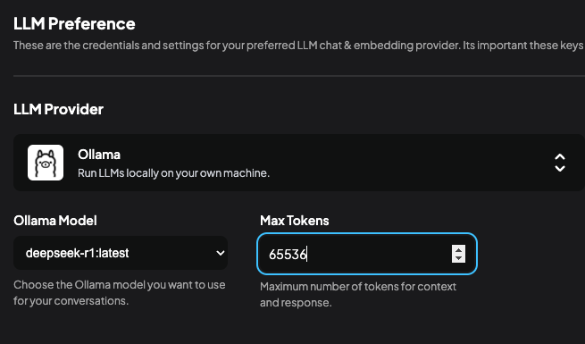

# AnythingLLM本地知识库的一个小Tip

之前尝试本地知识库，GPT一直无法给出准确的答案，一时间非常头疼且不知是什么问题，直到我看完了下面的讲解：

* [20分钟速成 RAG &amp; 向量数据库核心概念 【小白学AI系列 -1 】_哔哩哔哩_bilibili](https://www.bilibili.com/video/BV11zf6YyEnT/?spm_id_from=333.337.search-card.all.click&vd_source=964bbd88f350a12d2453698dd08ec8ca)
* [AnythingLLM本地知识库避坑指南+配置攻略 - 知乎](https://zhuanlan.zhihu.com/p/21427971294)

其实一个重要的设置我忽略了。就是这个 `Max Tokens`设置，本地知识库的一个核心步骤就是，当向量数据库查询完后，将会把所有相关性前几的文本（contex）结合你的问题一并丢给GPT，相当于一个较长的，附带了可能答案的新prompt。所以如果你的上限太小，GPT就无法阅读完所有的查询结果，提供的回答自然就不准确了。

要查询大模型的token上限，在ollama中查看model部分的参数即可：

然后在你的本地平台将Max Tokens 提高，但不易过高，否则会显著影响回答的响应速度

