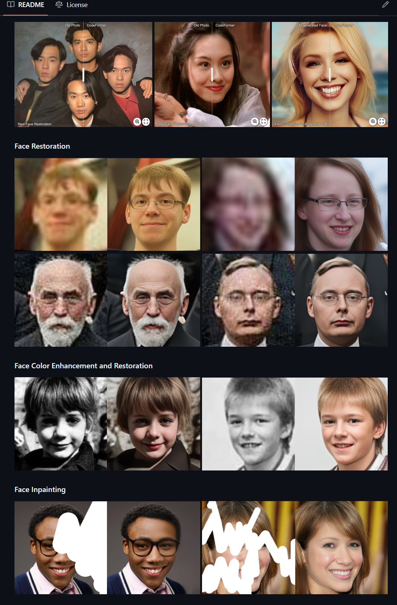

## 介绍

> 开源项目

**CodeFormer** 是由南洋理工大学（NTU）S-Lab团队开发的一种面向人脸修复的深度学习模型，由Shangchen Zhou、Kelvin C.K. Chan、Chongyi Li和Chen Change Loy共同提出，并在2022年NeurIPS会议上发表。它旨在通过一种新颖的“Codebook Lookup Transformer”架构，实现鲁棒的盲人脸修复（Blind Face Restoration），即在没有明确退化先验的情况下，对低质量、模糊或损坏的人脸图像进行高质量的修复和增强。

CodeFormer的核心优势在于其结合了Transformer架构和Codebook机制，能够有效地处理人脸图像中的复杂退化问题，同时保留人脸的细节和纹理。它不仅支持人脸修复，还扩展到了人脸上色、人脸修复以及视频增强等多种应用场景，具有广泛的应用前景。

## 功能简介

1. **图像修复与增强**CodeFormer专注于修复老旧照片或损坏图像中的各种问题，如模糊、划痕、噪点、褪色等。它通过深度学习算法对图像进行分析和处理，恢复图像的细节和色彩，使其看起来更加清晰和自然。
2. **人脸修复与美化**对于人脸图像，CodeFormer能够特别优化人脸区域，修复人脸的瑕疵，如皱纹、痘痘、斑点等，同时保持人物的自然特征和表情。它还可以对人脸进行美化，提亮肤色、增强五官立体感等，让照片中的人物看起来更加年轻和有魅力。
3. **细节增强与色彩调整**CodeFormer可以增强图像的细节，使图像中的纹理和边缘更加清晰。同时，它还能对图像的色彩进行调整，修复褪色或偏色的问题，让图像的色彩更加鲜艳和真实。
4. **用户友好的交互界面**在Hugging Face Spaces平台上，CodeFormer提供了一个简单易用的交互界面，用户可以轻松上传需要修复的图像，并通过调整参数来控制修复的强度和效果。即使没有专业的图像处理知识，用户也能快速获得满意的结果。
5. **支持多种图像格式**CodeFormer支持多种常见的图像格式，如JPEG、PNG等，用户可以方便地将各种格式的图像上传进行处理，同时支持一定程度的视频增强。
6. **基于深度学习的智能处理**
   CodeFormer背后采用了先进的深度学习技术，通过大量的图像数据训练模型，使其能够自动识别图像中的问题并进行智能修复。这种技术使得CodeFormer在处理复杂图像问题时表现出色，修复效果自然且高效。

总之，CodeFormer是一个强大的图像修复工具，无论是对于个人用户修复家庭照片，还是专业人士提升图像质量，都能提供高效、便捷的解决方案。

## 链接：

* Github：[sczhou/CodeFormer: [NeurIPS 2022] Towards Robust Blind Face Restoration with Codebook Lookup Transformer](https://github.com/sczhou/CodeFormer)
* 在线使用：[CodeFormer - a Hugging Face Space by sczhou](https://huggingface.co/spaces/sczhou/CodeFormer)
* 作者主页：[Shangchen Zhou](https://shangchenzhou.com/)
