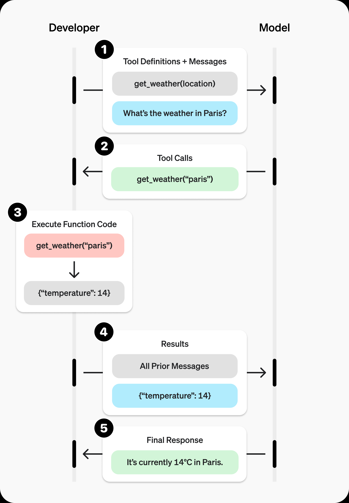

# 如何让智能体执行任务

## Tool Calling|Function calling（函数调用）

Tool Calling = 让 LLM 在需要时自动调用外部函数/接口。
模型把自然语言翻译成 **结构化的函数调用**（`name + arguments`），由宿主程序执行并返回结果，再交给模型继续对话。

[使用 Kimi API 完成工具调用（tool_calls） - Moonshot AI - 开放平台](https://platform.moonshot.cn/docs/guide/use-kimi-api-to-complete-tool-calls#%E4%BB%80%E4%B9%88%E6%98%AF%E5%B7%A5%E5%85%B7%E8%B0%83%E7%94%A8-tool_calls)
[Function calling - OpenAI API](https://platform.openai.com/docs/guides/function-calling)

### 典型流程

1. 开发者把函数签名（JSON Schema）注册给模型。
2. 用户提问 → 模型根据问题判断需要那些指令 → 生成调用指令。
3. 请求端本地执行指定的指令 →指令运行结果回传 → 模型生成最终答案。

!!! Note
    模型可能一次性调用多个工具要求客户端执行，然后客户端将这些请求挨个执行，然后一并将结果的string格式返回给模型。



举个例子，比如我定义了如下的几个tool函数以供GPT调用这些函数都已经定义并开发好了（假设）：

```python
tool_map = {
    "search": search,
    "crawl": crawl,
    "weather_query": weather_query,
    "drone_data_query": drone_data_query,
}
```

之后在向模型请求时将这些函数签名注册给大模型并发送，大模型会识别到需要企图Tool模式，第一次会返回它需要调用的函数名，在while循环中将会接收到 `finish_reason = "tool_calls" `然后本地将会执行指定的函数并将结果返回给模型。

在这个例子中，用户需要查询无人机状态和天气情况，模型会自动调用 `drone_data_query` 和 `weather_query` 函数。然后还会触发搜索函数 `search`，最后将这些函数还给用户端去执行，执行的结果返回给模型，模型会将结果整合成最终的回答。

!!! Warning
    这里只提供了部分核心代码，完整代码可以到openai官网或其它平台文档参考

```python
messages = [
    {"role": "system", "content": "你是人工智能助手。"},
    {
        "role": "user",
        "content": """无人机'1001'现在的状态是什么，以及现在天气如何？此外请告诉我什么是无人机？什么是无人机的飞行控制系统？搜一搜再回答""",
    },
]
while finish_reason is None or finish_reason == "tool_calls":
    completion = client.chat.completions.create(
        model="./qwen2.5-32b",
        messages=messages,
        temperature=0.3,
        tools=tools,  # Use the imported tools
    )
    print(f"--\n{completion}\n--")
    choice = completion.choices[0]
    finish_reason = choice.finish_reason
    if finish_reason == "tool_calls":
        messages.append(choice.message)

        for tool_call in choice.message.tool_calls:
            tool_call_name = tool_call.function.name
            tool_call_arguments = json.loads(tool_call.function.arguments)
            tool_function = tool_map[tool_call_name]  # Use the imported tool_map
            tool_result = tool_function(tool_call_arguments)
            print(
                f"\033[32mtool_call:\033[0m \033[36m{tool_call_name}\033[0m, "
                f"\033[33marguments:\033[0m \033[35m{tool_call_arguments}\033[0m, "
                f"\033[34mresult:\033[0m \033[37m{tool_result}\033[0m"
            )
            messages.append(
                {
                    "role": "tool",
                    "tool_call_id": tool_call.id,
                    "name": tool_call_name,
                    "content": json.dumps(tool_result),
                }
            )

print(choice.message.content)
```

函数被调用的过程在控制台中可以看出，`tool_call` 就是被GPT要求调用的函数以及GPT自动生成的的传入参数，模型自行判断，且没有调取访问网页的功能 `crawl`。

当然最后的结果是根据函数的处理结果得到的，这里的函数返回的结果都是既定的测试用的随便写的数据和链接而已。

```
--
ChatCompletion(id='chatcmpl-6392822b08bb4e87b4a17555ecff3c6c', choices=[Choice(finish_reason='tool_calls', index=0, logprobs=None, message=ChatCompletionMessage(content=None, refusal=None, role='assistant', annotations=None, audio=None, function_call=None, tool_calls=[ChatCompletionMessageToolCall(id='chatcmpl-tool-0d9c3be8ef5b47ddb6741ef21f88a970', function=Function(arguments='{"query": "无人机1001的状态"}', name='drone_data_query'), type='function'), ChatCompletionMessageToolCall(id='chatcmpl-tool-01019803bf8744bb9919410b0f9a9cb3', function=Function(arguments='{"city": ""}', name='weather_query'), type='function'), ChatCompletionMessageToolCall(id='chatcmpl-tool-34ede9e8d519473b8eed057386672a56', function=Function(arguments='{"query": "什么是无人机"}', name='search'), type='function'), ChatCompletionMessageToolCall(id='chatcmpl-tool-898c7b1f2fd544508e86028f9b26644b', function=Function(arguments='{"query": "无人机的飞行控制系统"}', name='search'), type='function')], reasoning_content=None), stop_reason=None)], created=1752821572, model='./qwen2.5-32b', object='chat.completion', service_tier=None, system_fingerprint=None, usage=CompletionUsage(completion_tokens=88, prompt_tokens=423, total_tokens=511, completion_tokens_details=None, prompt_tokens_details=None), prompt_logprobs=None, kv_transfer_params=None)
--
tool_call: drone_data_query, arguments: {'query': '无人机1001的状态'}, result: {'result': {'drone_id': 101, 'status': 'Destroyed', 'location': 'Area 51'}}
tool_call: weather_query, arguments: {'city': ''}, result: {'result': {'city': '', 'weather': 'Storm', 'temperature': '25°C'}}
tool_call: search, arguments: {'query': '什么是无人机'}, result: {'result': [{'title': 'Test Title 1', 'url': 'https://example.com/1', 'description': 'Test description 1'}]}
tool_call: search, arguments: {'query': '无人机的飞行控制系统'}, result: {'result': [{'title': 'Test Title 1', 'url': 'https://example.com/1', 'description': 'Test description 1'}]}
--
ChatCompletion(id='chatcmpl-3d96bd08160043eda7ea8b3b0b3898f7', choices=[Choice(finish_reason='stop', index=0, logprobs=None, message=ChatCompletionMessage(content='无人机\'1001\'当前的状态是已损毁，位于Area 51。不过请注意，我找到的数据是 关于无人机101的，可能是查询时出现了错误，没有找到无人机1001的信息。\n\n至于天气，由于您没有指定城市，所以我无法提供准确的天气信息。但是根据最近的一次无特定地点的搜索，天气情况为风暴，温度为25°C。这可能不是您想要了解的地方的天气，请您再次 告知我具体的城市名称。\n\n关于您的其他问题：\n\n- **什么是无人机**：根据搜索结果，我找到了一个标题为"Test Title 1"的网页（[链接](https://example.com/1)），描述为"Test description 1"。看起来这个链接可能不是一个有效的资源来解释无人机的概念 。通常来说，无人机是一种无人驾驶的飞行器，可以通过远程控制或预设程序自主飞行。\n  \n- **无人机的飞行控制系统**：同样地，搜索结果指向了一个标题为"Test Title 1"的网页（[链接](https://example.com/1)），描述为"Test description 1"。这似乎也不 是一个有效的资源。无人机的飞行控制系统是一套硬件和软件的组合，用于控制无人机的飞行路径、高度和其他飞行参数，确保无人机能够按照预定的路线安全飞行。\n\n如果您需要更详细的信息，建议访问专业的航空或科技网站获取更多资料。', refusal=None, role='assistant', annotations=None, audio=None, function_call=None, tool_calls=[], reasoning_content=None), stop_reason=None)], created=1752821574, model='./qwen2.5-32b', object='chat.completion', service_tier=None, system_fingerprint=None, usage=CompletionUsage(completion_tokens=293, prompt_tokens=672, total_tokens=965, completion_tokens_details=None, prompt_tokens_details=None), prompt_logprobs=None, kv_transfer_params=None)
--
```

### 前置条件

1. **模型支持**：模型训练阶段已见过函数调用格式，也就是说模型本身必须支持这个功能（如 GPT-4、Claude 3.5、Qwen-2.5等，其它以及更多具体信息需自行查阅），在vllm中也需要启用相关功能才能调用：[Tool Calling - vLLM](https://docs.vllm.ai/en/stable/features/tool_calling.html)，[Tool support · Ollama Blog](https://ollama.com/blog/tool-support)。
2. **函数存在**：宿主程序有真实可执行的函数 `get_weather(...)`。
3. **接口实现**：宿主能注册函数签名给模型，并接收/执行模型返回的 `name+arguments`。

### 优缺点

- ✅ 开发简单：只定义函数、不改造系统。
- ✅ 生态成熟：OpenAI、Claude、Gemini 等都支持。
- ⚠️ 仅**单次请求-响应**；跨轮对话状态要自己管。
- ⚠️ 工具名必须是模型“见过”的，冷门函数需微调或 Prompt 映射。

---

## MCP（Model Context Protocol）

[一文看懂：MCP(大模型上下文协议) - 知乎](https://zhuanlan.zhihu.com/p/27327515233)

MCP = **AI 世界的 “USB-C” 协议**。
它把「数据源、工具、提示模板」抽象成 **统一的 JSON-RPC 服务**，让任何 LLM（Host）像插 U 盘一样即插即用。

---

可以这么理解：

**MCP ≈ 统一规范化的 Function Call 基础设施**，但它**不是 Function Call 本身**，而是把 Function Call 的“工具定义 + 调用方式 + 传输协议”**全部标准化**，从而让不同模型、不同工具之间可以“即插即用”。

### 一句话类比

- **Function Call** 是“我会用螺丝刀”；
- **MCP** 是“所有螺丝刀都统一成 USB-C 接口，插哪都能用”。

### 更具体地说

| 维度                   | Function Call                           | MCP                                              |
| ---------------------- | --------------------------------------- | ------------------------------------------------ |
| **本质**         | 模型调用外部函数的**能力**        | 定义工具、调用方式、通信格式的**协议标准** |
| **工具定义在哪** | 通常写在客户端（如 Prompt 里）          | 写在 MCP Server 里，标准化暴露                   |
| **协议格式**     | 各平台不同（OpenAI、Google 等格式不一） | 统一用 JSON-RPC 2.0                              |
| **模型依赖性**   | 依赖特定模型的实现                      | 模型无关，任何支持 MCP 的模型都能用              |
| **通信方式**     | 通常是本地函数调用                      | 支持 stdio、SSE 等，支持远程调用                 |
| **扩展性**       | 每个工具都要手动接入                    | 一次接入，所有 MCP 客户端可用                    |

### 举个例子

假设你要让 AI 调用一个“查天气”工具：

- **传统 Function Call**：你得在代码里定义函数名、参数、返回格式，还要确保模型支持这种格式。
- **用 MCP**：你只需在 MCP Server 里写好“查天气”工具的定义，任何支持 MCP 的客户端（如 Claude Desktop、Cursor）都能直接用，无需关心模型差异。

### 总结

MCP 并不是替代 Function Call，而是**把 Function Call 的“工具定义和调用过程”标准化、模块化、远程化**，让 AI 能像一个万能接口一样，轻松连接各种工具和数据源。

## 如何选择

| 需求                                       | 首选                                |
| ------------------------------------------ | ----------------------------------- |
| 只想让模型查个天气 / 算个公式              | **Tool Calling**（最快落地）  |
| 需要把数据库、内部 API、本地文件打包给模型 | **MCP**（统一、可扩展、安全） |
| 后续可能演进到**多 Agent 协作**      | 先用 MCP 打底，平滑接入 A2A         |

一句话总结：
**Tool Calling 解决「单兵能力」，MCP 解决「后勤补给」，两者互补而非替代。**
