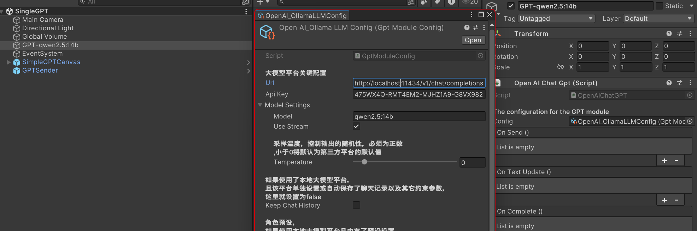

# 本地部署大语言模型

 Try some interesting things with Unity and GPT, and most importantly: Learning!

```
······················································································
:██████╗ ██╗   ██╗███╗   ██╗███╗   ██╗██╗   ██╗     ██████╗██╗  ██╗███████╗███╗   ██╗:
:██╔══██╗██║   ██║████╗  ██║████╗  ██║╚██╗ ██╔╝    ██╔════╝██║  ██║██╔════╝████╗  ██║:
:██████╔╝██║   ██║██╔██╗ ██║██╔██╗ ██║ ╚████╔╝     ██║     ███████║█████╗  ██╔██╗ ██║:
:██╔══██╗██║   ██║██║╚██╗██║██║╚██╗██║  ╚██╔╝      ██║     ██╔══██║██╔══╝  ██║╚██╗██║:
:██████╔╝╚██████╔╝██║ ╚████║██║ ╚████║   ██║       ╚██████╗██║  ██║███████╗██║ ╚████║:
:╚═════╝  ╚═════╝ ╚═╝  ╚═══╝╚═╝  ╚═══╝   ╚═╝        ╚═════╝╚═╝  ╚═╝╚══════╝╚═╝  ╚═══╝:
······················································································
```

### 接口规范

这里使用 [OpenAI API chat 的统一规范格式][https://platform.openai.com/docs/api-reference/chat/create)，大部分模型和平台都有这个接口规范的：

通过POST的方式发送规范的Json格式请求到指定服务器，并接受返回的结果即可

json格式：

```json
curl https://api.openai.com/v1/chat/completions \
  -H "Content-Type: application/json" \
  -H "Authorization: Bearer $OPENAI_API_KEY" \
  -d '{
    "model": "gpt-4o",
    "messages": [
      {
        "role": "system",
        "content": "You are a helpful assistant."
      },
      {
        "role": "user",
        "content": "Hello!"
      }
    ]
  }'

```

**任何时候都需要：**

* url：服务器地址
* model：模型名字
* messages：发送的请求类型和内容：

  * **`system`** ：

    * **作用** ： System 角色用于提供通知模型行为的设置信息或上下文。这可能包括有关对话应如何进行的说明或指南。
    * **何时使用** ：您可以使用此角色为交互设置阶段。例如，如果您希望模型在整个对话中保持正式的语气，或者如果您需要指定规则（例如避免某些话题）。
  * **`user`**：

    * **作用** ： 此角色代表对话中的人类用户。来自用户的输入将指导对话并提示助手的响应。
    * **何时使用** ：每当人类用户发表声明或提出问题时。这是标准交互中最常用的角色。
  * **`agent`** ：

    * **功能简介** ：这是模型本身的作用，根据系统设置的上下文响应用户输入。
  * * **何时使用** ：当模型回复用户的查询或遵循系统的指示时，模型会自动代入此角色。

### 大语言模型平台（LLM）

以下任意一种平台均可使用统一的OpenAI规范接口，所以都只用更改网址、API Key和model名称即可！

* 如果你使用ChatGPT，那么就很简单了，直接用上面的接口格式就行，只需要API key 和模型名称即可：如在控制台中输入：`ollama run qwen2.5` 即可下载运行千问大模型
* 如果使用Ollama部署本地大模型：

    * 同样可以使用Open AI规范的形式，参考：[OpenAI compatibility · Ollama Blog][https://ollama.com/blog/openai-compatibility)
    * 只要下载并部署好Ollama并安装好指定的模型即可
    * 常用的Ollama环境变量设置（[Global Configuration Variables for Ollama · Issue #2941 · ollama/ollama](https://github.com/ollama/ollama/ issues/2941#issuecomment-2322778733)）：

      >
      > * `OLLAMA_ORIGINS`: 允许的来源，用于跨域请求，如果遇到（CORS）问题，可以设置变量为 `*`
      > * `OLLAMA_MODELS`: 指定模型下载存储路径，默认是 `$HOME/.ollama/models`
      > * `OLLAMA_HOST`: 服务器端口地址，默认是 `http://127.0.0.1:11434`
      > * `OLLAMA_KEEP_ALIVE`: 模型激活后的保持时间，默认是5分钟，这会在加载大体量模型但常用的时候每一次请求都要重新加载模型，所以可以设置一个较长的时间如5h
      >

* 如果使用AnythingLLM搭建本地知识库

    1.  确保Ollama已经安装
    2.  下载安装[Download AnythingLLM for Desktop][https://anythingllm.com/download)
    3.  然后简单的配置好，指定Ollama为内核即可
    4.  为了能够像OpenAI那样使用网络API接口，在 设置>工具>API密钥 里申请一个密钥，然后点击“阅读API文档”，点击“Authorize”将密钥复制进去就可以测试接口了：
    5.  在你创建完一个workspace后，就可以查阅模型名称：
        
        将查阅的模型名称输入到聊天API中测试：	
    6. 之后你只需要将上述特定的json数据请求格式发送到：

        ```bash
        http://localhost:3001/api/v1/openai/chat/completions
        ```

### 然后就是Unity C#代码的简单解析：

#### 处理发送信息

这个连接可以帮助你理解：[聊天接口 /v1/chat/completions - API2D][https://api2d-doc.apifox.cn/)

为了通过规范且整洁的方式生成json信息，我们通过创建C# Class的Object并通过Newtonsoft. Json强制转换为json格式:JsonConvert.SerializeObject())

```csharp
private SimpleOpenAIRequest SetupSimpleRequest()
{
    var userRequest = new SimpleOpenAIRequest
{
        Model = config.modelSettings.model,
        Stream = config.modelSettings.useStream,
        Temperature = config.modelSettings.temperature,
        Messages = new List<Message>()
    };

    return userRequest;
}
```

```csharp
var jsonString = JsonConvert.SerializeObject(_simpleOpenAIRequest).ToLower();
```

**具体的数据结构设置在脚本：[ SimpleOpenAIRequest.cs][Assets/GPTModule/Scripts/OpenAIChatGPT.cs)
然后生成的具体脚本在：[ OpenAIChatGPT.cs][Assets/GPTModule/Scripts/OpenAIChatGPT.cs)**

网络协议的请求格式：

```csharp
/// <summary>
        ///  生成OpenAI请求
        /// </summary>
        /// <returns> 返回一个UnityWebRequest对象 </returns>
        private UnityWebRequest GenerateOpenAIRequest()
        {
            //convert the data to JSON，注意这里的ToLower()，因为OpenAI的API对大小写敏感，如果Class的属性名是大写，会导致请求失败
            var jsonString = JsonConvert.SerializeObject(_simpleOpenAIRequest).ToLower();
            var request = new UnityWebRequest(config.url, "POST");
            var bodyRaw = System.Text.Encoding.UTF8.GetBytes(jsonString);
            request.uploadHandler = new UploadHandlerRaw(bodyRaw);
            request.downloadHandler = new DownloadHandlerBuffer();
            request.SetRequestHeader("Content-Type", "application/json");
            request.SetRequestHeader("Authorization", "Bearer " + config.apiKey);
            request.certificateHandler = new ChatGptWebRequestCert();
            Debug.Log("<color=orange>Request: </color>" + jsonString);
            onSend.Invoke(); // Event to show that the request is being sent
            return request;
        }
```

#### 处理接受信息

gpt的回调也是Json形式，同样可以把他们再转会C#的数据格式

所以最后的收发核心代码为：

```csharp
 /// <summary>
        /// <param name="prompt"> The text to send to the GPT model </param>
        /// <param name="callback"> The callback function to be called when the response is received,
        /// leave it null if you don't need a callback </param>
        /// <returns></returns>  
        /// </summary>
        private IEnumerator GetChatGptResponse(string prompt, Action<string> callback = null)
        {
            SetUserRequest(prompt);

            var request = GenerateOpenAIRequest();

            yield return request.SendWebRequest();

            if (request.result is UnityWebRequest.Result.ConnectionError or UnityWebRequest.Result.ProtocolError)
            {
                Debug.LogError("Error: " + request.error);
            }
            else
            {
                Debug.Log("<color=green>Respond: </color>" + request.downloadHandler.text);
                var responseText = request.downloadHandler.text;
                //Debug.Log("Response: " + responseText);
                // Parse the JSON response to extract the required parts
                var response = JsonConvert.DeserializeObject<OpenAIResponse>(responseText);
                callback?.Invoke(response.Choices[0].Message.Content);
                latestResult = response.Choices[0].Message.Content;
                onTextUpdate.Invoke();
                onComplete.Invoke();
            }
        }

```

**具体细节还请参考：[OpenAIChatGPT.cs][Assets/GPTModule/Scripts/OpenAIChatGPT.cs)**

## Unity中配置：

**GPT相关的配置设置都放在[ GPTConfig.cs][Assets/GPTModule/Scripts/GptModuleConfig.cs)中，这个类主要是用来设置GPT的一些参数，如API Key、模型名称、请求地址等等，在Unityinspector中附在[ OpenAIChatGPT.cs][Assets/GPTModule/Scripts/OpenAIChatGPT.cs)组件物体上:**


