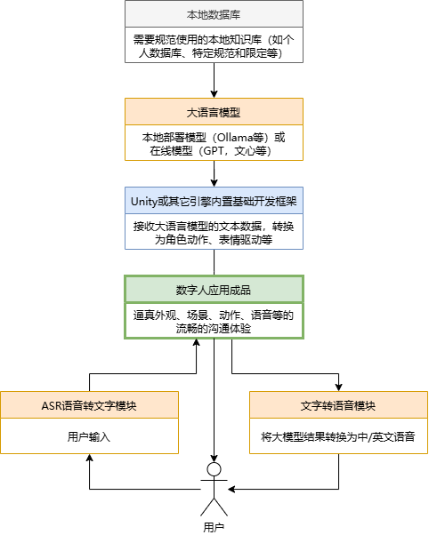

!!! Abstract
    本章节将以Unity和C#为主要平台，记录一些数字人、代理和ChatGPT的内容

## 章节介绍

其中一个重要的内容是目前正在进行开发和尝试的 **Unity** 数字人项目，该项目期望由下图组成，并计划逐个实现。

!!! Info
    Unity项目文件在(暂不对外开放)：[Lizhenghe-Chen/Unity-GPT-Test](https://github.com/Lizhenghe-Chen/Unity-GPT-Test){ .md-button }
    此外部分文档尚未以对外的形式撰写，可能会有所省略或者一些步骤

平台支持（未测试则留空）：

| Android | iOS | Windows | macOS | linux | HarmonyOS | WebGL |
| ------- | --- | ------- | ----- | ----- | --------- | ----- |
| ✅      |     | ✅      |       |       |           | 🚫    |

AI+游戏恐怕在所难免，虽然现在没有成熟的技术和解决方案来时间GPT和游戏的深度融合，但是探索的脚步无法阻挡，所以尝试用相对简单的方式实现Unity+GPT的一些功能：

* [X] 实现ChatGPT以及本地大模型的文字对话
* [X] 实现GPT本地知识库接入（目前无法多端同时接入使用）
* [X] 实现GPT的本地化语音转文字输入（STT）
* [ ] 实现GPT的本地化文字转语音输出（TTS）
* [X] 驱动数字人（动作、表情、唇动）
* [X] 实现GPT控制Unity内场景物体
* [ ] 。。。

该数字人由以下几个主要部分构成：

1. Unity引擎使用主流的游戏引擎作为载体
2. GPT本地大语言模型，目前使用Ollama使得像ChatGPT那样的语言模型可以在自己的电脑或者服务器上运行
3. 基于GPT大模型的本地化数据库（知识库），目前常识了AnythingLLM使得GPT能够高度自定义其知识内容和回答方式
4. 用户语音转文字STT本地化部署的大模型使得语音识别可以在自己的电脑或者服务器上运行，目前使用ASR模型
5. 数字人文字转语音TTS
   本地化部署的大模型使得数字人处理的输出文本可以转换为语音输出，本地化部署使得语音识别可以在自己的电脑或者服务器上运行

