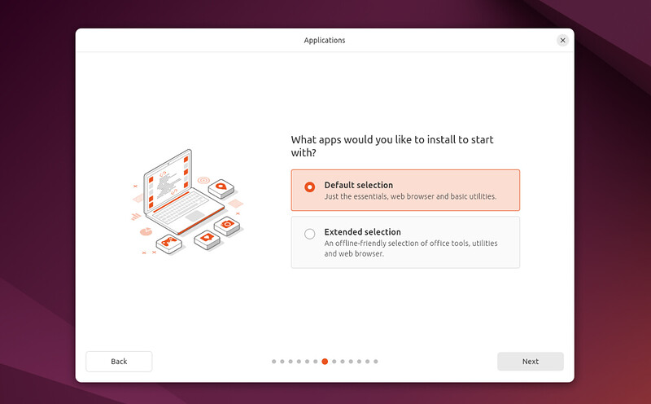

# Ubuntu Desktop 替代APP

## OneDrive同步手段

* 如果想要完整，全文件的同步（比如一些项目文件彼此依赖），会麻烦一些，需要在命令行中注册协议：[abraunegg/onedrive: OneDrive Client for Linux](https://github.com/abraunegg/onedrive) 不过目前这个比较进阶，需要手动设置那些要同步那些不同步
  * 参考：[如何在 Ubuntu 22.04 中安装和设置 OneDrive 客户端](https://cn.linux-terminal.com/?p=7582#google_vignette)
* 如果只是浏览互不依赖的文件，如图片和文档等，那么这个发方法最简单优雅，只需要在账户设置中登录自己的Office365账号即可，*不过目前我尝试了，速度比较慢，必须确保没有其它设备在编辑才能够保存*
  * 参考：[如何在 Ubuntu 24.04 LTS 中启用 OneDrive 文件访问](https://cn.linux-console.net/?p=31535#google_vignette)

## Office软件

* LibreOffice是首个选择方案。在你安装Ubuntu Desktop 时，会有个选项征求你是否安装更完整的系统版本，这个版本包括了LibreOffice，图片视频音频播放器和其它诸多方便日常生活工作的软件，[下载 LibreOffice | LibreOffice 简体中文官方网站 - 自由免费的办公套件](https://zh-cn.libreoffice.org/download/libreoffice/)
* 此外的选项，这一次WPS将会胜出：[WPS Office for Linux-支持多版本下载_WPS官方网站](https://www.wps.cn/product/wpslinux#)

## Unity

[Unity 2022.x 长期支持版本下载 | Unity中国官网](https://unity.cn/releases/lts/2022)

[Install .NET on Ubuntu - .NET | Microsoft Learn](https://learn.microsoft.com/en-gb/dotnet/core/install/linux-ubuntu-install?pivots=os-linux-ubuntu-2404&tabs=dotnet9#ubuntu-2404)
