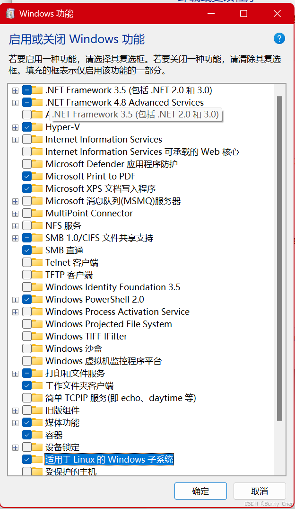
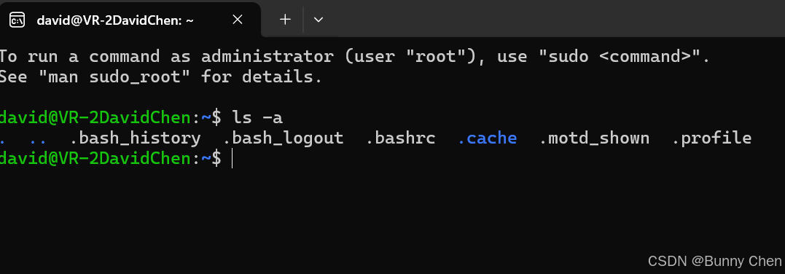
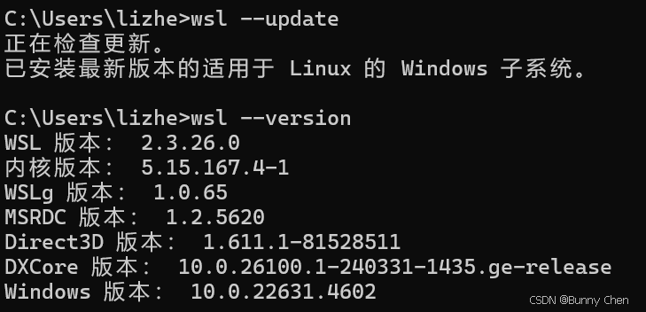
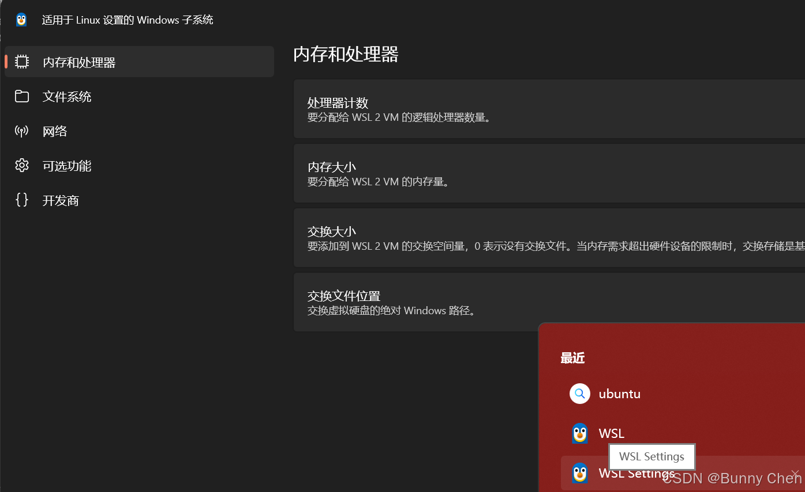
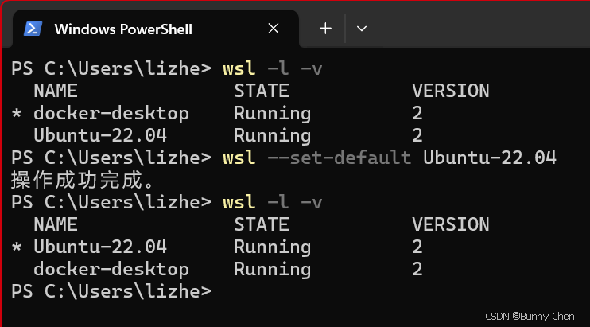
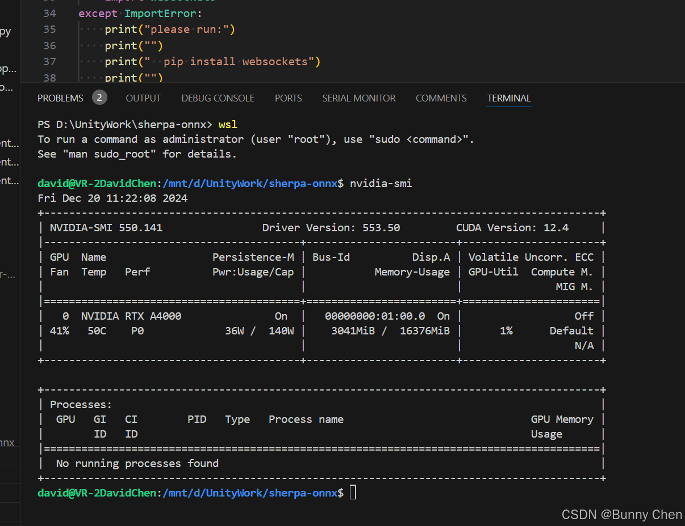

# Windows中运行Linux（WSL）

Windows Subsystem for Linux（WSL）是一个在Windows 10和更高版本上运行Linux二进制可执行文件（ELF格式）的兼容层。它允许你在Windows上直接运行Linux环境，包括大多数命令行工具、实用程序和应用程序，无需修改。以下是使用WSL的基本步骤：

1. ## **启用WSL功能** ：

    * 打开“控制面板” > “程序” > “程序和功能” > “启用或关闭Windows功能”。
    * 在弹出的窗口中找到“ **适用于Linux的Windows子系统** ”，勾选它，然后点击“确定”。系统会提示你重启计算机，同时     启动 **Hyper-V** 以及 **虚拟机平台** 也是可选的或者必要的，由于我之前已经启用，所以我不确定这两个是不是必要 的，但后续可能会方便你的拓展操作。

2. ## **安装Linux发行版** ：

    * 重启后，打开Microsoft Store，搜索你想要安装的Linux发行版，比如Ubuntu、Debian等。
    * 选择一个发行版，点击“获取”或“安装”。

      **设置Linux用户账户** ：
    * 安装完成后，打开开始菜单，找到你安装的Linux发行版，点击启动。
    * 首次启动时，系统会提示你创建一个新的用户账户和密码。
  
3. ## **运行指令**

    * 安装成功后你就可以开始使用Linux的各种指令了！

    

    * 更新你的WSL到最新版（WSL2）。你的wsl可能不是最新版，可能会导致一些意想不到的问题，所以打开 **Windows cmd** 命令窗口，输入 **wsl --version** 以及 **wsl --update**

    

4. ## **灵活启动WSL**

    * 你可以在你的集成开发环境IDE中的命令窗口或者任何Windows指令窗口中输入wsl 来直接在当前文件夹中启用Linux窗口，此外搜索WSL Settings可以调整其性能和其它设置（**需要注意的是，为了达到最佳的性能，工程文件一定要放到WSL的系统目录而不是Windows目录！**）
    * 使用 `wsl -l -v `*命令列出所有已安装的 Linux 发行版及其版本信息，* 为当前默认的发行版，使用 `wsl --set-default <发行版名称> ` 来更改默认发行版。
      
    * 现在就可以在当前IDE的文件夹下使用 “wsl” 指令启动Linux窗口并运行相关指令了，比如我现在在VSCode中启动wsl并查询一下显卡信息：

5. ### 卸载 Ubuntu-22.04 的步骤

    * **停止运行 Ubuntu-22.04（如果在运行）**

    确保 Ubuntu-22.04 已经停止。你可以通过以下命令确认：      `wsl --shutdown `

    * **卸载 Ubuntu-22.04**

    使用以下命令卸载 Ubuntu-22.04：      `wsl --unregister Ubuntu-22.04 `运行后，Ubuntu-22.04 会从 WSL 中完全删除，包括它的文件系统和配置。

    * **验证卸载**

    再次运行以下命令，检查是否卸载成功：      `wsl -l -v `
    如果 Ubuntu-22.04 不再出现在列表中，说明卸载已成功。
