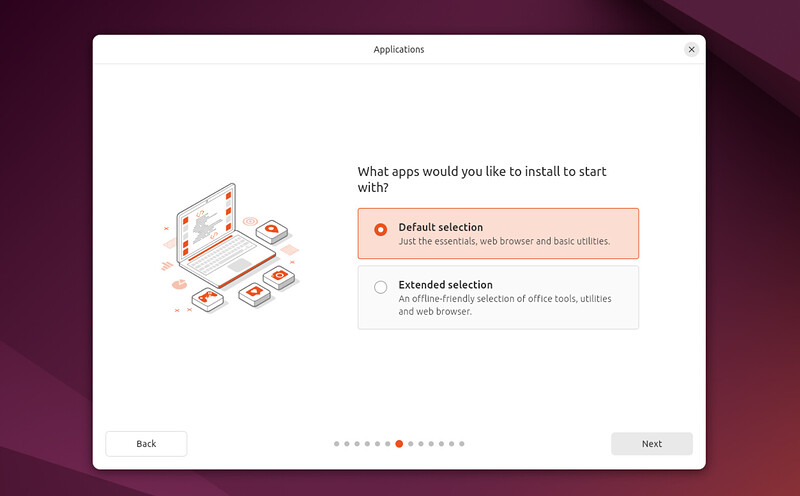

# 安装和部署 Ubuntu Desktop

## Linux简介

Linux是一个开源的、多用户、多任务的类Unix操作系统内核，以其稳定性、安全性、灵活性和强大的社区支持而广受欢迎，适用于从嵌入式设备到超级计算机的广泛硬件平台。

Linux的主流发行版包括：

1. **Ubuntu** ：一个用户友好的发行版，适合初学者和高级用户，拥有庞大的用户社区和软件库。
2. **Debian** ：Ubuntu的上游源，以其稳定性和强大的软件包管理系统（APT）而闻名。
3. **Fedora** ：由Red Hat赞助，以其最新技术和创新而著称，是Red Hat Enterprise Linux（RHEL）的上游源。
4. **CentOS** ：以前是RHEL的免费克隆，现在CentOS Stream是RHEL的上游，而CentOS 8的后续版本是AlmaLinux和Rocky Linux。
5. **openSUSE** ：以其YaST配置工具和对硬件的支持而闻名，适合桌面和服务器使用。
6. **Red Hat Enterprise Linux (RHEL)** ：一个商业发行版，以其企业级特性和支持而受到大型企业的青睐。
7. **Arch Linux** ：以其滚动发布模型和高度的可定制性而受到高级用户的欢迎。

## 安装Linux (Ubuntu Desktop)

在官网中选择合适的Ubuntu Desktop 版本，这里选择24.04.1 LTS版本

[Download Ubuntu Desktop | Ubuntu](https://ubuntu.com/download/desktop)

官方的安装文档：[Install Ubuntu desktop | Ubuntu](https://ubuntu.com/tutorials/install-ubuntu-desktop#1-overview)

这里需要主要的是，官方推荐的USB启动器烧录程序[balenaEtcher](https://etcher.balena.io/)，我不知道现在的Ubuntu系统启动器是不是都这样，这个程序会安全将U盘格式化并且处理其分区，使得文件管理器无法再访问和使用其存储，能且仅能用作启动U盘。所以如果你的U盘内有重要数据，或者你的U盘容量很大，那么就不推荐用来做启动U盘了，通常一个8GB的3.0盘就足够了。

如果需要还原U盘重新用作存储，可以参考：[Etcher User Documentation | Etcher](https://etcher-docs.balena.io/USER-DOCUMENTATION#recovering-broken-drives) 或 [Etcher broke my USB stick … or did it?](https://blog.balena.io/did-etcher-break-my-usb-sd-card/)

!!!note
    一般电脑主板的BIOS界面都是开机出现Logo时连续按F2，或者F9、F10、Del来启动，然后找到 **引导菜单** ，选择启动U盘的名字进行安装。

!!!warning
    此外，不要错误安装为服务器（没有图形界面），除非你需要的是服务器版本：[Get Ubuntu Server | Download | Ubuntu](https://ubuntu.com/download/server#how-to-install-lts)

!!!success
    如果是个人办公使用的话，在设置Ubuntu阶段会提示是否使用拓展安装（Extended selection）这里推荐选择是，该扩展选择包含其他 Office 工具和实用程序，适用于离线情况。

## 设置Ubuntu中文智能输入法

* 系统语言建议安装英文，因为很多教程和文档都是英文的，这样方便找到正确的选项

安装好的Ubuntu默认是没有中文输入法的，但是可以在系统里面设置，虽然这个输入法的智能程度我觉得一般：

[Ubuntu中文设置与安装中文输入法（超详细）_ubuntu中文输入法安装-CSDN博客](https://blog.csdn.net/fr16021028/article/details/125891812)

!!!tip
    **Install/Remove Language** 之后一定要重启，重启后重点是keyboard里面添加点+，在点开chinese展开，选择拼音；
    一些应用，如VSCode，如果使用系统自带的 APP Center 安装是无法输入中文的！请到官网下载.deb文件[Download Visual Studio Code - Mac, Linux, Windows](https://code.visualstudio.com/Download)

## 关于Linux安装和卸载软件

### deb和rpm安装包

`.deb` 和 `.rpm` 是两种不同的软件包格式，它们分别用于不同的Linux发行版系列。以下是这两种格式的详细解释：

`.deb` 文件（Debian Package）

- **用途**：`.deb` 文件是 Debian 及其衍生发行版（如 Ubuntu、Linux Mint、Raspbian 等）使用的软件包格式。
- **结构**：`.deb` 文件是一个压缩的存档文件，包含了软件的所有文件、依赖信息、版本信息、维护者信息等。
- **安装**：通常使用 `dpkg` 命令安装 `.deb` 文件，例如：
  ```bash
  sudo dpkg -i package.deb
  ```
- **包管理器**：`.deb` 文件也可以通过高级包管理器 `apt` 来管理，`apt` 会自动处理依赖关系。

`.rpm` 文件（Red Hat Package Manager）

- **用途**：`.rpm` 文件最初是为 Red Hat Linux 设计的，但现在也被其他基于 RPM 的发行版使用，如 Fedora、CentOS、RHEL（Red Hat Enterprise Linux）等。
- **结构**：`.rpm` 文件也是一个压缩的存档文件，包含了软件包的文件、依赖信息、配置文件、文档等。
- **安装**：使用 `rpm` 命令安装 `.rpm` 文件，例如：
  ```bash
  sudo rpm -ivh package.rpm
  ```
- **包管理器**：`.rpm` 文件可以通过 `yum`（Red Hat的Yellowdog Updater Modified）或 `dnf`（Fedora的Dandified YUM）等包管理器来管理，这些工具也负责处理依赖关系。

区别和兼容性

- **文件格式**：`.deb` 和 `.rpm` 文件格式不同，它们包含的元数据和文件组织方式也不同。
- **依赖处理**：`.deb` 和 `.rpm` 的依赖处理方式也有所不同，`apt` 和 `yum/dnf` 处理依赖的方式也有所区别。
- **兼容性**：通常情况下，`.deb` 文件不能直接在基于 RPM 的系统上安装，反之亦然。尽管有一些工具（如 `alien`）可以尝试将 `.deb` 转换为 `.rpm` 或者反之，但这并不总是推荐的做法，因为可能会丢失一些包信息或依赖关系。

总的来说，`.deb` 和 `.rpm` 是两种不同的软件包管理系统，它们各自有其特定的使用场景和优势。用户应根据自己使用的Linux发行版选择合适的包格式。

### Ubuntu中安装和卸载软件

#### 安装

除了Ubuntu自带的AppCenter中的少量软件，其它绝大部分软件都需要从第三方自己下载安装包来安装，其中Ubuntu最重要的就是APT

**APT (Advanced Package Tool)** ：

* **Ubuntu** 、**Debian** 和其他基于Debian的发行版使用APT作为其包管理器。
* 安装软件：`sudo apt-get install package_name` 也可以通过APPCenter打开来安装它
* 更新软件列表：`sudo apt-get update`
* 升级所有软件：`sudo apt-get upgrade`

!!!note
    sudo 是一个命令行工具，代表 "superuser do"，意味着以超级用户（root）的身份执行命令。在Unix和类Unix操作系统（如Linux）中，sudo 允许授权的用户以另一个用户的安全权限（通常是root用户）来执行命令。

#### 卸载 .deb 应用

[Ubuntu - 卸载软件的三种最佳方式 - Citrusliu - 博客园](https://www.cnblogs.com/citrus/p/13879838.html)

##### 一些自带的应用可以通过AppCenter去卸载，但是大部分不可以

##### 使用dpkg命令：

* 列出所有已安装的软件包及其状态 `dpkg -l` 或 `apt list --installed`
* 如果你知道软件的部分名称或关键字，可以使用grep来搜索 `dpkg -l | grep keyword` 或 `apt list  --installed | grep -i keyword` 替换keyword为你想查找的软件的关键字
* 删除软件包 `sudo dpkg -r package_name` 或 `sudo apt remove package_name`
* 卸载软件包-完全删除已安装的软件包及其配置文件 `sudo dpkg -P package_name` 或 `sudo apt-get purge package_name`

##### 使用图形界面卸载：

* 使用Synaptic [^Synaptic] 包管理器，你可以安装它：`sudo apt-get install synaptic` 然后在该应用中通过筛选器或搜索你想卸载的软件包，通常在Status列中会出现“Installed”标签，第三方通常是“Installed(Manual\local\obsolete)”标签

## Ubuntu 远程端口 SSH Shell

[在 Ubuntu 中配置 SSH 的完整指南](https://cn.linux-console.net/?p=18128)

确保本机和远端设备都安装好ssh后，可以直接通过命令行输入 `ssh username@address` 后

[【Ubuntu】远程连接乌班图的方式-命令行界面、图形界面_ubuntu远程桌面-CSDN博客](https://blog.csdn.net/Best_lgx/article/details/137558756)

## Ubuntu RDP远程桌面

1. 使用系统自带功能：系统提供了两个选项，
   1. **远程桌面协助** 但是需要本地解锁才行（**强烈建议您启用自动登录。在 Ubuntu Desktop 22.04 LTS 上，默认是启用屏幕空白和自动屏幕锁定。如果您的 Ubuntu 桌面空闲了一段时间，触发了屏幕空白或锁屏，您将与远程桌面会话断开连接。要解决此问题，您必须禁用屏幕空白和自动屏幕锁定以实现无缝的远程桌面会话。所以这个功能更适合远程协助**[^1]）
   2. **远程RDP登录**，可以实现完整的权限、屏幕分辨率，是最经典的远程桌面，**必须要先确保本地段已经注销**，否则会黑屏。但注意，如果安装了XRDP（下面的第二部），可能会导致该选项失效。
      此外，目前尝试发现，如果远程登录一个正在本地使用的账户，那么大概率会黑屏卡死，有效的解决方法是为远程桌面单独创建一个账户，用且仅用该账户作为远程桌面的登录账户。
2. 使用RDP传统流程：[Ubuntu22.04远程桌面配置（RDP，VNC） - pipci - 博客园](https://www.cnblogs.com/pipci/p/16377032.html) 但是需要先在本地Ubuntu中注销，才能远程桌面

[^Synaptic]: [Use Synaptic for more advanced software management](https://help.ubuntu.com/stable/ubuntu-help/addremove-install-synaptic.html.en)
    
[^1]: [在UBUNTU 24.04上开启远程桌面_ubuntu24.04远程桌面-CSDN博客](https://blog.csdn.net/qq_35534279/article/details/138371938)
