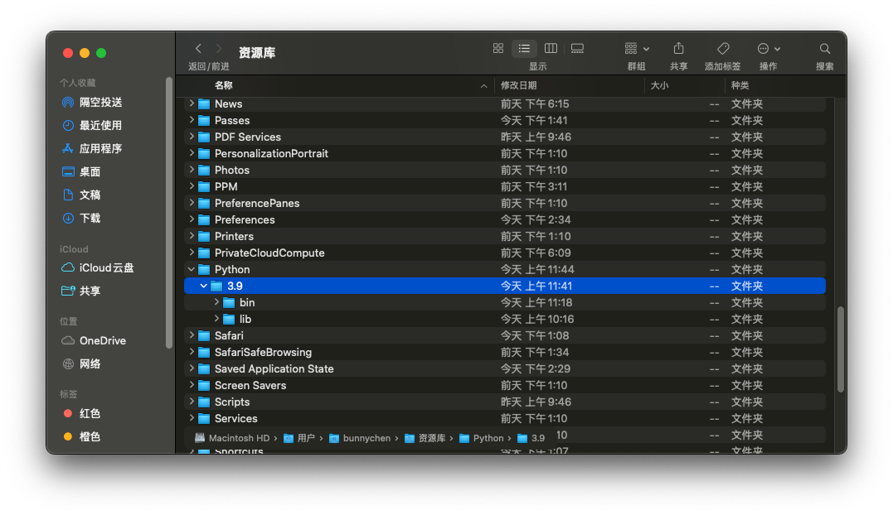

## **MacOS的Python配置**

我真的是服了，虽然MacOS的底层也是Unix，但是它在开发上真的没有Linux（Ubuntu）便捷

和Ubunty一样，MacOS出厂就装备了Python（甚至是两个），但是看起来并没有定义好其运行环境路径，导致pip，pip3，python3，python2混在一起，没法直接进行使用

## 重新配置环境

无需卸载或者安装新的python，只需要找到指定的python目录即可，为了能够显示隐藏的文件，需要先在终端执行：[Mac 访达 (Finder) 显示隐藏文件和文件夹的方法_finder 显示隐藏文件-CSDN博客](https://blog.csdn.net/sdnuwjw/article/details/112439193)

### **方chon z法 1：将 `/Users/用户名/Library/Python/3.9/bin`添加到 `PATH`环境变量**

1. **打开终端** 。
2. 先在访达中找到对应的python路径:

   ```
   bunnychen@BunnyChens-Mac-mini ~ % whereis python3
   python3: /usr/bin/python3
   ```

   这通常是在自己的用户文件夹下：`/Users/用户名/Library/Python/3.9/bin`
   
3. **编辑你的shell配置文件** （取决于你使用的shell，通常是 `.bash_profile`或 `.zshrc`）：
   **bash**复制

```bash
   nano ~/.zshrc
```

   或者：
   **bash**复制

```bash
   nano ~/.bash_profile
```

1. **在文件末尾添加以下行** ：
   **bash**复制

```bash
   export PATH="/Users/bunnychen/Library/Python/3.9/bin:$PATH"
```

2. **保存文件并重新加载配置** ：
   **bash**复制

```bash
   source ~/.zshrc
```

   或者：
   **bash**复制

```bash
   source ~/.bash_profile
```

3. **验证更改** ：
   **bash**复制

```bash
   echo $PATH
```

   确保 `/Users/bunnychen/Library/Python/3.9/bin`已经出现在 `PATH`中。

## 方法2:

[Mac下关于pip和pip3的正确解锁方式_mac which pip-CSDN博客](https://blog.csdn.net/u014259820/article/details/100580970)
