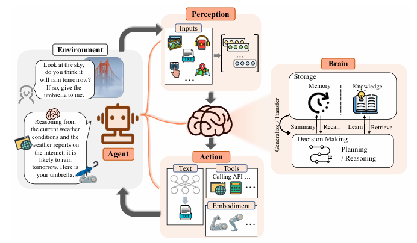

# 单个智能体建模与优化现状

人类长期以来追求类似于或超越人类水平的人工智能 (AI)，而 基于AI的代理（Agent）被认为是一个有前途的研究方向。传统计算机领域的Agent有多种，如自动化脚本、网络爬虫、推荐系统、软件机器人能够独立自主的完成某些特定任务的软件实体 [^1]。如今AI领域以及大语言模型LLM的飞速发展，使得人们对代理的需求量和以及任务复杂度要求变得越来越高，从而对代理有了更加新和具体的定义——智能体（Agent）。其中基于生成式AI的大型语言模型（LLM）因其多样化的能力被视为潜在的通用人工智能的基础 [^2]。

基于LLM的智能体通常由以下几个模块组成 [^2]：Brain（大脑）+Perception（感知）+Action （行动）。其中的核心，即大脑，又由自然语言交互（Natural Language Interaction）、知识（Knowledge）、记忆（Memory）、推理与规划（Reasoning & Planning）、可转移性和泛化所构成（Transferability and Generalization）。

## **Brain（大脑）**

为了确保有效通信，进行 **自然语言交互（Natural Language Interaction）** 的能力至关重要。大脑模块接收到 **感知模块** 处理的信息后，首先检索 **知识（Knowledge** 和调用 **记忆（Memory**。这些结果有助于智能体制定计划、推理和做出明智的 **推理与规划（Reasoning & Planning**。此外，大脑模块可能会以摘要、向量或其他数据结构的形式记住智能体过去的观察、想法和行动。同时，它还可以更新常识和领域知识等知识a以备将来使用。基于 LLM 的智能体还可以凭借其 **可转移性和泛化（Transferability and Generalization** 能力适应不熟悉的场景。在后续部分中，我们将逐一并有所侧重地探讨这些模块：

1. **自然语言交互（Natural Language Interaction** 处理与用户的文本对话，理解用户意图，并生成适当的响应。得益于现今LLM的高速迭代和发展以及自身特性，使得智能体能够很轻松的理解人类的表达和要求的同时还能将自处理的信息很好的表达给人类 [^3][^4]。此外，以自然语言进行交流的基于LLM的智能体可以赢得更多的信任，并更有效地与人类协作。与此同时，高质量自然语言生成 [^5]、多轮对话能力 [^6]使得目前以GPT，LAMA等为主的大模型在语言交互层面有了卓越的表现和可用性。不过对与人类模糊以及隐含的语言表达，目前的智能体自然语言交互还未能对其进行充分的语义理解和分析 [^7]，此外研究发现以ChatGPT为主的模型更擅长理解非拉丁文字语言，而不是生成它们 [^8]。
2. **知识（Knowledge）** 存储和访问领域特定或通用的知识库，这些信息为智能体提供预料来训练和学习，从而被用于回答问题、提供信息 [^9]。基于语言模型拥有众多参数的特性，语言模型几乎能够学习所有知识并编码进其参数中，同时还能提供准确的查询 [^10][^11]，这些知识主要被划分为：**语言知识**。它包括形态学、句法、语义学。智能体可以通过在包含多种语言的数据集上进行训练来获得多语言知识，无需额外的翻译模型 [^12]；**常识**。即人们日常生活中的生活常识 [^13]。此类信息通常不会在准备的训练知识上下文中明确提及。因此，缺乏相应常识知识的模型可能无法理解或误解其原意 [^14]；**专业知识**。如编程、数学、医学等专业领域的知识 [^15]。

然而，就技术层面而言，仍然有两个主要且严重的问题尚未得到很好的解决：

   - **知识权威性问题**。模型在训练期间获得的知识可能从一开始就过时甚至不正确。解决此问题的一种简单方法是重新训练。但是，它需要高级数据、大量时间和计算资源。更糟糕的是，它可能导致灾难性的遗忘 [^2]。
   - **遗忘问题**。一旦一个网络被训练来执行特定任务，例如鸟类分类，它就不能轻易地被训练来执行新任务，例如，逐步学习识别其他鸟类或学习完全不同的任务，例如花卉识别。当添加新任务时，典型的深度神经网络很容易灾难性地忘记以前的任务 [^16]。
   - **幻觉问题**。LLM可能会生成与来源或事实信息相冲突的内容，这种现象通常被称为幻觉 [^17][^18]。这是 LLM 不能广泛用于事实严格的任务的关键原因之一。
   - **记忆（Memory**。和既定和不变的知识Knowledge不同，“记忆Memory”存储了主体过去的观察、思想和行动的序列，正如人脑依靠记忆系统回顾性地利用先前的经验来制定策略和做出决策一样 [^19]，智能体需要特定的记忆机制来确保它们能够熟练地处理一系列连续的任务 [^20]。当面临复杂问题时，记忆机制帮助智能体重新审视并有效地应用前行策略 [^21]。

记忆同样面对挑战，这涉及到如何对过往的记忆做取舍以避免遗忘以及如何应对激增的记忆存储问题，此外如何提取查询这些记忆也随着数据量激增而产生，这使得在相关主题之间建立联系变得越来越具有挑战性，并可能导致智能体将其响应与正在进行的上下文不一致 [^2]。

### **推理与规划（Reasoning & Planning）**

推理作为人工智能的核心能力，涉及基于证据和逻辑的问题解决、决策制定和批判性分析，其中演绎、归纳和溯因是主要的推理形式 [^22]。对于大型语言模型（LLMs）而言，推理能力对于处理复杂任务至关重要。Chain-of-Thought（CoT）方法等技术被用来激发LLMs的推理能力，而自我一致性、自我打磨、自我精炼和选择性推理等策略则被提出以增强LLMs的性能 [^2]。

规划作为人类面对复杂挑战的关键策略，对于基于LLMs的智能体同样至关重要，它涉及将复杂任务分解为更易管理的子任务，并为每个子任务制定适当的计划 [^23]。规划过程包括计划制定和计划反思两个阶段，前者涉及将总体任务分解为多个子任务，后者则利用内部反馈机制和与人类的互动来完善和增强策略和规划方法，确保智能体能够适应现实世界的情况并成功执行任务。

### **可转移性和泛化（Transferability and Generalization）**

使智能体能够适应新情境，并将已有的知识应用于未曾见过的问题。

## **Perception（感知）**

对于基于 LLM 的智能体来说，从各种来源和方式接收信息也至关重要。这种扩展的感知空间有助于智能体更好地了解他们的环境，做出明智的决策，并在更广泛的任务中表现出色，使其成为一个重要的发展方向。Agent 将此信息处理给 Brain 模块，以便通过 perception 模块进行处理。文本、视觉和听觉输入。其他可能的输入形式，例如触觉反馈、手势和 3D 地图，以丰富智能体的感知域并增强其多功能性 [^2]。

## **Action（行动）**

当一个主体拥有具有知识、记忆、推理、计划和泛化能力以及多模态感知能力的类脑结构时，它还被期望拥有类似于人类的各种行动来响应其周围环境。在智能体的构建中，动作模块接收大脑模块发送的动作序列，并执行动作与环境交互 [^2]。

**单个智能体的挑战总结与可靠解决方案**

我们不得不面对一个关键问题——灾难性遗忘。这一现象指的是，当网络被训练以适应新任务时，它们会遗忘之前学到的知识，尤其在增量学习的场景中更为明显。为了缓解这一问题，研究者们提出了多种策略，包括正则化、集成、排练、双记忆模型和稀疏编码等，旨在保护原有知识不受新学习任务的干扰 [^16]。大型语言模型（LLMs）在理解和生成类人文本方面取得了显著进展，但它们在更新模型以保持信息的时效性和准确性方面面临挑战 [^22]。为了解决这一问题，研究者们提出了多种编辑技术，并通过构建新的基准数据集和实证分析来评估这些方法的有效性 [^22]。LLMs在适应快速变化的世界知识方面也存在挑战，例如处理过时信息和生成幻觉信息的倾向 [^23]。为了提高LLMs的事实性，FRESHPROMPT方法被提出，该方法通过将搜索引擎检索到的最新信息整合到模型提示中。

ChatDB框架的提出，为LLMs提供了一种新的增强方式，即通过将数据库作为符号记忆来解决传统神经记忆机制的局限性 [^24]。这种方法特别适用于需要精确记录和处理历史信息的场景，如数据管理。最后，FreshQA基准测试和FreshPrompt方法的提出，旨在提高LLMs在事实性问题上的性能，通过将从搜索引擎检索到的相关和最新信息合并到提示中，显著提升了LLMs的性能 [^25]。这些研究为未来改进LLMs的准确性和适应性提供了新的方向和工具。

**异构智能体（未完整）**

一些算法(Yu et al.，[2022](https://arxiv.org/html/2304.09870v2/#bib.bib65); de Witt 等人，[2020](https://arxiv.org/html/2304.09870v2/#bib.bib12))依赖于参数共享，并要求智能体是_同质_的（_即_共享相同的观察空间和动作空间，并在协作任务中扮演相似的角色），这在很大程度上限制了它们对_异构_智能体设置的适用性（_即_，对观察空间、动作空间和智能体的角色没有约束），并可能损害性能(Christianos 等人，[2021](https://arxiv.org/html/2304.09870v2/#bib.bib10)).

# 引用

[^1]: “Is It an agent, or just a program?: A taxonomy for autonomous agents,” Available: https://link.springer.com/chapter/10.1007/bfb0013570.
    
[^2]:   “The Rise and Potential of Large Language Model Based Agents: A Survey,” Available: https://arxiv.org/abs/2309.07864.
    
[^3]:   “Language Models are Few-Shot Learners,” Available: https://proceedings.neurips.cc/paper/2020/hash/1457c0d6bfcb4967418bfb8ac142f64a-Abstract.html.
    
[^4]:   “Open and efficient foundation language,” Available: https://arxiv.org/abs/2302.13971.
    
[^5]:   “MEGA: Multilingual Evaluation of Generative AI,” Available: https://arxiv.org/abs/2303.12528.
    
[^6]:   W. LLMmeetsdomainexperts. Available: https://arxiv.org/abs/2304.04370.
    
[^7]:   “Understanding Natural Language Commands for Robotic Navigation and Mobile Manipulation,” Available: https://www.researchgate.net/publication/363512801_Understanding_Natural_Language_Commands_for_Robotic_Navigation_and_Mobile_Manipulation.
    
[^8]:   “A Multitask, Multilingual, Multimodal Evaluation of ChatGPT on Reasoning, Hallucination, and Interactivity,” Available: https://arxiv.org/abs/2302.04023.
    
[^9]:   “How Much Knowledge Can You Pack Into the Parameters of a Language Model,” Available: https://arxiv.org/abs/2002.08910.
    
[^10]:  “Scaling Laws for Neural Language Models,” Available: https://arxiv.org/abs/2001.08361.
    
[^11]:  “How Much Knowledge Can You Pack Into the Parameters of a Language Model,” Available: https://arxiv.org/abs/2002.08910.
    
[^12]:  “A Multitask, Multilingual, Multimodal Evaluation of ChatGPT on Reasoning, Hallucination, and Interactivity,” Available: https://arxiv.org/abs/2302.04023.
    
[^13]:  “Language Models of Code are Few-Shot Commonsense Learners,” Available: https://arxiv.org/abs/2210.07128.
    
[^14]:  “Commonsense knowledge in machine intelligence,” Available: https://dl.acm.org/doi/10.1145/3186549.3186562.
    
[^15]:  “ Don’t stop pretraining: Adapt language,” Available: https://arxiv.org/abs/2004.10964.
    
[^16]:  “Measuring Catastrophic Forgetting in Neural Networks,” Available: https://arxiv.org/abs/1708.02072.
    
[^17]:  “A Survey on Hallucination in Large Language Models: Principles, Taxonomy, Challenges, and Open Questions,” Available: https://arxiv.org/abs/2311.05232.
    
[^18]:  “Large Language Models Can Be Easily Distracted by Irrelevant Context,” Available: https://arxiv.org/abs/2302.00093.
    
[^19]:  “Reconsolidation of human memory: brain mechanisms and clinical relevance,” Available: https://pubmed.ncbi.nlm.nih.gov/24755493/.
    
[^20]:  “Walking Down the Memory Maze: Beyond Context Limit through Interactive Reading,” Available: https://arxiv.org/abs/2310.05029.
    
[^21]:  “Empowering Private Tutoring by Chaining Large Language Models,” Available: https://arxiv.org/abs/2309.08112.