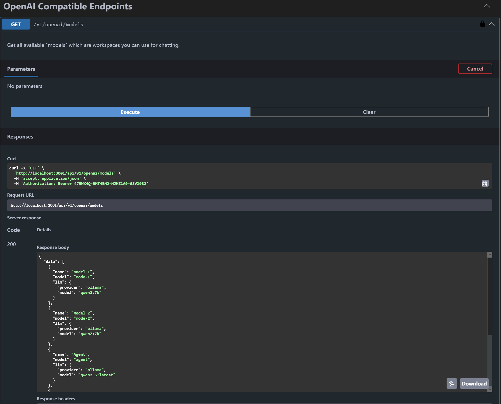
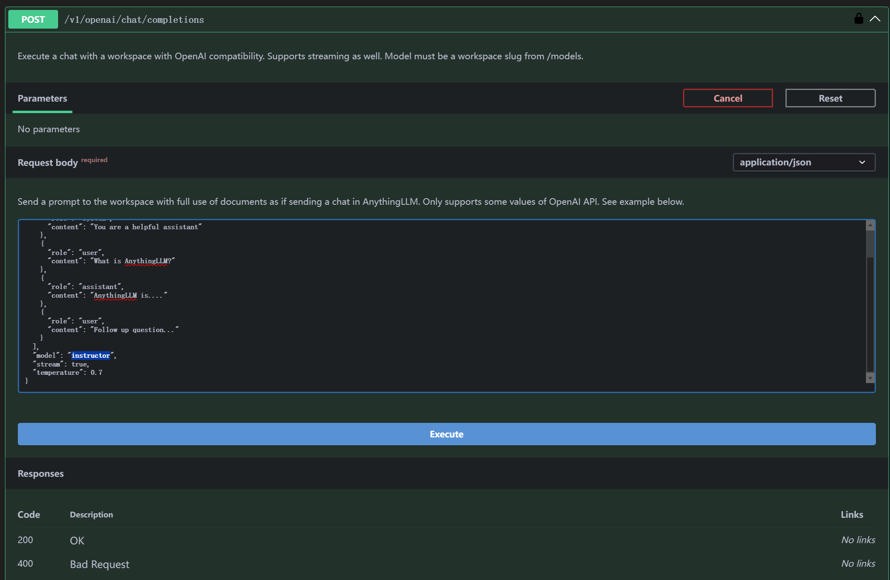
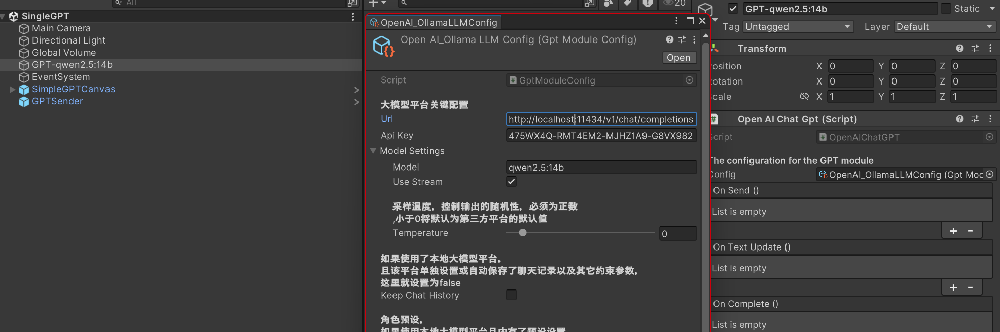

# 本地部署Ollama + AnythingLLM知识库

## 本地部署

非常简单，直接参考官方文档即可：

[Download Ollama](https://ollama.com/download)

## 关于离线或内网安装

Ollama的部署已经非常简单，通常只需要下载好安装包即可通过文件传输软件传输并安装，Linux稍微麻烦一点点，可以参考：

* [ollama/docs/linux.md at main · ollama/ollama](https://github.com/ollama/ollama/blob/main/docs/linux.md)
* [离线部署大模型：ollama+deepseek+open-webui安装使用方法及常见问题解决 - 雨梦山人 - 博客园](https://www.cnblogs.com/shanren/p/18789753)

部署完成后，只需要在能联网的平台中下载好模型文件，将模型文件夹上传至指定或默认的 `OLLAMA_MODELS`模型目录下即可

## Ollama 配置项

以下任意一种平台均可使用统一的OpenAI规范接口，所以都只用更改网址、API Key和model名称即可！

* 如果你使用ChatGPT，那么就很简单了，直接用上面的接口格式就行，只需要API key 和模型名称即可：如在控制台中输入：`ollama run qwen2.5` 即可下载运行千问大模型
* 如果使用Ollama部署本地大模型：

  * 同样可以使用Open AI规范的形式，参考：[OpenAI compatibility · Ollama Blog](https://ollama.com/blog/openai-compatibility)
  * 只要下载并部署好Ollama并安装好指定的模型即可
  * 常用的Ollama环境变量设置[Global Configuration Variables for Ollama · Issue #2941 · ollama/ollama](https://github.com/ollama/ollama/issues/2941#issuecomment-2322778733)：

    > * `OLLAMA_ORIGINS`: 允许的来源，用于跨域请求，如果遇到（CORS）问题，可以设置变量为 `*`
    > * `OLLAMA_MODELS`: 指定模型下载存储路径，默认是 `$HOME/.ollama/models`
    > * `OLLAMA_HOST`: 服务器端口地址，默认是 `http://127.0.0.1:11434`
    > * `OLLAMA_KEEP_ALIVE`: 模型激活后的保持时间，默认是5分钟，这会在加载大体量模型但常用的时候每一次请求都要重新加载模型，所以可以设置一个较长的时间如5h
    >

    !!!Note:
    如果需要外网或者局域网的其它设备访问到，必须配置其Host值为"0,0,0,0"，并确保端口防火墙是开放的。[Linux/Windows 系统 ollama 配置允许外网访问－Windows 日常故障－瓦力技术小记](https://www.walimao.com/archives/675.html)，在其它电脑上输入【ollama主机ip:11434】，如果出现 `Ollama is running`就🆗了
* 如果使用AnythingLLM搭建本地知识库

  1. 确保Ollama已经安装
  2. 下载安装：[Download AnythingLLM for Desktop](https://anythingllm.com/desktop)
  3. 然后简单的配置好，指定Ollama为内核即可
  4. 为了能够像OpenAI那样使用网络API接口，在 设置>工具>API密钥 里申请一个密钥，然后点击“阅读API文档”，点击“Authorize”将密钥复制进去就可以测试接口了：
  5. 在你创建完一个workspace后，就可以查阅模型名称：
     
     将查阅的模型名称输入到聊天API中测试：	
  6. 之后你只需要将上述特定的json数据请求格式发送到：

     ```bash
     http://localhost:3001/api/v1/openai/chat/completions
     ```

### Unity C#代码的简单调用：

#### 处理发送信息

这个连接可以帮助你理解：[聊天接口 /v1/chat/completions - API2D](https://api2d-doc.apifox.cn/)

为了通过规范且整洁的方式生成json信息，我们通过创建C# Class的Object并通过Newtonsoft. Json强制转换为json格式:JsonConvert.SerializeObject())

```csharp
private SimpleOpenAIRequest SetupSimpleRequest()
{
    var userRequest = new SimpleOpenAIRequest
{
        Model = config.modelSettings.model,
        Stream = config.modelSettings.useStream,
        Temperature = config.modelSettings.temperature,
        Messages = new List<Message>()
    };

    return userRequest;
}
```

```csharp
var jsonString = JsonConvert.SerializeObject(_simpleOpenAIRequest).ToLower();
```

**具体的数据结构设置在脚本：[ SimpleOpenAIRequest.cs][Assets/GPTModule/Scripts/OpenAIChatGPT.cs)
然后生成的具体脚本在：[ OpenAIChatGPT.cs][Assets/GPTModule/Scripts/OpenAIChatGPT.cs)**

网络协议的请求格式：

```csharp
/// <summary>
        ///  生成OpenAI请求
        /// </summary>
        /// <returns> 返回一个UnityWebRequest对象 </returns>
        private UnityWebRequest GenerateOpenAIRequest()
        {
            //convert the data to JSON，注意这里的ToLower()，因为OpenAI的API对大小写敏感，如果Class的属性名是大写，会导致请求失败
            var jsonString = JsonConvert.SerializeObject(_simpleOpenAIRequest).ToLower();
            var request = new UnityWebRequest(config.url, "POST");
            var bodyRaw = System.Text.Encoding.UTF8.GetBytes(jsonString);
            request.uploadHandler = new UploadHandlerRaw(bodyRaw);
            request.downloadHandler = new DownloadHandlerBuffer();
            request.SetRequestHeader("Content-Type", "application/json");
            request.SetRequestHeader("Authorization", "Bearer " + config.apiKey);
            request.certificateHandler = new ChatGptWebRequestCert();
            Debug.Log("<color=orange>Request: </color>" + jsonString);
            onSend.Invoke(); // Event to show that the request is being sent
            return request;
        }
```

#### 处理接受信息

gpt的回调也是Json形式，同样可以把他们再转会C#的数据格式

所以最后的收发核心代码为：

```csharp
 /// <summary>
        /// <param name="prompt"> The text to send to the GPT model </param>
        /// <param name="callback"> The callback function to be called when the response is received,
        /// leave it null if you don't need a callback </param>
        /// <returns></returns>  
        /// </summary>
        private IEnumerator GetChatGptResponse(string prompt, Action<string> callback = null)
        {
            SetUserRequest(prompt);

            var request = GenerateOpenAIRequest();

            yield return request.SendWebRequest();

            if (request.result is UnityWebRequest.Result.ConnectionError or UnityWebRequest.Result.ProtocolError)
            {
                Debug.LogError("Error: " + request.error);
            }
            else
            {
                Debug.Log("<color=green>Respond: </color>" + request.downloadHandler.text);
                var responseText = request.downloadHandler.text;
                //Debug.Log("Response: " + responseText);
                // Parse the JSON response to extract the required parts
                var response = JsonConvert.DeserializeObject<OpenAIResponse>(responseText);
                callback?.Invoke(response.Choices[0].Message.Content);
                latestResult = response.Choices[0].Message.Content;
                onTextUpdate.Invoke();
                onComplete.Invoke();
            }
        }

```

**具体细节还请参考：[OpenAIChatGPT.cs][Assets/GPTModule/Scripts/OpenAIChatGPT.cs)**

## Unity中配置：

**GPT相关的配置设置都放在[ GPTConfig.cs][Assets/GPTModule/Scripts/GptModuleConfig.cs)中，这个类主要是用来设置GPT的一些参数，如API Key、模型名称、请求地址等等，在Unityinspector中附在[ OpenAIChatGPT.cs][Assets/GPTModule/Scripts/OpenAIChatGPT.cs)组件物体上:**


