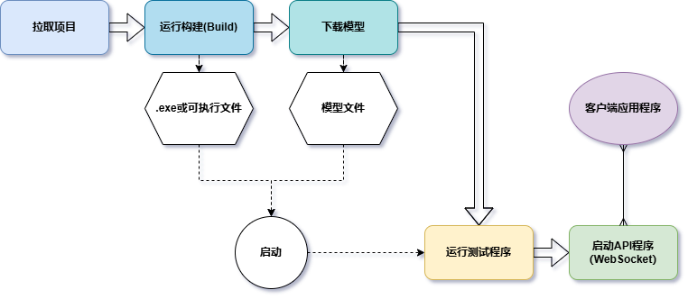
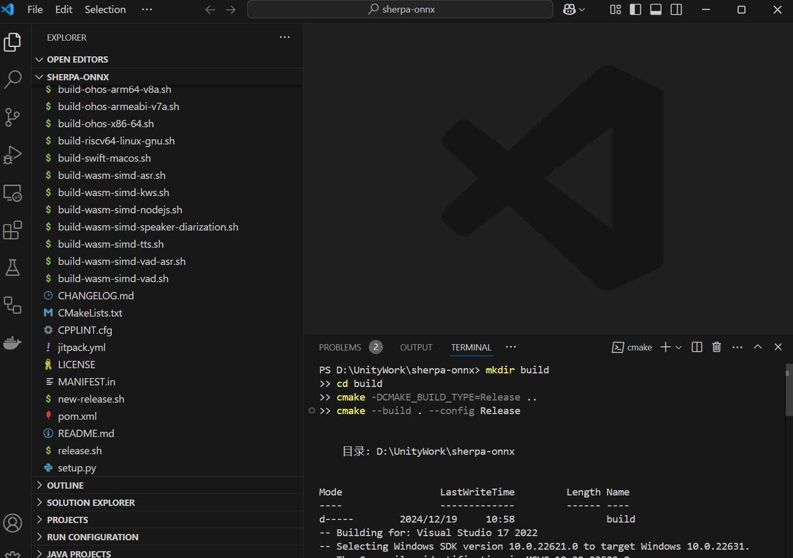
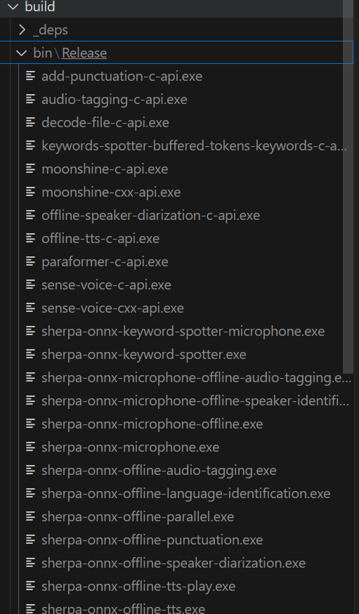
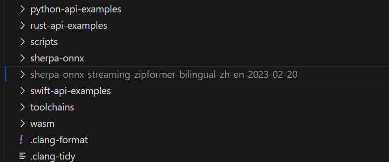

# Sherpa Onnx ASR 多平台语音转文字STT实战

## 前言

本项目期望使用自己的语音识别模块（STT）项目和Sherpa大模型框架实现通讯，从而进一步提高项目的解耦能力以及响应速度。由于原项目的[开发文档](https://k2-fsa.github.io/sherpa/onnx/tutorials/index.html "开发文档")比较进阶，所以这里用更直白简洁且清晰的方式对某几个Demo和功能实现做进一步的阐述。

同时使用Streaming WebSocket的方案简单运行一个例子

## 流程阐述

整个流程主要分为6步，按照下图的顺序，一步一步实现项目的对接。



项目仓库：[https://github.com/k2-fsa/sherpa-onnx](https://github.com/k2-fsa/sherpa-onnx "https://github.com/k2-fsa/sherpa-onnx")

1. ### 拉取项目
使用任何一种方式从项目仓库中下载zip或者克隆、fork项目到本地电脑
项目仓库：[https://github.com/k2-fsa/sherpa-onnx](https://github.com/k2-fsa/sherpa-onnx "https://github.com/k2-fsa/sherpa-onnx")

1. ### 构建（Build）
参考 [Windows — sherpa 1.3 documentation](https://k2-fsa.github.io/sherpa/onnx/install/windows.html#bit-windows-x64)
克隆好项目后，使用VSCode或者其它编辑器打开该项目文件，或者使用命令窗口打开项目文件。
构建项目，这里需要区分CPU版本还是GPU版本，构建需要一些时间。本次使用GPU版本，因为通常GPU速度更快（详情参考上面的官方文档）：  
注意：可能需要安装[CMake](https://cmake.org/download/)才能构建
```
git clone https://github.com/k2-fsa/sherpa-onnx
cd sherpa-onnx
mkdir build
cd build
cmake -DCMAKE_BUILD_TYPE=Release -DBUILD_SHARED_LIBS=ON -DSHERPA_ONNX_ENABLE_GPU=ON ..
cmake --build . --config Release
```

构建成功后将会多出一个“build” 文件夹，里面有所有构建成功的APP（build\bin）


1. ### 下载模型和导入
接下来就是下载需要使用的已经训练好的模型：[Pre-trained models — sherpa 1.3 documentation](https://k2-fsa.github.io/sherpa/onnx/pretrained_models/index.html#sherpa-onnx-pre-trained-models)  
要确定哪模型的类型是否适用当前的APP，可以使用指令 `./build/bin/Release/sherpa-onnx-online-websocket-server` 在当前目录中查看help信息：
```
   PS D:\UnityWork\sherpa-onnx> ./build/bin/Release/sherpa-onnx-online-websocket-server   
   D:\UnityWork\sherpa-onnx\sherpa-onnx\csrc\parse-options.cc:PrintUsage:416 

   Automatic speech recognition with sherpa-onnx using websocket.

   Usage:

   ./bin/sherpa-onnx-online-websocket-server --help

   ./bin/sherpa-onnx-online-websocket-server \
     --port=6006 \
     --num-work-threads=5 \
     --tokens=/path/to/tokens.txt \
     --encoder=/path/to/encoder.onnx \
     --decoder=/path/to/decoder.onnx \
     --joiner=/path/to/joiner.onnx \
     --log-file=./log.txt \
     --max-batch-size=5 \
     --loop-interval-ms=10

   Please refer to
   https://k2-fsa.github.io/sherpa/onnx/pretrained_models/index.html
   for a list of pre-trained models to download.

   Options:
     --trt-timing-cache-path     : Set path for storing timing cache. (string, default = ".")
     --paraformer-encoder        : Path to encoder.onnx of paraformer. (string, default = "")
     --decoder                   : Path to decoder.onnx (string, default = "")
     --feat-dim                  : Feature dimension. Must match the one expected by the model. Not used by whisper and CED models (int, default = 80)
     --trt-detailed-build-log    : Enable detailed logging of build steps. (bool, default = false)
     --high-freq                 : High cutoff frequency for mel bins (if <= 0, offset from Nyquist) (float, default = -400)
     --warm-up                   : Number of warm-up to run the onnxruntimeValid vales are: zipformer2 (int, default = 0)
     --decoding-method           : decoding method,now support greedy_search and modified_beam_search. (string, default = "greedy_search")
     --rule3-min-trailing-silence : This endpointing rule3 requires duration of trailing silence in seconds) to be >= this value. (float, default = 0)
     --port                      : The port on which the server will listen. (int, default = 6006)
     --num-io-threads            : Thread pool size for network connections. (int, default = 1)
     --tokens                    : Path to tokens.txt (string, default = "")
     --rule2-min-utterance-length : This endpointing rule2 requires utterance-length (in seconds) to be >= this value. (float, default = 0)
     --end-tail-padding          : It determines the length of tail_padding at the end of audio. (float, default = 0.8)
     --cuda-cudnn-conv-algo-search : CuDNN convolution algrorithm search (int, default = 1)
     --num-work-threads          : Thread pool size for for neural network computation and decoding. (int, default = 3)
     --provider                  : Specify a provider to use: cpu, cuda, coreml (string, default = "cpu")
     --sample-rate               : Sampling rate of the input waveform. Note: You can have a different sample rate for the input waveform. We will do resampling inside the feature extractor (int, default = 16000)
     --lm-shallow-fusion         : Boolean whether to use shallow fusion or rescore. (bool, default = true)
     --low-freq                  : Low cutoff frequency for mel bins (float, default = 20)
     --dither                    : Dithering constant (0.0 means no dither). By default the audio samples are in range [-1,+1], so 0.00003 is a good value, equivalent to the default 1.0 from kaldi (float, default = 0)
     --lm-num-threads            : Number of threads to run the neural network of LM model (int, default = 1)
     --rule2-min-trailing-silence : This endpointing rule2 requires duration of trailing silence in seconds) to be >= this value. (float, default = 1.2)
     --trt-engine-cache-path     : Set path to store cached TensorRT engines. (string, default = ".")
     --encoder                   : Path to encoder.onnx (string, default = "")
     --lm                        : Path to LM model. (string, default = "")
     --joiner                    : Path to joiner.onnx (string, default = "")
     --paraformer-decoder        : Path to decoder.onnx of paraformer. (string, default = "")
     --ctc-max-active            : Decoder max active states.  Larger->slower; more accurate (int, default = 3000)
     --wenet-ctc-model           : Path to CTC model.onnx from WeNet. Please see https://github.com/k2-fsa/sherpa-onnx/pull/425 (string, default = "")
     --wenet-ctc-chunk-size      : Chunk size after subsampling used for decoding. (int, default = 16)
     --trt-engine-cache-enable   : Enable caching of TensorRT engines. (bool, default = true)
     --wenet-ctc-num-left-chunks : Number of left chunks after subsampling used for decoding. (int, default = 4)
     --zipformer2-ctc-model      : Path to CTC model.onnx. See also https://github.com/k2-fsa/icefall/pull/1413 (string, default = "")
     --nemo-ctc-model            : Path to CTC model.onnx from NeMo. Please see https://github.com/k2-fsa/sherpa-onnx/pull/843 (string, default = "")
     --lm-provider               : Specify a provider to LM model use: cpu, cuda, coreml (string, default = "cpu")
     --trt-max-workspace-size    : Set TensorRT EP GPU memory usage limit. (int64, default = 2147483647)
     --trt-max-partition-iterations : Limit partitioning iterations for model conversion. (int, default = 10)
     --blank-penalty             : The penalty applied on blank symbol during decoding. Note: It is a positive value. Increasing value will lead to lower deletion at the costof higher insertions. Currently only applicable for transducer models. (fl
   oat, default = 0)                                                                                                                                                                                                                                      --trt-min-subgraph-size     : Set minimum size for subgraphs in partitioning. (int, default = 5)
     --max-active-paths          : beam size used in modified beam search. (int, default = 4)
     --trt-fp16-enable           : Enable FP16 precision for faster performance. (bool, default = true)
     --trt-timing-cache-enable   : Enable use of timing cache to speed up builds. (bool, default = true)
     --bpe-vocab                 : The vocabulary generated by google's sentencepiece program. It is a file has two columns, one is the token, the other is the log probability, you can get it from the directory where your bpe model is generated. On
   ly used when hotwords provided and the modeling unit is bpe or cjkchar+bpe (string, default = "")                                                                                                                                                      --trt-dump-subgraphs        : Dump optimized subgraphs for debugging. (bool, default = false)
     --device                    : GPU device index for CUDA and Trt EP (int, default = 0)
     --num-threads               : Number of threads to run the neural network (int, default = 1)
     --debug                     : true to print model information while loading it. (bool, default = false)
     --modeling-unit             : The modeling unit of the model, commonly used units are bpe, cjkchar, cjkchar+bpe, etc. Currently, it is needed only when hotwords are provided, we need it to encode the hotwords into token sequence. (string, defa
   ult = "cjkchar")                                                                                                                                                                                                                                       --model-type                : Specify it to reduce model initialization time. Valid values are: conformer, lstm, zipformer, zipformer2, wenet_ctc, nemo_ctc. All other values lead to loading the model twice. (string, default = "")
     --rule1-must-contain-nonsilence : If True, for this endpointing rule1 to apply there must be nonsilence in the best-path traceback. For decoding, a non-blank token is considered as non-silence (bool, default = false)
     --rule1-min-trailing-silence : This endpointing rule1 requires duration of trailing silence in seconds) to be >= this value. (float, default = 2.4)
     --rule1-min-utterance-length : This endpointing rule1 requires utterance-length (in seconds) to be >= this value. (float, default = 0)
     --rule2-must-contain-nonsilence : If True, for this endpointing rule2 to apply there must be nonsilence in the best-path traceback. For decoding, a non-blank token is considered as non-silence (bool, default = true)
     --enable-endpoint           : True to enable endpoint detection. False to disable it. (bool, default = true)
     --rule3-must-contain-nonsilence : If True, for this endpointing rule3 to apply there must be nonsilence in the best-path traceback. For decoding, a non-blank token is considered as non-silence (bool, default = false)
     --hotwords-file             : The file containing hotwords, one words/phrases per line, For example: HELLO WORLD浣犲ソ涓栫晫 (string, default = "")
     --rule3-min-utterance-length : This endpointing rule3 requires utterance-length (in seconds) to be >= this value. (float, default = 20)
     --lm-scale                  : LM scale. (float, default = 0.5)
     --ctc-graph                 : Path to H.fst, HL.fst, or HLG.fst (string, default = "")
     --hotwords-score            : The bonus score for each token in context word/phrase. Used only when decoding_method is modified_beam_search (float, default = 1.5)
     --temperature-scale         : Temperature scale for confidence computation in decoding. (float, default = 2)
     --rule-fsts                 : If not empty, it specifies fsts for inverse text normalization. If there are multiple fsts, they are separated by a comma. (string, default = "")
     --rule-fars                 : If not empty, it specifies fst archives for inverse text normalization. If there are multiple archives, they are separated by a comma. (string, default = "")
     --loop-interval-ms          : It determines how often the decoder loop runs.  (int, default = 10)
     --max-batch-size            : Max batch size for recognition. (int, default = 5)
     --log-file                  : Path to the log file. Logs are appended to this file (string, default = "./log.txt")

   Standard options:
     --config                    : Configuration file to read (this option may be repeated) (string, default = "")
     --help                      : Print out usage message (bool, default = false)
     --print-args                : Print the command line arguments (to stderr) (bool, default = true)
```
可以看出，模型的类型需要有 tokens, encoder, joiners,decoder 这几个参数，然后才能运行。所以 **Zipformer** 的模型应该是最适合的，所以下载[Zipformer-transducer-based Models — sherpa 1.3 documentation](https://k2-fsa.github.io/sherpa/onnpretrained_models/online-transducer/zipformer-transducer-models.html#sherpa-onnx-streaming-zipformer-bilingual-zh-en-2023-02-20)模型，并放置在该项目的 **根目录** 中以供后续使

1. ### 运行测试程序
根据[Streaming WebSocket server and client ](https://k2-fsa.github.io/sherpa/onnx/websocket/online-websocket.html#start-the-server)输入以下指令，指定模型后方可运行服务器，服务器支持多个设备同时访问：
```
./build/bin/Release/sherpa-onnx-online-websocket-server `
  --port=6006 `
  --num-work-threads=3 `
  --num-io-threads=2 `
  --tokens=./sherpa-onnx-streaming-zipformer-bilingual-zh-en-2023-02-20/tokens.txt `
  --encoder=./sherpa-onnx-streaming-zipformer-bilingual-zh-en-2023-02-20/encoder-epoch-99-avg-1.onnx `
  --decoder=./sherpa-onnx-streaming-zipformer-bilingual-zh-en-2023-02-20/decoder-epoch-99-avg-1.onnx `
  --joiner=./sherpa-onnx-streaming-zipformer-bilingual-zh-en-2023-02-20/joiner-epoch-99-avg-1.onnx `
  --log-file=./log.txt `
  --max-batch-size=5 `
  --loop-interval-ms=20
```  

1. ### 启动API程序  
    * 首先可以先用案例音频文件做测试，案例提供了Python程序作为客户端，python获取音频文件信息并发送给服务器，服务器处理完成后返回识别出来的文本信息。   在确保上一步的服务器后台运行的情况下，新建一个命令窗口执行python程序（你需要使用python的pip或者虚拟环境确  赖的package支持,需要numpy，websockets，你将会看到服务器以stream 的方式逐字的返回音频的识别结果:
    ```
    python ./python-api-examples/online-websocket-client-decode-file.py `
    --server-addr localhost `
    --server-port 6006 `
    --seconds-per-message 0.1 `
    ./sherpa-onnx-streaming-zipformer-bilingual-zh-en-2023-02-20/test_wavs/0.wav
  
    ``` 
    运行结果：
    ```
       PS D:\UnityWork\sherpa-onnx> python ./python-api-examples/online-websocket-client-decode-file.py `
    >>   --server-addr localhost `
    >>   --server-port 6006 `
    >>   --seconds-per-message 0.1 `
    >>   ./sherpa-onnx-streaming-zipformer-bilingual-zh-en-2023-02-20/test_wavs/0.wav
    >> 
    D:\UnityWork\sherpa-onnx\python-api-examples\online-websocket-client-decode-file.py:111: DeprecationWarning: websockets.WebSocketServerProtocol is deprecated
      async def receive_results(socket: websockets.WebSocketServerProtocol):
    2024-12-19 15:28:08,308 INFO [online-websocket-client-decode-file.py:160] {'server_addr': 'localhost', 'server_port': 6006, 'samples_per_message': 8000, 'seconds_per_message': 0.1, 'sound_file': './    sherpa-onnx-streaming-zipformer-bilingual-zh-en-2023-02-20/test_wavs/0.wav'}
    2024-12-19 15:28:10,365 INFO [online-websocket-client-decode-file.py:134] Sending ./sherpa-onnx-streaming-zipformer-bilingual-zh-en-2023-02-20/test_wavs/0.wav
    2024-12-19 15:28:10,428 INFO [online-websocket-client-decode-file.py:116] {'text': '', 'tokens': [], 'timestamps': [], 'ys_probs': [], 'lm_probs': [], 'context_scores': [], 'segment': 0, 'words': [], 'start_time': 0.0, 'is_final': False}
    2024-12-19 15:28:10,516 INFO [online-websocket-client-decode-file.py:116] {'text': '', 'tokens': [], 'timestamps': [], 'ys_probs': [], 'lm_probs': [], 'context_scores': [], 'segment': 0, 'words': [], 'start_time': 0.0, 'is_final': False}
    2024-12-19 15:28:10,641 INFO [online-websocket-client-decode-file.py:116] {'text': '昨', 'tokens': ['昨'], 'timestamps': [0.64], 'ys_probs': [-0.413628], 'lm_probs': [], 'context_scores': [], 'segment': 0, 'words': [], 'start_time': 0.0,     'is_final': False}
    2024-12-19 15:28:10,674 INFO [online-websocket-client-decode-file.py:116] {'text': '昨天', 'tokens': ['昨', '天'], 'timestamps': [0.64, 1.04], 'ys_probs': [-0.413628, -0.117294], 'lm_probs': [], 'context_scores': [], 'segment': 0, 'words':     [], 'start_time': 0.0, 'is_final': False}
    2024-12-19 15:28:10,735 INFO [online-websocket-client-decode-file.py:116] {'text': '昨天是', 'tokens': ['昨', '天', '是'], 'timestamps': [0.64, 1.04, 1.48], 'ys_probs': [-0.413628, -0.117294, -0.750868], 'lm_probs': [], 'context_scores': [],     'segment': 0, 'words': [], 'start_time': 0.0, 'is_final': False}
    2024-12-19 15:28:10,858 INFO [online-websocket-client-decode-file.py:116] {'text': '昨天是', 'tokens': ['昨', '天', '是'], 'timestamps': [0.64, 1.04, 1.48], 'ys_probs': [-0.413628, -0.117294, -0.750868], 'lm_probs': [], 'context_scores': [],     'segment': 0, 'words': [], 'start_time': 0.0, 'is_final': False}
    2024-12-19 15:28:10,891 INFO [online-websocket-client-decode-file.py:116] {'text': '昨天是 MON', 'tokens': ['昨', '天', '是', ' MO', 'N'], 'timestamps': [0.64, 1.04, 1.48, 2.08, 2.2], 'ys_probs': [-0.413628, -0.117294, -0.750868, -0.604206, -0.    39962], 'lm_probs': [], 'context_scores': [], 'segment': 0, 'words': [], 'start_time': 0.0, 'is_final': False}
    2024-12-19 15:28:10,954 INFO [online-websocket-client-decode-file.py:116] {'text': '昨天是 MONDAY', 'tokens': ['昨', '天', '是', ' MO', 'N', 'DAY'], 'timestamps': [0.64, 1.04, 1.48, 2.08, 2.2, 2.4], 'ys_probs': [-0.413628, -0.117294, -0.   750868, -0.604206, -0.39962, -0.652224], 'lm_probs': [], 'context_scores': [], 'segment': 0, 'words': [], 'start_time': 0.0, 'is_final': False}
    2024-12-19 15:28:10,986 INFO [online-websocket-client-decode-file.py:116] {'text': '昨天是 MONDAY', 'tokens': ['昨', '天', '是', ' MO', 'N', 'DAY'], 'timestamps': [0.64, 1.04, 1.48, 2.08, 2.2, 2.4], 'ys_probs': [-0.413628, -0.117294, -0.   750868, -0.604206, -0.39962, -0.652224], 'lm_probs': [], 'context_scores': [], 'segment': 0, 'words': [], 'start_time': 0.0, 'is_final': False}
    2024-12-19 15:28:11,078 INFO [online-websocket-client-decode-file.py:116] {'text': '昨天是 MONDAY', 'tokens': ['昨', '天', '是', ' MO', 'N', 'DAY'], 'timestamps': [0.64, 1.04, 1.48, 2.08, 2.2, 2.4], 'ys_probs': [-0.413628, -0.117294, -0.   750868, -0.604206, -0.39962, -0.652224], 'lm_probs': [], 'context_scores': [], 'segment': 0, 'words': [], 'start_time': 0.0, 'is_final': False}
    2024-12-19 15:28:11,171 INFO [online-websocket-client-decode-file.py:116] {'text': '昨天是 MONDAY', 'tokens': ['昨', '天', '是', ' MO', 'N', 'DAY'], 'timestamps': [0.64, 1.04, 1.48, 2.08, 2.2, 2.4], 'ys_probs': [-0.413628, -0.117294, -0.   750868, -0.604206, -0.39962, -0.652224], 'lm_probs': [], 'context_scores': [], 'segment': 0, 'words': [], 'start_time': 0.0, 'is_final': False}
    2024-12-19 15:28:11,204 INFO [online-websocket-client-decode-file.py:116] {'text': '昨天是 MONDAY', 'tokens': ['昨', '天', '是', ' MO', 'N', 'DAY'], 'timestamps': [0.64, 1.04, 1.48, 2.08, 2.2, 2.4], 'ys_probs': [-0.413628, -0.117294, -0.   750868, -0.604206, -0.39962, -0.652224], 'lm_probs': [], 'context_scores': [], 'segment': 0, 'words': [], 'start_time': 0.0, 'is_final': True}
    2024-12-19 15:28:11,296 INFO [online-websocket-client-decode-file.py:116] {'text': '', 'tokens': [], 'timestamps': [], 'ys_probs': [], 'lm_probs': [], 'context_scores': [], 'segment': 1, 'words': [], 'start_time': 3.84, 'is_final': False}
    2024-12-19 15:28:11,390 INFO [online-websocket-client-decode-file.py:116] {'text': ' TODAY', 'tokens': [' TO', 'DAY'], 'timestamps': [0.32, 0.52], 'ys_probs': [-1.108149, -0.539323], 'lm_probs': [], 'context_scores': [], 'segment': 1,    'words': [], 'start_time': 3.84, 'is_final': False}
    2024-12-19 15:28:11,421 INFO [online-websocket-client-decode-file.py:116] {'text': ' TODAY', 'tokens': [' TO', 'DAY'], 'timestamps': [0.32, 0.52], 'ys_probs': [-1.108149, -0.539323], 'lm_probs': [], 'context_scores': [], 'segment': 1,    'words': [], 'start_time': 3.84, 'is_final': False}
    2024-12-19 15:28:11,514 INFO [online-websocket-client-decode-file.py:116] {'text': ' TODAY', 'tokens': [' TO', 'DAY'], 'timestamps': [0.32, 0.52], 'ys_probs': [-1.108149, -0.539323], 'lm_probs': [], 'context_scores': [], 'segment': 1,    'words': [], 'start_time': 3.84, 'is_final': False}
    2024-12-19 15:28:11,608 INFO [online-websocket-client-decode-file.py:116] {'text': ' TODAY IS', 'tokens': [' TO', 'DAY', ' IS'], 'timestamps': [0.32, 0.52, 1.28], 'ys_probs': [-1.108149, -0.539323, -1.039585], 'lm_probs': [],     'context_scores': [], 'segment': 1, 'words': [], 'start_time': 3.84, 'is_final': False}
    2024-12-19 15:28:11,640 INFO [online-websocket-client-decode-file.py:116] {'text': ' TODAY IS LI', 'tokens': [' TO', 'DAY', ' IS', ' LI'], 'timestamps': [0.32, 0.52, 1.28, 1.72], 'ys_probs': [-1.108149, -0.539323, -1.039585, -2.270836],    'lm_probs': [], 'context_scores': [], 'segment': 1, 'words': [], 'start_time': 3.84, 'is_final': False}
    2024-12-19 15:28:11,733 INFO [online-websocket-client-decode-file.py:116] {'text': ' TODAY IS LIB', 'tokens': [' TO', 'DAY', ' IS', ' LI', 'B'], 'timestamps': [0.32, 0.52, 1.28, 1.72, 1.96], 'ys_probs': [-1.108149, -0.539323, -1.039585, -2.    270836, -1.815881], 'lm_probs': [], 'context_scores': [], 'segment': 1, 'words': [], 'start_time': 3.84, 'is_final': False}
    2024-12-19 15:28:11,768 INFO [online-websocket-client-decode-file.py:116] {'text': ' TODAY IS LIBR', 'tokens': [' TO', 'DAY', ' IS', ' LI', 'B', 'R'], 'timestamps': [0.32, 0.52, 1.28, 1.72, 1.96, 2.32], 'ys_probs': [-1.108149, -0.539323, -1.   039585, -2.270836, -1.815881, -1.301535], 'lm_probs': [], 'context_scores': [], 'segment': 1, 'words': [], 'start_time': 3.84, 'is_final': False}
    2024-12-19 15:28:11,826 INFO [online-websocket-client-decode-file.py:116] {'text': ' TODAY IS LIBR', 'tokens': [' TO', 'DAY', ' IS', ' LI', 'B', 'R'], 'timestamps': [0.32, 0.52, 1.28, 1.72, 1.96, 2.32], 'ys_probs': [-1.108149, -0.539323, -1.   039585, -2.270836, -1.815881, -1.301535], 'lm_probs': [], 'context_scores': [], 'segment': 1, 'words': [], 'start_time': 3.84, 'is_final': False}
    2024-12-19 15:28:11,949 INFO [online-websocket-client-decode-file.py:116] {'text': ' TODAY IS LIBR THE', 'tokens': [' TO', 'DAY', ' IS', ' LI', 'B', 'R', ' THE'], 'timestamps': [0.32, 0.52, 1.28, 1.72, 1.96, 2.32, 3.0], 'ys_probs': [-1.    108149, -0.539323, -1.039585, -2.270836, -1.815881, -1.301535, -0.777046], 'lm_probs': [], 'context_scores': [], 'segment': 1, 'words': [], 'start_time': 3.84, 'is_final': False}
    2024-12-19 15:28:11,981 INFO [online-websocket-client-decode-file.py:116] {'text': ' TODAY IS LIBR THE DAY', 'tokens': [' TO', 'DAY', ' IS', ' LI', 'B', 'R', ' THE', ' DAY'], 'timestamps': [0.32, 0.52, 1.28, 1.72, 1.96, 2.32, 3.0, 3.28],     'ys_probs': [-1.108149, -0.539323, -1.039585, -2.270836, -1.815881, -1.301535, -0.777046, -0.621227], 'lm_probs': [], 'context_scores': [], 'segment': 1, 'words': [], 'start_time': 3.84, 'is_final': False}
    2024-12-19 15:28:12,043 INFO [online-websocket-client-decode-file.py:116] {'text': ' TODAY IS LIBR THE DAY AFTER', 'tokens': [' TO', 'DAY', ' IS', ' LI', 'B', 'R', ' THE', ' DAY', ' AFTER'], 'timestamps': [0.32, 0.52, 1.28, 1.72, 1.96, 2.32,     3.0, 3.28, 3.6], 'ys_probs': [-1.108149, -0.539323, -1.039585, -2.270836, -1.815881, -1.301535, -0.777046, -0.621227, -0.428543], 'lm_probs': [], 'context_scores': [], 'segment': 1, 'words': [], 'start_time': 3.84, 'is_final': False}
    2024-12-19 15:28:12,169 INFO [online-websocket-client-decode-file.py:116] {'text': ' TODAY IS LIBR THE DAY AFTER', 'tokens': [' TO', 'DAY', ' IS', ' LI', 'B', 'R', ' THE', ' DAY', ' AFTER'], 'timestamps': [0.32, 0.52, 1.28, 1.72, 1.96, 2.32,     3.0, 3.28, 3.6], 'ys_probs': [-1.108149, -0.539323, -1.039585, -2.270836, -1.815881, -1.301535, -0.777046, -0.621227, -0.428543], 'lm_probs': [], 'context_scores': [], 'segment': 1, 'words': [], 'start_time': 3.84, 'is_final': False}
    2024-12-19 15:28:12,200 INFO [online-websocket-client-decode-file.py:116] {'text': ' TODAY IS LIBR THE DAY AFTER TOMORROW', 'tokens': [' TO', 'DAY', ' IS', ' LI', 'B', 'R', ' THE', ' DAY', ' AFTER', ' TO', 'M', 'OR', 'ROW'], 'timestamps': [0.    32, 0.52, 1.28, 1.72, 1.96, 2.32, 3.0, 3.28, 3.6, 4.2, 4.32, 4.4, 4.44], 'ys_probs': [-1.108149, -0.539323, -1.039585, -2.270836, -1.815881, -1.301535, -0.777046, -0.621227, -0.428543, -0.224091, -0.25309, -0.225288, -0.125919], 'lm_probs':    [], 'context_scores': [], 'segment': 1, 'words': [], 'start_time': 3.84, 'is_final': False}
    2024-12-19 15:28:12,261 INFO [online-websocket-client-decode-file.py:116] {'text': ' TODAY IS LIBR THE DAY AFTER TOMORROW', 'tokens': [' TO', 'DAY', ' IS', ' LI', 'B', 'R', ' THE', ' DAY', ' AFTER', ' TO', 'M', 'OR', 'ROW'], 'timestamps': [0.    32, 0.52, 1.28, 1.72, 1.96, 2.32, 3.0, 3.28, 3.6, 4.2, 4.32, 4.4, 4.44], 'ys_probs': [-1.108149, -0.539323, -1.039585, -2.270836, -1.815881, -1.301535, -0.777046, -0.621227, -0.428543, -0.224091, -0.25309, -0.225288, -0.125919], 'lm_probs':    [], 'context_scores': [], 'segment': 1, 'words': [], 'start_time': 3.84, 'is_final': False}
    2024-12-19 15:28:12,386 INFO [online-websocket-client-decode-file.py:116] {'text': ' TODAY IS LIBR THE DAY AFTER TOMORROW', 'tokens': [' TO', 'DAY', ' IS', ' LI', 'B', 'R', ' THE', ' DAY', ' AFTER', ' TO', 'M', 'OR', 'ROW'], 'timestamps': [0.    32, 0.52, 1.28, 1.72, 1.96, 2.32, 3.0, 3.28, 3.6, 4.2, 4.32, 4.4, 4.44], 'ys_probs': [-1.108149, -0.539323, -1.039585, -2.270836, -1.815881, -1.301535, -0.777046, -0.621227, -0.428543, -0.224091, -0.25309, -0.225288, -0.125919], 'lm_probs':    [], 'context_scores': [], 'segment': 1, 'words': [], 'start_time': 3.84, 'is_final': False}
    2024-12-19 15:28:12,417 INFO [online-websocket-client-decode-file.py:116] {'text': ' TODAY IS LIBR THE DAY AFTER TOMORROW是', 'tokens': [' TO', 'DAY', ' IS', ' LI', 'B', 'R', ' THE', ' DAY', ' AFTER', ' TO', 'M', 'OR', 'ROW', '是'],    'timestamps': [0.32, 0.52, 1.28, 1.72, 1.96, 2.32, 3.0, 3.28, 3.6, 4.2, 4.32, 4.4, 4.44, 5.2], 'ys_probs': [-1.108149, -0.539323, -1.039585, -2.270836, -1.815881, -1.301535, -0.777046, -0.621227, -0.428543, -0.224091, -0.25309, -0.225288, -0.  125919, -0.317764], 'lm_probs': [], 'context_scores': [], 'segment': 1, 'words': [], 'start_time': 3.84, 'is_final': False}
    2024-12-19 15:28:12,482 INFO [online-websocket-client-decode-file.py:116] {'text': ' TODAY IS LIBR THE DAY AFTER TOMORROW是星', 'tokens': [' TO', 'DAY', ' IS', ' LI', 'B', 'R', ' THE', ' DAY', ' AFTER', ' TO', 'M', 'OR', 'ROW', '是', '星'],    'timestamps': [0.32, 0.52, 1.28, 1.72, 1.96, 2.32, 3.0, 3.28, 3.6, 4.2, 4.32, 4.4, 4.44, 5.2, 5.56], 'ys_probs': [-1.108149, -0.539323, -1.039585, -2.270836, -1.815881, -1.301535, -0.777046, -0.621227, -0.428543, -0.224091, -0.25309, -0.   225288, -0.125919, -0.317764, -0.222694], 'lm_probs': [], 'context_scores': [], 'segment': 1, 'words': [], 'start_time': 3.84, 'is_final': False}
    2024-12-19 15:28:12,606 INFO [online-websocket-client-decode-file.py:116] {'text': ' TODAY IS LIBR THE DAY AFTER TOMORROW是星期三', 'tokens': [' TO', 'DAY', ' IS', ' LI', 'B', 'R', ' THE', ' DAY', ' AFTER', ' TO', 'M', 'OR', 'ROW', '是', '星',     '期', '三'], 'timestamps': [0.32, 0.52, 1.28, 1.72, 1.96, 2.32, 3.0, 3.28, 3.6, 4.2, 4.32, 4.4, 4.44, 5.2, 5.56, 5.8, 6.04], 'ys_probs': [-1.108149, -0.539323, -1.039585, -2.270836, -1.815881, -1.301535, -0.777046, -0.621227, -0.428543, -0.    224091, -0.25309, -0.225288, -0.125919, -0.317764, -0.222694, -0.215515, -0.181114], 'lm_probs': [], 'context_scores': [], 'segment': 1, 'words': [], 'start_time': 3.84, 'is_final': False}
    2024-12-19 15:28:12,695 INFO [online-websocket-client-decode-file.py:116] {'text': ' TODAY IS LIBR THE DAY AFTER TOMORROW是星期三', 'tokens': [' TO', 'DAY', ' IS', ' LI', 'B', 'R', ' THE', ' DAY', ' AFTER', ' TO', 'M', 'OR', 'ROW', '是', '星',     '期', '三'], 'timestamps': [0.32, 0.52, 1.28, 1.72, 1.96, 2.32, 3.0, 3.28, 3.6, 4.2, 4.32, 4.4, 4.44, 5.2, 5.56, 5.8, 6.04], 'ys_probs': [-1.108149, -0.539323, -1.039585, -2.270836, -1.815881, -1.301535, -0.777046, -0.621227, -0.428543, -0.    224091, -0.25309, -0.225288, -0.125919, -0.317764, -0.222694, -0.215515, -0.181114], 'lm_probs': [], 'context_scores': [], 'segment': 1, 'words': [], 'start_time': 3.84, 'is_final': False}
    2024-12-19 15:28:12,728 INFO [online-websocket-client-decode-file.py:116] {'text': ' TODAY IS LIBR THE DAY AFTER TOMORROW是星期三', 'tokens': [' TO', 'DAY', ' IS', ' LI', 'B', 'R', ' THE', ' DAY', ' AFTER', ' TO', 'M', 'OR', 'ROW', '是', '星',     '期', '三'], 'timestamps': [0.32, 0.52, 1.28, 1.72, 1.96, 2.32, 3.0, 3.28, 3.6, 4.2, 4.32, 4.4, 4.44, 5.2, 5.56, 5.8, 6.04], 'ys_probs': [-1.108149, -0.539323, -1.039585, -2.270836, -1.815881, -1.301535, -0.777046, -0.621227, -0.428543, -0.    224091, -0.25309, -0.225288, -0.125919, -0.317764, -0.222694, -0.215515, -0.181114], 'lm_probs': [], 'context_scores': [], 'segment': 1, 'words': [], 'start_time': 3.84, 'is_final': True}
    2024-12-19 15:28:12,730 INFO [online-websocket-client-decode-file.py:155]
    Final result is:
    {'text': ' TODAY IS LIBR THE DAY AFTER TOMORROW是星期三', 'tokens': [' TO', 'DAY', ' IS', ' LI', 'B', 'R', ' THE', ' DAY', ' AFTER', ' TO', 'M', 'OR', 'ROW', '是', '星', '期', '三'], 'timestamps': [0.32, 0.52, 1.28, 1.72, 1.96, 2.32, 3.0, 3.   28, 3.6, 4.2, 4.32, 4.4, 4.44, 5.2, 5.56, 5.8, 6.04], 'ys_probs': [-1.108149, -0.539323, -1.039585, -2.270836, -1.815881, -1.301535, -0.777046, -0.621227, -0.428543, -0.224091, -0.25309, -0.225288, -0.125919, -0.317764, -0.222694, -0.215515,   -0.181114], 'lm_probs': [], 'context_scores': [], 'segment': 1, 'words': [], 'start_time': 3.84, 'is_final': True}
    ```
    * 接下来可以调用python的麦克风接口，实现你说话它逐字识别的效果了，python需要 安装： pip install sounddevice
    ```
    python ./python-api-examples/online-websocket-client-microphone.py `
    --server-addr localhost `
    --server-port 6006

    ``` 
    运行结果：  
    ```
    PS D:\UnityWork\sherpa-onnx> python ./python-api-examples/online-websocket-client-microphone.py `
    >>   --server-addr localhost `
    >>   --server-port 6006
    >> 
    D:\UnityWork\sherpa-onnx\python-api-examples\online-websocket-client-microphone.py:104: DeprecationWarning: websockets.WebSocketServerProtocol is deprecated
      async def receive_results(socket: websockets.WebSocketServerProtocol):
    {'server_addr': 'localhost', 'server_port': 6006}
    Started! Please Speak
       0 Microsoft 声音映射器 - Input, MME (2 in, 0 out)
    >  1 麦克风 (Pico Streaming Virtual Aud, MME (2 in, 0 out)
       2 麦克风 (PicoStreamingMicrophone), MME (2 in, 0 out)
       3 入梦麦克风 (VB-Audio Cable A), MME (8 in, 0 out)
       4 Microsoft 声音映射器 - Output, MME (0 in, 2 out)
    <  5 U2790B (NVIDIA High Definition , MME (0 in, 2 out)
       6 主声音捕获驱动程序, Windows DirectSound (2 in, 0 out)
       7 麦克风 (Pico Streaming Virtual Audio), Windows DirectSound (2 in, 0 out)
       8 麦克风 (PicoStreamingMicrophone), Windows DirectSound (2 in, 0 out)
       9 入梦麦克风 (VB-Audio Cable A), Windows DirectSound (8 in, 0 out)
      10 主声音驱动程序, Windows DirectSound (0 in, 2 out)
      11 U2790B (NVIDIA High Definition Audio), Windows DirectSound (0 in, 2 out)
      12 U2790B (NVIDIA High Definition Audio), Windows WASAPI (0 in, 2 out)
      13 麦克风 (PicoStreamingMicrophone), Windows WASAPI (2 in, 0 out)
      14 入梦麦克风 (VB-Audio Cable A), Windows WASAPI (2 in, 0 out)
      15 麦克风 (Pico Streaming Virtual Audio), Windows WASAPI (2 in, 0 out)
      16 麦克风 (), Windows WDM-KS (2 in, 0 out)
      17 Output (), Windows WDM-KS (0 in, 2 out)
      18 Output (NVIDIA High Definition Audio), Windows WDM-KS (0 in, 2 out)
      19 CABLE-A Output (VB-Audio CABLE-A), Windows WDM-KS (8 in, 0 out)
      20 Speakers (VB-Audio CABLE-A), Windows WDM-KS (0 in, 8 out)
      21 麦克风 (), Windows WDM-KS (2 in, 0 out)
      22 Output (), Windows WDM-KS (0 in, 2 out)
    Use default device: 麦克风 (Pico Streaming Virtual Aud

    Started! Please speak
    { "text": "", "tokens": [], "timestamps": [], "ys_probs": [], "lm_probs": [], "context_scores": [], "segment": 0, "words": [], "start_time": 0.00, "is_final": false}
    { "text": "", "tokens": [], "timestamps": [], "ys_probs": [], "lm_probs": [], "context_scores": [], "segment": 0, "words": [], "start_time": 0.00, "is_final": true}
    { "text": "", "tokens": [], "timestamps": [], "ys_probs": [], "lm_probs": [], "context_scores": [], "segment": 0, "words": [], "start_time": 2.56, "is_final": false}
    { "text": "", "tokens": [], "timestamps": [], "ys_probs": [], "lm_probs": [], "context_scores": [], "segment": 0, "words": [], "start_time": 2.56, "is_final": true}
    { "text": "你", "tokens": ["你"], "timestamps": [0.00], "ys_probs": [-1.395866], "lm_probs": [], "context_scores": [], "segment": 0, "words": [], "start_time": 5.12, "is_final": false}
    { "text": "你好", "tokens": ["你", "好"], "timestamps": [0.00, 0.36], "ys_probs": [-1.395866, -0.521248], "lm_probs": [], "context_scores": [], "segment": 0, "words": [], "start_time": 5.12, "is_final": false}
    { "text": "你好你", "tokens": ["你", "好", "你"], "timestamps": [0.00, 0.36, 0.72], "ys_probs": [-1.395866, -0.521248, -0.549305], "lm_probs": [], "context_scores": [], "segment": 0, "words": [], "start_time": 5.12, "is_final": false}
    { "text": "你好你好", "tokens": ["你", "好", "你", "好"], "timestamps": [0.00, 0.36, 0.72, 1.16], "ys_probs": [-1.395866, -0.521248, -0.549305, -0.259537], "lm_probs": [], "context_scores": [], "segment": 0, "words": [], "start_time": 5.12,    "is_final": false}
    { "text": "你好你好", "tokens": ["你", "好", "你", "好"], "timestamps": [0.00, 0.36, 0.72, 1.16], "ys_probs": [-1.395866, -0.521248, -0.549305, -0.259537], "lm_probs": [], "context_scores": [], "segment": 0, "words": [], "start_time": 5.12,    "is_final": true}
    { "text": "", "tokens": [], "timestamps": [], "ys_probs": [], "lm_probs": [], "context_scores": [], "segment": 1, "words": [], "start_time": 7.68, "is_final": false}
    { "text": "你好", "tokens": ["你", "好"], "timestamps": [1.60, 1.80], "ys_probs": [-0.638321, -0.246239], "lm_probs": [], "context_scores": [], "segment": 1, "words": [], "start_time": 7.68, "is_final": false}
    { "text": "你好语音识", "tokens": ["你", "好", "语", "音", "识"], "timestamps": [1.60, 1.80, 2.24, 2.32, 2.44], "ys_probs": [-0.638321, -0.246239, -0.398979, -0.250481, -0.180568], "lm_probs": [], "context_scores": [], "segment": 1, "words":     [], "start_time": 7.68, "is_final": false}
    { "text": "你好语音识别", "tokens": ["你", "好", "语", "音", "识", "别"], "timestamps": [1.60, 1.80, 2.24, 2.32, 2.44, 2.64], "ys_probs": [-0.638321, -0.246239, -0.398979, -0.250481, -0.180568, -0.637367], "lm_probs": [], "context_scores": [],     "segment": 1, "words": [], "start_time": 7.68, "is_final": false}
    { "text": "你好语音识别成功", "tokens": ["你", "好", "语", "音", "识", "别", "成", "功"], "timestamps": [1.60, 1.80, 2.24, 2.32, 2.44, 2.64, 2.88, 3.08], "ys_probs": [-0.638321, -0.246239, -0.398979, -0.250481, -0.180568, -0.637367, -0.340027,     -0.124863], "lm_probs": [], "context_scores": [], "segment": 1, "words": [], "start_time": 7.68, "is_final": false}
    { "text": "你好语音识别成功啦", "tokens": ["你", "好", "语", "音", "识", "别", "成", "功", "啦"], "timestamps": [1.60, 1.80, 2.24, 2.32, 2.44, 2.64, 2.88, 3.08, 3.36], "ys_probs": [-0.638321, -0.246239, -0.398979, -0.250481, -0.180568, -0.   637367, -0.340027, -0.124863, -1.270697], "lm_probs": [], "context_scores": [], "segment": 1, "words": [], "start_time": 7.68, "is_final": false}
    { "text": "你好语音识别成功啦你这", "tokens": ["你", "好", "语", "音", "识", "别", "成", "功", "啦", "你", "这"], "timestamps": [1.60, 1.80, 2.24, 2.32, 2.44, 2.64, 2.88, 3.08, 3.36, 4.48, 4.56], "ys_probs": [-0.638321, -0.246239, -0.398979, -0.   250481, -0.180568, -0.637367, -0.340027, -0.124863, -1.270697, -1.697639, -1.719715], "lm_probs": [], "context_scores": [], "segment": 1, "words": [], "start_time": 7.68, "is_final": false}
    { "text": "你好语音识别成功啦你这 GOOD", "tokens": ["你", "好", "语", "音", "识", "别", "成", "功", "啦", "你", "这", " GOOD"], "timestamps": [1.60, 1.80, 2.24, 2.32, 2.44, 2.64, 2.88, 3.08, 3.36, 4.48, 4.56, 4.80], "ys_probs": [-0.638321, -0.   246239, -0.398979, -0.250481, -0.180568, -0.637367, -0.340027, -0.124863, -1.270697, -1.697639, -1.719715, -1.534966], "lm_probs": [], "context_scores": [], "segment": 1, "words": [], "start_time": 7.68, "is_final": false}
    { "text": "你好语音识别成功啦你这 GOOD MESSAGE", "tokens": ["你", "好", "语", "音", "识", "别", "成", "功", "啦", "你", "这", " GOOD", " ME", "S", "S", "AGE"], "timestamps": [1.60, 1.80, 2.24, 2.32, 2.44, 2.64, 2.88, 3.08, 3.36, 4.48, 4.56, 4.   80, 5.12, 5.24, 5.28, 5.32], "ys_probs": [-0.638321, -0.246239, -0.398979, -0.250481, -0.180568, -0.637367, -0.340027, -0.124863, -1.270697, -1.697639, -1.719715, -1.534966, -0.421280, -0.444351, -0.427959, -0.818891], "lm_probs": [],    "context_scores": [], "segment": 1, "words": [], "start_time": 7.68, "is_final": false}
    { "text": "你好语音识别成功啦你这 GOOD MESSAGE", "tokens": ["你", "好", "语", "音", "识", "别", "成", "功", "啦", "你", "这", " GOOD", " ME", "S", "S", "AGE"], "timestamps": [1.60, 1.80, 2.24, 2.32, 2.44, 2.64, 2.88, 3.08, 3.36, 4.48, 4.56, 4.   80, 5.12, 5.24, 5.28, 5.32], "ys_probs": [-0.638321, -0.246239, -0.398979, -0.250481, -0.180568, -0.637367, -0.340027, -0.124863, -1.270697, -1.697639, -1.719715, -1.534966, -0.421280, -0.444351, -0.427959, -0.818891], "lm_probs": [],    "context_scores": [], "segment": 1, "words": [], "start_time": 7.68, "is_final": true}
    { "text": "", "tokens": [], "timestamps": [], "ys_probs": [], "lm_probs": [], "context_scores": [], "segment": 2, "words": [], "start_time": 14.40, "is_final": false}
    { "text": "", "tokens": [], "timestamps": [], "ys_probs": [], "lm_probs": [], "context_scores": [], "segment": 2, "words": [], "start_time": 14.40, "is_final": true}
    { "text": "", "tokens": [], "timestamps": [], "ys_probs": [], "lm_probs": [], "context_scores": [], "segment": 2, "words": [], "start_time": 16.96, "is_final": false}

    Caught Ctrl + C. Exiting
    ```
2. ### 客户端程序对接
现在参考python客户端的逻辑，就可以用其它编程语言，通过Websocket直接对接服务器了

