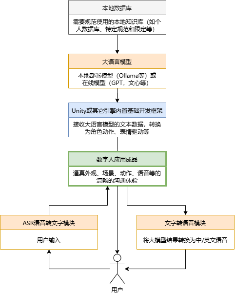
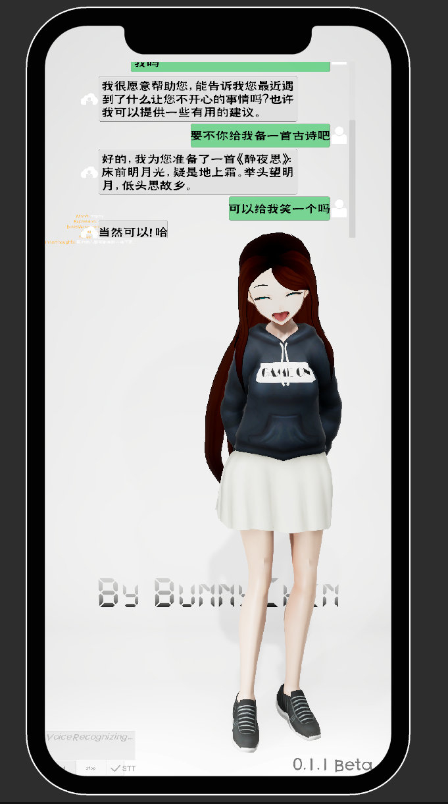

!!! Abstract
    本章节将以Unity和C#为主要平台，记录一些数字人、代理和ChatGPT的内容

# MetaHuman

## 章节介绍

其中一个重要的内容是目前正在进行开发和尝试的 **Unity** 数字人项目，该项目期望由下图组成，并计划逐个实现。

## 项目进度

!!! Info
    Unity项目文件在(暂不对外开放)：[Lizhenghe-Chen/Unity-GPT-Test](https://github.com/Lizhenghe-Chen/Unity-GPT-Test){ .md-button }
    本章节部分文档尚未以对外的形式撰写，可能会省略一些步骤

可运行平台（未测试则留空）：

| Android | iOS | Windows | macOS | linux | HarmonyOS | WebGL |
| :-----: | --- | :-----: | :---: | :---: | :-------: | :---: |
|   ✅   |     |   ✅   |      |  ✅  |          |  🚫  |

AI+游戏恐怕在所难免，虽然现在没有成熟的技术和解决方案来时间GPT和游戏的深度融合，但是探索的脚步无法阻挡，所以尝试用相对简单的方式实现Unity+GPT的一些功能：

* [X] 实现ChatGPT以及本地大模型的文字对话
* [X] 实现GPT本地知识库接入（目前无法多端同时接入使用）
* [X] 实现私有化的本地化语音转文字输入（STT）
* [X] 实现第三方语音转文字输入（STT）【目前使用木子李[^muzili]爬虫形式的版本】
* [ ] 实现私有化的本地化文字转语音输出（TTS）
* [X] 实现第三方文字转语音输出（TTS）
* [X] GPT驱动数字人表情
* [X] GPT以及程序化驱动数字人动画
* [X] 驱动数字人唇动
* [X] 实现GPT控制Unity内场景物体
* [X] 实现通用渲染管线URP的数字人角色运行
* [ ] 实现高清渲染管线HDRP的数字人角色运行
* [ ] 。。。

## 数字人项目主要构成部分

1. Unity引擎使用主流的游戏引擎作为载体
2. GPT本地大语言模型，目前使用Ollama使得像ChatGPT那样的语言模型可以在自己的电脑或者服务器上运行
3. 基于GPT大模型的本地化数据库（知识库），目前尝试了AnythingLLM使得GPT能够高度自定义其知识内容和回答方式，但响应速度较慢
4. 用户语音转文字STT本地化部署的大模型使得语音识别可以在自己的电脑或者服务器上运行，目前使用ASR模型
5. 数字人文字转语音TTS
   本地化部署的大模型使得数字人处理的输出文本可以转换为语音输出，本地化部署使得语音识别可以在自己的电脑或者服务器上运行

[^muzili]: [LKZMuZiLi/human: Unity 实时3d数据人](https://github.com/LKZMuZiLi/human)
