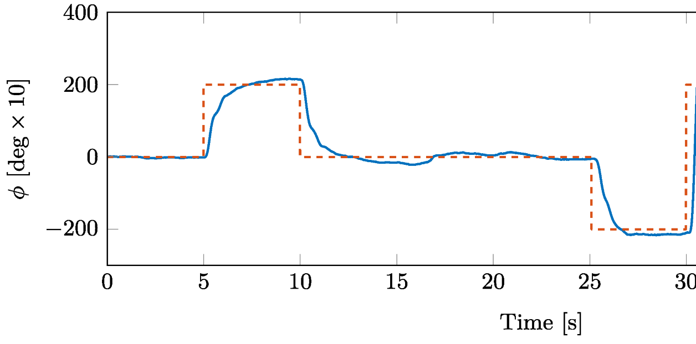
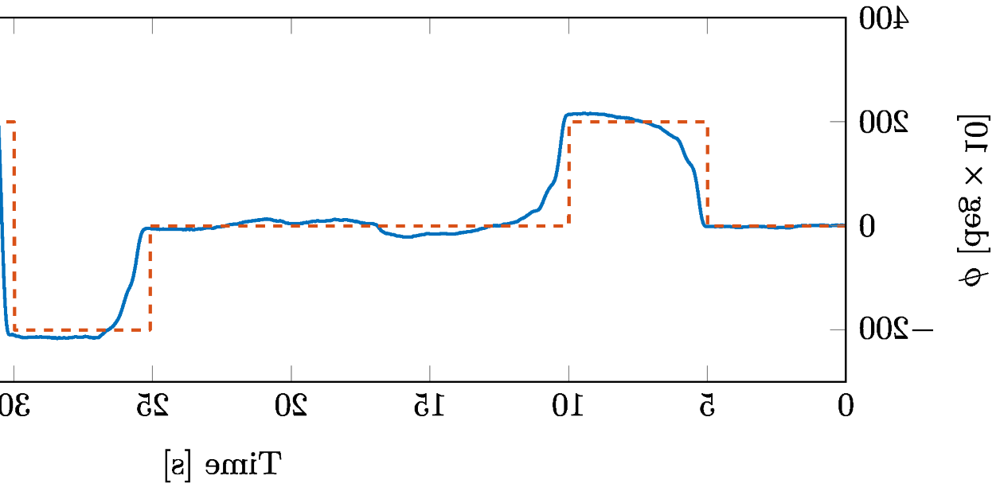
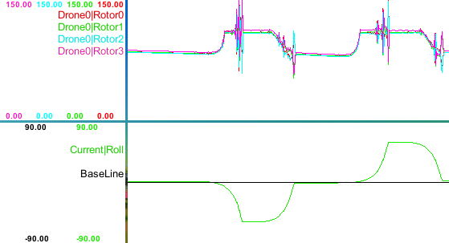
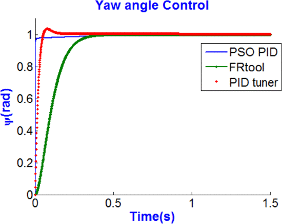
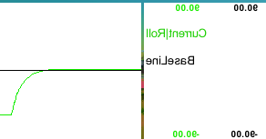
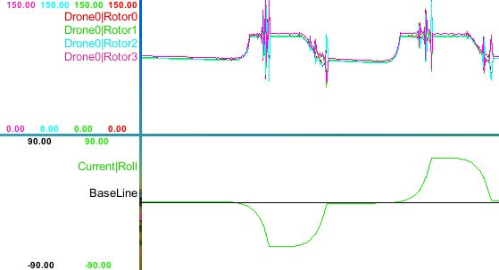
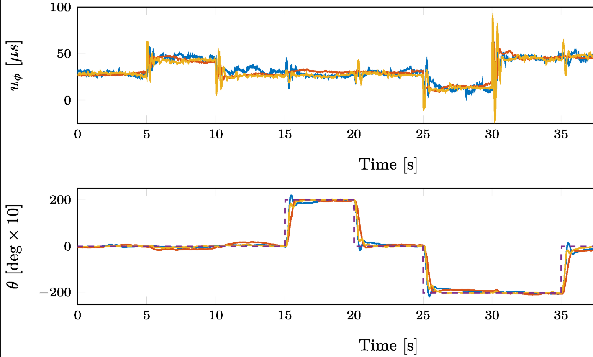
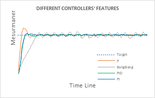

## 四旋翼相关物理公式

### 升力

#### **简单模型**

在四旋翼无人机中，每个旋翼的升力可以表示为：

$$
F_i = C_T \cdot \omega_i^2
$$

- \( F_i \) 是第 \( i \) 个旋翼产生的升力
- \( C_T \) 是升力系数，可以通过下面更严谨的公式代替
- \( \omega_i \) 是第 \( i \) 个旋翼的角速度

#### **更严谨的公式**

- 更严谨的升力公式考虑了空气密度和旋翼面积：
  网页标题为“**The Lift Equation**”，主要介绍了升力方程及其相关变量。以下是网页内容的总结和升力方程的详细解释：

  - 升力方程
    升力 \( L \) 可以通过以下公式计算[^5]：

    $$
    L = C_l \times A \times 0.5 \times \rho \times V^2
    $$

    变量解释

    - **\( L \)**：升力（单位：牛顿，N）
    - **\( C_l \)**：升力系数（无量纲），\( C_T => C_l \times A \times 0.5 \times \rho \)（单位：无量纲）
    - **\( A \)**：机翼面积（单位：平方米，m²）
    - **\( \rho \)**：空气密度（单位：千克每立方米，kg/m³）
    - **\( V \)**：速度（单位：米每秒，m/s）

    公式解释

    - **升力系数 \( C_l \)**：这是一个无量纲系数，用于表示机翼或物体的形状、倾斜角度（攻角）、空气的粘性和可压缩性等因素对升力的    影响。在简单情况下，\( C_l \) 可以通过数学方法计算，但在大多数情况下，**需要通过实验确定**。
    - **空气密度 \( \rho \)**：表示空气的密度，和海拔、温度、湿度等有关，往往多变且复杂。
    - **速度 \( V \)**：表示物体相对于空气的速度，单位是米每秒（m/s），和\( \omega \) 正相关，所以也可以使用\( \omega \)，即角速度。
    - **机翼面积 \( A \)**：表示机翼或物体的迎风面积，单位是平方米（m²）。
    - **动态压力**：公式中的 \( 0.5 \times \rho \times V^2 \) 部分称为动态压力，它在伯努利方程中也出现。

#### **四旋翼总升力**

  对于一个四旋翼无人机，总升力 \( L_{\text{total}} \) 是所有旋翼产生的升力之和，\( C_T \) 可以将那些复杂且难以确定的变量统一在一起取近似：

$$
L_{\text{total}} = F_1 + F_2 + F_3 + F_4 = C_T \cdot (\omega_1^2 + \omega_2^2 + \omega_3^2 + \omega_4^2)
$$

### 空气密度

虽然我们不能够获得准确的\( C_l \)，但我们至少还可以通过空气密度\( \rho \)来近似得到升力的线形关系。
**空气密度的公式为[^6]：**

$$
\rho = \frac{p}{1718 \times (T + 459.7)}
$$

其中：

- \( \rho \) 表示空气密度，单位为 slugs/ft³（斯拉格每立方英尺）。
- \( p \) 表示空气压力，单位为 psf（磅每平方英尺）。
- \( T \) 表示空气温度，单位为华氏度（°F）。

值得一提的是，在不同的大气层高度区间下，温度和压力的变化规律是不同的。所以我们可以抽象出3个主要的区间：

- 对流层（Troposphere）：从地面到 36,152 英尺。（约 11,000 米）
- 下平流层（Lower Stratosphere）：从 36,152 英尺到 82,345 英尺（约 11,000 米到 25,000 米）。
- 上平流层（Upper Stratosphere）：从 82,345 英尺以上。（约 25,000 米以上）。

旋翼机基本上就在对流层以下飞行了，所以我们只用考虑这个区间即可，\(h\) 为高度：

- **温度公式**：\( T = 59 - 0.00356 \times h \)
- **压力公式**：\( p = 2116 \times \left( \frac{T + 459.7}{518.6} \right)^{5.256} \)

因此，我们可以得到在对流层高度，即10,000米以下，空气密度和高度的关系为：

将 \( T \) 的表达式代入 \( p \) 的表达式中，得到：

$$
p = 2116 \times \left( \frac{(59 - 0.00356h) + 459.7}{518.6} \right)^{5.256}
$$

简化括号内的表达式：

$$
p = 2116 \times \left( \frac{518.7 - 0.00356h}{518.6} \right)^{5.256}
$$

现在，将 \( p \) 和 \( T \) 的表达式代入空气密度公式：

$$
\rho = \frac{2116 \times \left( \frac{518.7 - 0.00356h}{518.6} \right)^{5.256}}{1718 \times (59 - 0.00356h + 459.7)}
$$

简化分母，可以得到：

$$
\boxed{\rho = \frac{2116 \times \left( \frac{518.7 - 0.00356h}{518.6} \right)^{5.256}}{1718 \times (518.7 - 0.00356h)}}
$$

!!! success
    **因此，随着高度 h 的增加，分子和分母都会减小。但是，由于分子中的指数函数的减小速度比分母中的线性函数的减小速度快，所以空气密度 ρ 会随着 h 的增加而减小。**

### 空气阻力

空气阻力同样是一个非常复杂的参数，其中的阻力系数 \(C_d\) 比升力系数 \(C_l\) 更难以确定。所以我们同样也只能讲那些复杂的因素统一在一个近似的阻力系数 \(C_d\) 中，从而得到一个近似的线性关系[^7]：

$$
D = C_d \times A \times 0.5 \times \rho \times V^2
$$

其中：

- \(D\) 是阻力（Drag）。
- \(C_d\) 是阻力系数（Drag Coefficient）。
- \(A\) 是参考面积（Reference Area）。
- \(\rho\) 是空气密度（Air Density）。
- \(V\) 是速度（Velocity）。

这个公式表明，阻力与阻力系数、参考面积、空气密度和速度的平方成正比。这也就不难看出，速度越大，阻力就越大，同时高度越高，空气密度越小，阻力也会减小。

## BunnyChen Unity 无人机模拟的验证部份

### Roll

The roll control conforms to the response curve of a real drone. Since the timeline recorded in the experiment starts from the right side, it only needs to be reversed:

| Real-world drone roll attitude response curve                      | Real-world drone roll attitude response curve (reversed)       | Unity drone roll attitude response curve                           |
| ------------------------------------------------------------------ | -------------------------------------------------------------- | ------------------------------------------------------------------ |
| [^1] |  | [^2] |

| Real-world drone yaw attitude response curve                       | Unity drone roll attitude response curve (reversed)            | Unity drone roll attitude response curve                       |
| ------------------------------------------------------------------ | -------------------------------------------------------------- | -------------------------------------------------------------- |
| [^3] |  |  |

### Power

| Relationship between battery power and response                    | Relationship between motor power and response in Unity         |
| ------------------------------------------------------------------ | -------------------------------------------------------------- |
| [^4] |  |

### Altitude

[^1]: [Model-Based Optimization Approach for PID Control of Pitch–Roll UAV Orientation](https://www.mdpi.com/2227-7390/11/15/3390#)
    
[^2]: [BunnyChenFramework]()
    
[^3]: [AR.Drone UAV control parameters tuning based on particle swarm optimization algorithm | IEEE Conference Publication | IEEE Xplore](https://ieeexplore.ieee.org/abstract/document/7501380)
    
[^4]: [Model-Based Optimization Approach for PID Control of Pitch–Roll UAV Orientation](https://www.mdpi.com/2227-7390/11/15/3390)
    
[^5]: [The Lift Equation](https://www.grc.nasa.gov/www/k-12/VirtualAero/BottleRocket/airplane/lifteq.html)
    
[^6]: [Earth Atmosphere Model - English Units](https://www.grc.nasa.gov/www/k-12/VirtualAero/BottleRocket/airplane/atmos.html)
    
[^7]: [The Drag Equation](https://www.grc.nasa.gov/www/k-12/VirtualAero/BottleRocket/airplane/drageq.html)
