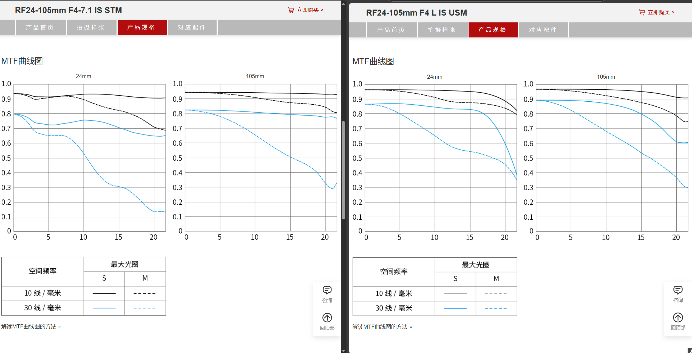
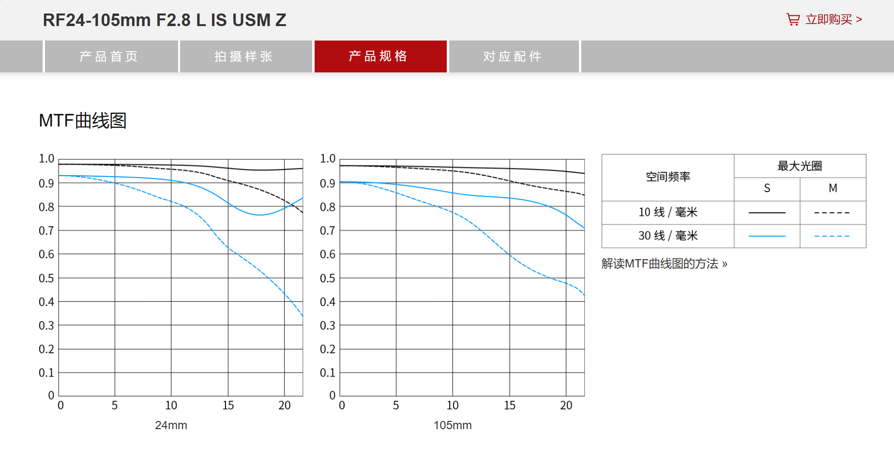
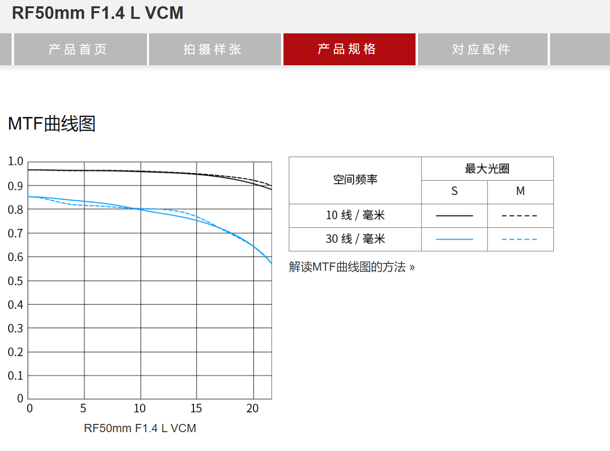
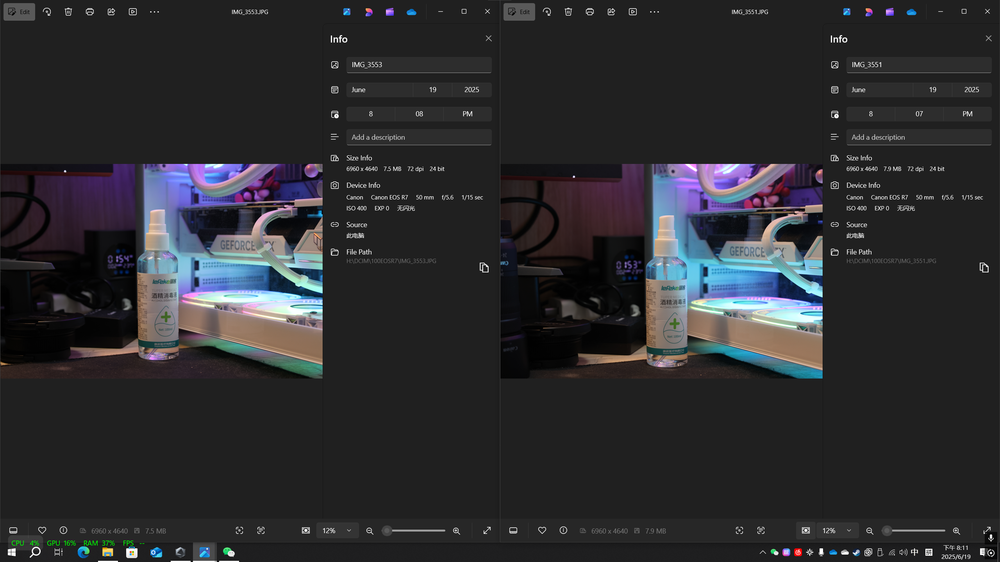
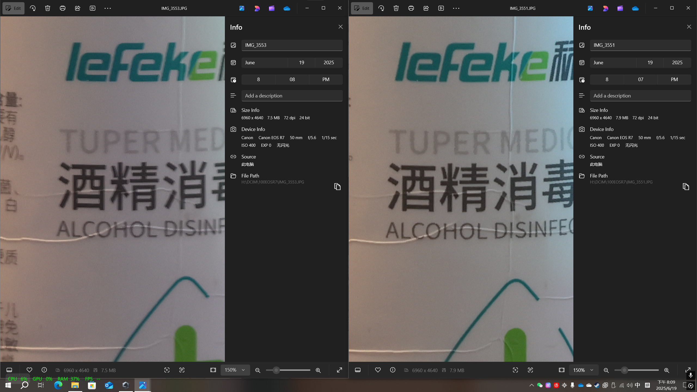
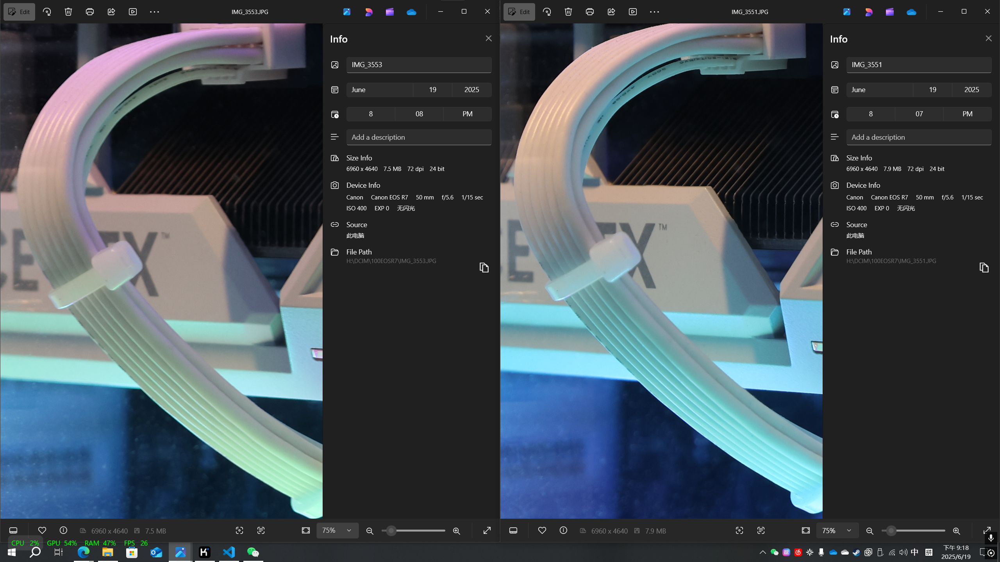
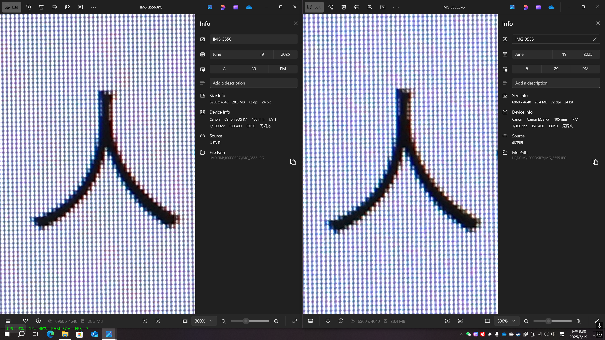

# 佳能 银圈RF24-105mm F4-7.1 IS STM 和 红圈RF24-105mm F4 L IS USM 对比

## 前言

> 一直以来，佳能的红圈镜头都被认为是高端专业镜头，而银圈镜头则是入门级或中端镜头。就如同索尼的G镜头和GM镜头一样，红圈镜头通常具有更好的光学性能、更高的制造质量和更强的耐用性。

最近在考虑入将手头的银圈RF24-105mm F4-7.1 IS STM镜头升级到红圈RF24-105mm F4 L IS USM镜头，但是在网上找不到太多具体的且系统的关于这两款镜头的对比信息（很奇怪）。红圈镜头的价格远高于银圈镜头，是否有升级的必要是非常需要数据或者实际使用来决定的，所以我决定自己做一个对比测评。

## 对比测评

### 手感和重量

首先到手红圈的RF24-105mm镜头就明显比银圈的RF24-105mm镜头重很多，红圈的重量为700克，而银圈的重量为395克。这个感觉还是让人有些不习惯的，所以银圈镜头此时在轻便性上有明显优势。当然，红圈的手感是那种非常扎实的，又粗又硬的沉甸甸的感觉，不过再加上一个机身，抬起来就有些吃力了。

### 机身功能

红圈镜头的机身上有对焦环、功能环，但银圈镜头只有功能环，其它基本保持一致。不过还有一个锁定按钮，可以锁定变焦环，防止在携带过程中意外变焦，这个功能还是比较实用的。

### 光学性能

光学性能无疑是两款镜头对比的重点。红圈镜头上采用了更多的光学玻璃和更先进的光学设计，理论上具有更好的成像质量、更低的畸变和色差。
一下是一些明显的差异：

- **光圈**：红圈镜头的最大光圈为恒定的F4，而银圈镜头的最大光圈为F4-7.1，这意味着在低光环境下，红圈镜头能够捕捉更多的光线，从而获得更好的曝光和更浅的景深。
- **最近对焦距离**：红圈镜头的最近对焦距离为0.45米，而银圈镜头的最近对焦距离为0.13米，这意味着银圈镜头在微距拍摄和场地空间狭窄时更有优势。当然这一点如今可以使用手机解决，毕竟手机在极度便携的情况下，在广角和微距上已经足够优秀了。
- **直径和长度**：红圈镜头的直径为83毫米，长度为107毫米，而银圈镜头的直径为76毫米，长度为88毫米，这意味着红圈镜头在体积上要大上不少。
- **滤镜尺寸**：红圈镜头的滤镜尺寸为77毫米，而银圈镜头的滤镜尺寸为67毫米，这意味着红圈镜头需要更大直径的滤镜，成本也会更高。
- 

### 成像质量（MTF）

这一点是最重要的，毕竟镜头的主要作用就是成像。以下是两款镜头在不同焦段下的成像质量对比：
首先我们通过科学的图像对比来看看两款镜头在不同焦段下的成像质量差异，标准是参考MTF（Modulation Transfer Function）曲线。

??? 什么是MTF曲线
    MTF曲线是用来描述镜头成像质量的一个重要指标，它表示了镜头在不同空间频率下的对比度传递能力。

    1.**曲线高度越高越好**：MTF值越接近1，表示镜头的成像质量越好。整体曲线越高，说明镜头在不同空间频率下的对比度和分辨率表现更好。
    2. **曲线越平直越好**：MTF曲线越平直，说明镜头中心和边缘的成像一致性越高，边缘画质下降越少。
    3. **子午曲线（M）与弧矢曲线（S）越接近越好**：两者距离越小，说明镜头的像散越小，成像越均匀。
    4. **特定频率下的MTF值越高越好**：低频（如10lp/mm）反映对比度，高频（如30lp/mm）反映分辨率。低频MTF值高，表示对比度好；高频MTF值高，表示分辨率高。
    5. **MTF曲线下的面积越大越好**：MTF曲线下的面积越大，表示镜头传输的信息量越多，成像越清晰。
    [光学基础知识：摄影镜头调制传输函数MTF解读](https://production.xitek.com/glossary-a-detail-id-76.html)，[如何评价镜头的好坏？光学镜头的一种评价标准_测摄像头mtf典型值为多少-CSDN博客](https://blog.csdn net/m0_68553508/article/details/145478106?fromshare=blogdetail&sharetype=blogdetail&sharerId=145478106&sharerefer=PC&sharesource=weixin_46146935&sharefrom=from_link)

这样一来，附上佳能官方的曲线图（[RF24-105mm F4 L IS USM](https://www.canon.com.cn/product/rf24105f4lis/spec.html#hover)，[RF24-105mm F4-7.1 IS STM](https://www.canon.com.cn/product/rf24105f471isstm/spec.html#hover)），就不难看出，红圈镜头在各个焦段下的成像质量都优于银圈镜头，虽然没有达到非常明显的差距。此外，在105mm焦段下，二者的差距好像还不相上下了。

/// caption
MTF曲线对比
///

为了增加对比，可以再拿一个更贵更高级的[RF24-105mm F2.8 L IS USM Z](https://www.canon.com.cn/product/rf24105f28lusmz/spec.html#hover)镜头做对比：

以及一个定焦红圈[RF镜头-RF50mm F1.4 L VCM](https://www.canon.com.cn/product/rf50f14lvcm/spec.html#hover) ：

### 成像质量（照片）

使用佳能R7手动挡相同参数拍摄。通过下面几幅图，可以看出，清晰度上，红圈镜头（右）的表现明显优于银圈镜头（左），尤其是在边缘部分。银圈镜头在中心部分的表现还可以，但边缘部分的清晰度和色彩还原明显不如红圈镜头。

/// caption
50mm焦段正常观察
///

/// caption
50mm焦段中心放大，右侧明显更清晰
///

/// caption
50mm焦段边缘放大，右侧明显更清晰
///

/// caption
105mm焦段放大，二者几乎没有差距
///

### 价格

红圈镜头的价格大约为银圈镜头的3倍多。2025年6月，红圈镜头国内行货为8000元左右，而银圈镜头的国内行货价格为2500元左右。

### 总结

- **红圈镜头**：成像质量更好，对焦快且安静，防抖效果强，适合专业拍摄和对画质要求高的用户，但价格高、重量大。
- **银圈镜头**：轻便、价格亲民，近距离拍摄能力强，适合日常拍摄和预算有限的用户。
- **是否升级**：如果你追求极致画质和专业性能，且预算充足，建议升级红圈镜头；如果你更看重便携性和性价比，银圈镜头已经足够满足大部分需求。
