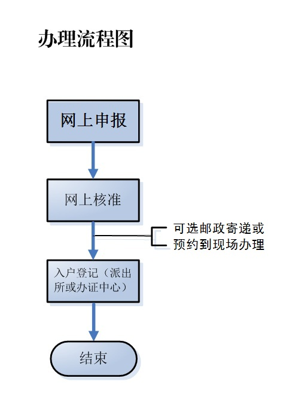

# 广州落户 应届生落户攻略笔记

参考文章：

* [应届毕业生如何落户广州？攻略来了！](https://mp.weixin.qq.com/s/tHMrzOKVE8LL3l5Y5B6ZYA)
* [2025年学历入户广州超详细流程](https://mp.weixin.qq.com/s/wLHQfGHLBkYbY5zI4xhawA)

人才引进补贴：

[南沙“国际化人才特区九条2.0”升级来袭](https://mp.weixin.qq.com/s/JJqErcOYdMyFkYBYb7foIA)

## 线下办理：

暂不知道（[应届毕业生如何落户广州？攻略来了！](https://mp.weixin.qq.com/s/tHMrzOKVE8LL3l5Y5B6ZYA)）

## 线上办理：

### 线上申报

#### 方法1

根据网站申请

通道：[智慧人才家园](https://gzrsj.rsj.gz.gov.cn/vsgzhr/login_home.aspx)（[2025年学历入户广州超详细流程](https://mp.weixin.qq.com/s/wLHQfGHLBkYbY5zI4xhawA)）

#### 方法2

根据微信小程序办理

通道：[站内检索 - 广州市公安局网站](https://search.gd.gov.cn/search/bsxx/200021?keywords=%E8%90%BD%E6%88%B7)

街道集体户落户承诺书地址查询：

[2024广州各区公共集体户情况汇总（地址+电话）- 广州本地宝](https://gz.bendibao.com/z/hukou/201832/238745.shtml)；

[入户广州街道公共集体户汇总（地址+电话） - 知乎](https://zhuanlan.zhihu.com/p/366435978)

### 入户登记

1. 线上申报后网上核准的结果证明复印件
2. 准备好户口本原件
3. 身份证原件
4. 房产证明（没房产的也需要开具无房产证明）复印件
