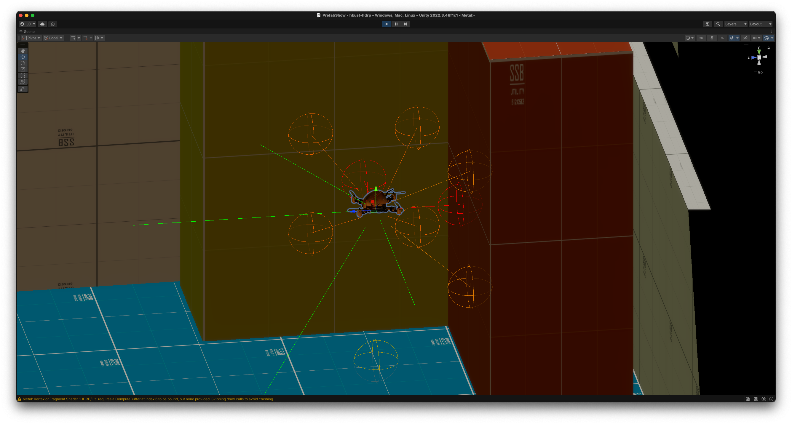
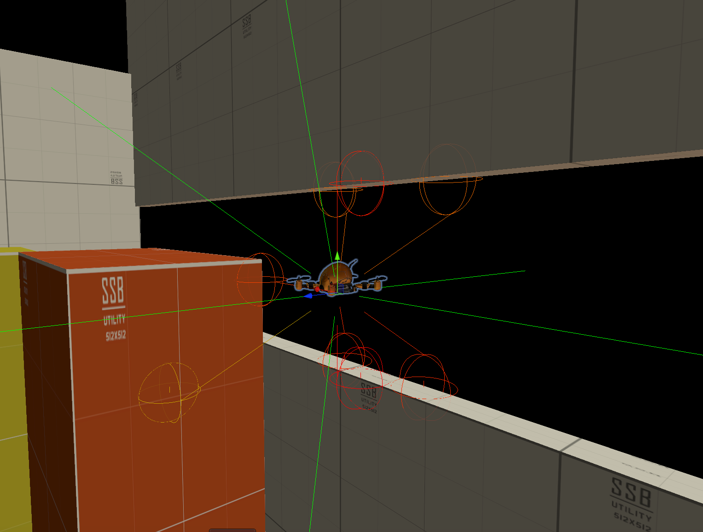

# Unity 激光雷达的简单模拟

## 简介

在游戏开发和虚拟现实应用中，雷达系统常常被用于检测和追踪目标物体。通过模拟雷达的工作原理，我们可以为角色或车辆添加环境感知能力，增强交互性和沉浸感。本文将介绍如何在 Unity 中实现一个简单的雷达模拟系统，并重点探讨为什么选择 `SphereCast` 而非单纯的 `Raycast` 来实现这一功能。



## 一、雷达模拟的思路

雷达的基本原理是发射信号并接收反射信号，通过计算信号往返的时间来确定目标物体的距离。在 Unity 中，我们可以通过射线检测（`Raycast`）或球体检测（`SphereCast`）来模拟这一过程。虽然 `Raycast` 是一种常用的检测方法，但 `SphereCast` 在某些场景下具有独特的优势。

### （一）`Raycast` 的局限性

`Raycast` 是一种直线检测方法，它从一个点向指定方向发射一条射线，检测射线路径上的第一个碰撞物体。虽然 `Raycast` 的计算效率很高，但它存在一些局限性：

1. **检测范围有限** ：`Raycast` 只能检测到射线路径上的物体，对于体积较小或形状不规则的物体，可能会出现检测不到的情况。
2. **容易被遮挡** ：如果射线路径上有多个物体，`Raycast` 只能检测到最近的一个物体，无法检测到被遮挡的物体。
3. **缺乏容错性** ：在复杂的场景中，物体可能会因为微小的位移或旋转而突然进入或离开射线路径，导致检测结果不稳定。

### （二）`SphereCast` 的优势

`SphereCast` 一种基于球体的检测方法，它从一个点向指定方向发射一个球体，检测球体路径上的所有碰撞物体。

> 换句话说，就是 `RayCast`能够直接穿过围栏或者有空隙的地方，但是 `SphereCast` 依然能够碰到，就像皮球无法会撞上栏杆而不是从栏杆的缝隙中穿过一样，这样便可以简单抽象雷达的本质功能了。

与 `Raycast` 相比，`SphereCast` 具有以下优势：

1. **更宽的检测范围** ：`SphereCast` 的检测范围是一个球体，能够检测到路径上一定范围内的所有物体，而不是仅仅局限于一条直线。这使得雷达系统能够更全面地感知周围环境。
2. **更强的容错性** ：由于检测范围是一个球体，即使物体发生微小的位移或旋转，也更有可能被检测到。这使得雷达系统在复杂的场景中更加稳定。
3. **更符合物理直觉** ：在现实世界中，雷达信号的传播并非完全直线，而是有一定的扩散范围。`SphereCast` 更接近真实雷达的工作原理，能够更好地模拟雷达的检测效果。

### （三）代码展示

```csharp
using System;
using UnityEngine;

/// <summary>
/// Copyright (c) [2025] [Lizhenghe.Chen https://github.com/Lizhenghe-Chen]
/// </summary>
public class LidarScanner : MonoBehaviour
{
    public float range = 10f; // 最大射线长度
    public float emitOffset = 1f; // 发射射线的偏移量
    public float sphereRadius = 1f; // SphereCast 的半径
    public float dangerDistance = 5f; // 危险距离
    public Color safeColor = Color.green; // 安全颜色
    public Color dangerColor = Color.red; // 危险颜色
    public LidarData lidarData;

    [Serializable]
    public struct LidarData
    {
        public float xPositive;
        public float xNegative;
        public float yPositive;
        public float yNegative;
        public float zPositive;
        public float zNegative;
        public float firstQuadrant;
        public float secondQuadrant;
        public float thirdQuadrant;
        public float fourthQuadrant;
        public float fifthQuadrant;
        public float sixthQuadrant;
        public float seventhQuadrant;
        public float eighthQuadrant;
    }

    private readonly HitData[] _hitData = new HitData[14];

    [Serializable]
    // 用于保存所有射线的命中数据
    private struct HitData
    {
        public readonly Vector3 Point;
        public readonly Color Color;

        public HitData(Vector3 point, Color color)
        {
            Point = point;
            Color = color;
        }
    }

    private void Update()
    {
        // 6个主要方向 (X, Y, Z)
        lidarData.xPositive = CastSphere(Vector3.right, 0); // +X
        lidarData.xNegative = CastSphere(Vector3.left, 1); // -X
        lidarData.yPositive = CastSphere(Vector3.up, 2); // +Y
        lidarData.yNegative = CastSphere(Vector3.down, 3); // -Y
        lidarData.zPositive = CastSphere(Vector3.forward, 4); // +Z
        lidarData.zNegative = CastSphere(Vector3.back, 5); // -Z

        // 8个象限方向
        lidarData.firstQuadrant = CastSphere(new Vector3(1, 1, 1).normalized, 6);
        lidarData.secondQuadrant = CastSphere(new Vector3(1, 1, -1).normalized, 7);
        lidarData.thirdQuadrant = CastSphere(new Vector3(1, -1, 1).normalized, 8);
        lidarData.fourthQuadrant = CastSphere(new Vector3(1, -1, -1).normalized, 9);
        lidarData.fifthQuadrant = CastSphere(new Vector3(-1, 1, 1).normalized, 10);
        lidarData.sixthQuadrant = CastSphere(new Vector3(-1, 1, -1).normalized, 11);
        lidarData.seventhQuadrant = CastSphere(new Vector3(-1, -1, 1).normalized, 12);
        lidarData.eighthQuadrant = CastSphere(new Vector3(-1, -1, -1).normalized, 13);
    }

    // 使用 SphereCast 进行检测
    private float CastSphere(Vector3 direction, int index)
    {
        var ray = new Ray(transform.position + direction * emitOffset, direction);

        if (Physics.SphereCast(ray, sphereRadius, out var hit, range))
        {
            var distance = hit.distance;
            var t = Mathf.InverseLerp(dangerDistance, range, distance);
            var currentColor = Color.Lerp(dangerColor, safeColor, t);

            // // 在 Scene 视图中绘制射线和命中点
            // Debug.DrawLine(ray.origin, hit.point, currentColor);
            Debug.DrawLine(ray.origin, ray.origin + direction * distance, currentColor);
            Debug.DrawRay(hit.point, Vector3.up * 0.2f, currentColor);

            // 保存命中数据
            _hitData[index] = new HitData(hit.point, currentColor);

            return distance;
        }

        // 没有命中时，清空命中数据
        _hitData[index] = new HitData(Vector3.zero, Color.clear);
        Debug.DrawRay(ray.origin, direction * range, safeColor);
        return range;
    }

    // 在 Scene 视图中绘制所有球体
    private void OnDrawGizmos()
    {
        for (var i = 0; i < _hitData.Length; i++)
        {
            if (_hitData[i].Point != Vector3.zero)
            {
                Gizmos.color = _hitData[i].Color;
                Gizmos.DrawWireSphere(_hitData[i].Point, sphereRadius);
            }
        }
    }
}
```

下图不难看出，当射线没有打在物体上时，球形检测变起到了作用：


