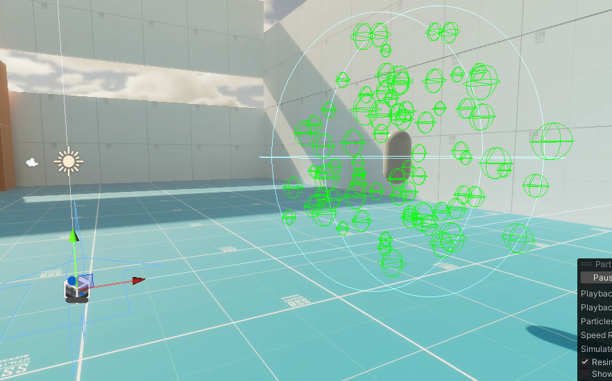
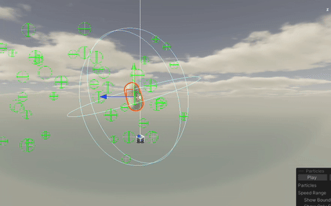

# Unity 零代码简单风力模拟

> 使用Unity内置的功能，根据风场设定来实现近似风力的物理效果

这里我们只需要两个核心组件：

* [粒子系统 (Particle System) - Unity 手册](https://docs.unity.cn/cn/2023.2/Manual/class-ParticleSystem.html)
  [风区（Wind Zones） - Unity 手册](https://docs.unity.cn/cn/2023.2/Manual/class-WindZone.html)
* [粒子系统力场 (Particle System Force Field) - Unity 手册](https://docs.unity.cn/cn/2023.2/Manual/class-ParticleSystemForceField.html) （额外）

设置粒子系统为一个球形的发射形状，确保粒子能够360度地在目标物体的各个方向上生成，接着打开粒子的碰撞功能；

1. 创建一个全局风场或多个局部风场（粒子系统力场同理），并设置其Layer，接着设置粒子系统中的“External Foces"为其对应，这样粒子的行为就可以被风场很好的控制了。
2. 接着锁定粒子系统组件跟随（或者为子物体）目标物体，即可实现持续且有脉冲和随机性的粒子碰撞和力的施加，从而模拟出近似风力的效果.
3. 为目标物体添加刚体组件（RigidBody）并适当设置其阻力和其它参数，（需将碰撞检测性能提高为Continuous Dynamic）

