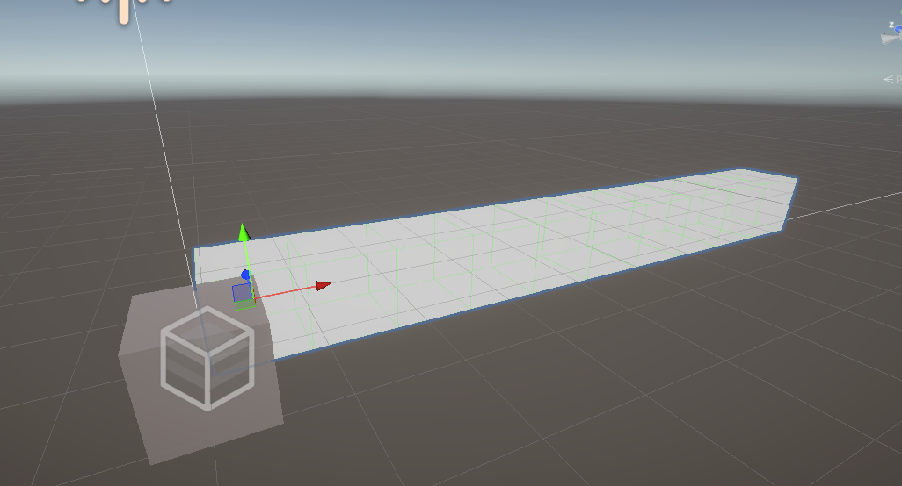
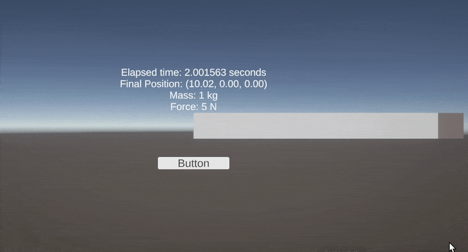

# Unity中的物理单位是真实的吗？

## 前言

为了更好的在Unity中进行更科学的物理模拟，就有必要探究一下Unity的物理单位是否和现实中的单位一致，是否符合牛顿力学。

我们已经知道，并且Unity官方也说了，在Transform中，单位为1的方块就是，1m的长宽高

> 那么我们需要确定，Unity中 `Rigidbody.AddForce`方法的力单位是否也是牛顿？Rigidbody的质量单位是否也是千克？

我们可以用一个非常简单的牛顿第二定律来验证。

## 验证

假设：

1. 10个方块的距离就是10米，即Unity中，Transform的scale 的单位1就是1m，当然特指的是默认的Cube的长宽高；
2. `Rigidbody.AddForce`方法施加的力的单位是牛顿（N）；
3. 没有任何形式的摩擦力（在Unity中把Rigibody中的阻力全设置为0）；
4. 单位为1的Rigibody 的 mass 就是1kg；

*现在，我们希望物体在 **恒定力** 的 **加速度运动** 中沿着 **直线运行整整2秒** 后走过 **10米** 的距离，需要多少的力才可以呢？*

我们使用运动学公式来计算需要的加速度。已知物体从静止开始运动，初速度 \( v_0 = 0 \)，位移 \( s = 10 \, \text{m} \)，时间 \( t = 2 \, \text{s} \)。代入公式：

$$
s = v_0 t + \frac{1}{2} a t^2
$$

   得：

$$
10 = 0 \cdot 2 + \frac{1}{2} a \cdot 2^2 \implies 10 = 2a \implies a = 5 \, \text{m/s}^2
$$

然后，我们根据牛顿第二定律计算需要的力。已知质量 \( m = 1 \, \text{kg} \) 和加速度 \( a = 5 \, \text{m/s}^2 \)，代入公式：

$$
F = ma
$$

   得：

$$
F = 1 \cdot 5 \implies F = 5 \, \text{N}
$$

结论：

$$
\boxed{5 \, \text{N}}
$$

因此，**我们需要在Unity中使用 `Rigidbody.AddForce` 方法施加 5牛顿 的力，才能观察使一个质量为1千克的物体是否能在2秒内沿直线运动10米。**

为了获得最准确的模拟效果，我们需要在Unity中设置[时间 (Time) - Unity 手册](https://docs.unity.cn/cn/2020.3/Manual/class-TimeManager.html) `Fixed Timestep` 为最小值0.0001，从而获得最细微的物理更新频率，并用10个方块来显示10m的距离



现在让方块沿着x轴匀加速运动，确保满足：`m=1, F=5`然后观察物体运动时间即可：

```csharp
using UnityEngine;
using UnityEngine.UI;

public class MassTest : MonoBehaviour
{
    public Rigidbody rb;
    public Button reset;
    public TMPro.TextMeshProUGUI debugText; // Text component to display debug information
    public float mass = 1f; // Adjustable mass of the Rigidbody
    public float force = 10f; // Adjustable force applied to the Rigidbody
    public float endDistance = 10f; // Target distance to stop the Rigidbody

    private bool _isStarted = false;
    private float _startTime;

    private void Awake()
    {
        // Check if Rigidbody is assigned
        if (rb == null)
        {
            Debug.LogError("Rigidbody component is missing on the GameObject.");
            debugText.text = "Error: Rigidbody component is missing.";
            return;
        }

        rb.mass = mass; // Set the mass of the Rigidbody

        // Add listener to the reset button
        reset.onClick.AddListener(() =>
        {
            _isStarted = true;
            _startTime = Time.time; // Record the start time
            rb.velocity = Vector3.zero; // Reset velocity
            rb.position = Vector3.zero; // Reset position
        });
    }

    private void OnValidate()
    {
        // Update Rigidbody mass in the editor
        if (rb != null)
        {
            rb.mass = mass;
        }
    }

    private void Update()
    {
        // Check if the Rigidbody has reached the target distance
        if (_isStarted && rb.position.x >= endDistance)
        {
            _isStarted = false;
            rb.velocity = Vector3.zero; // Stop the Rigidbody
            var elapsedTime = Time.time - _startTime; // Calculate elapsed time
            Debug.Log($"Elapsed time: {elapsedTime} seconds");
            debugText.text = $"Elapsed time: {elapsedTime} seconds\n" +
                             $"Final Position: {rb.position}\n" +
                             $"Mass: {rb.mass} kg\n" +
                             $"Force: {force} N";
        }
    }

    private void FixedUpdate()
    {
        // Apply force to the Rigidbody while the simulation is running
        if (_isStarted)
        {
            rb.AddForce(Vector3.right * force, ForceMode.Force);
            debugText.text = $"Current Position: {rb.position}\n" +
                             $"Mass: {rb.mass} kg\n" +
                             $"Force: {force} N";
        }
    }
}
```

## 结论

### 最终我们能观察到，物体在几乎2秒内沿直线运动了10米，符合我们的预期。证明Unity中的物理单位（m，kg，N）是符合现物理环境的。


