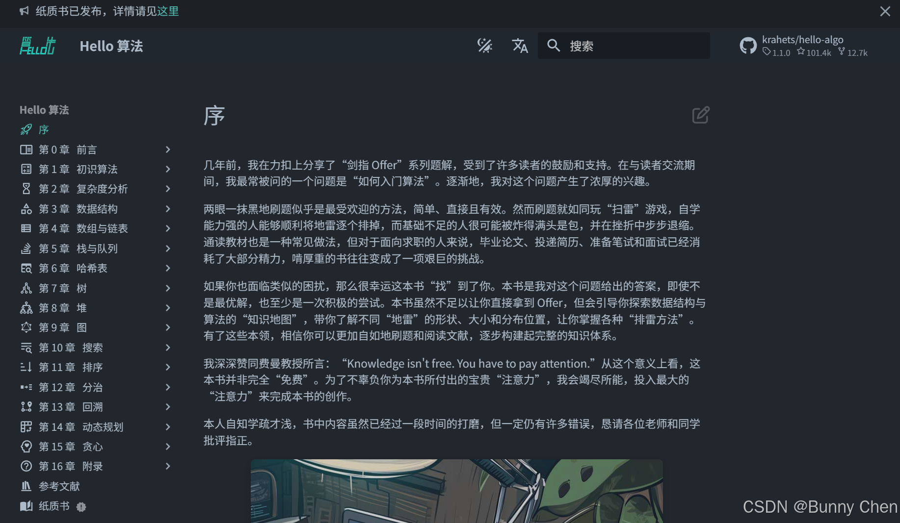
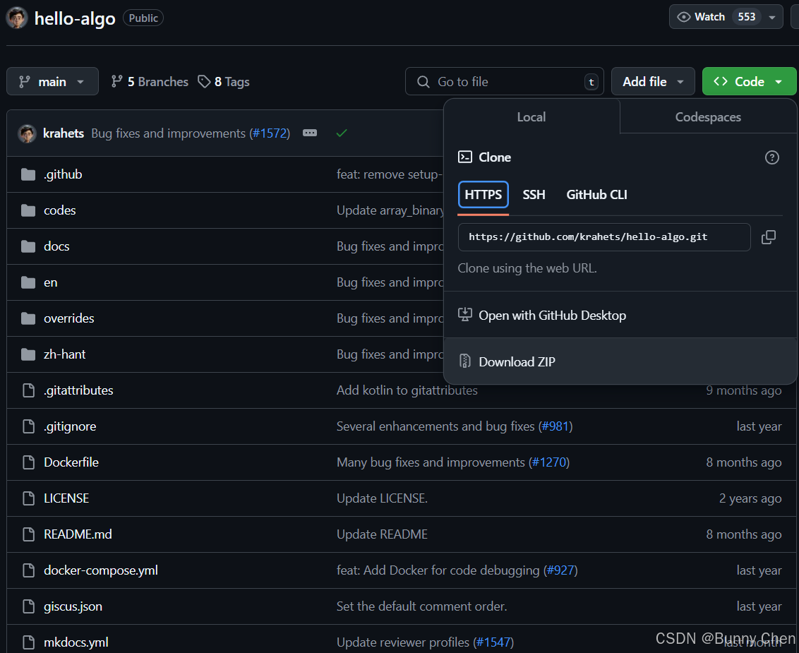
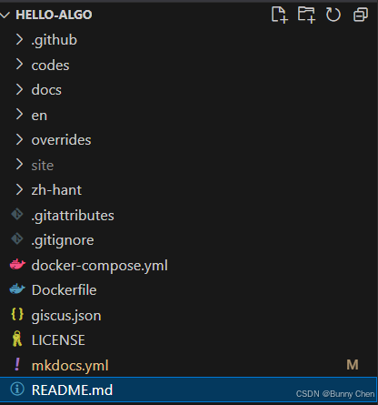

# Hello Algo (Hello 算法) 离线阅读和 MkDocs 网站搭建入门

## 前言

[Hello Algo(Hello 算法）](https://www.hello-algo.com "Hello Algo(Hello 算法）")是一个开源、免费、对新手友好的数据结构与算法入门教程。它通过动画图解和清晰的内容，帮助初学者平滑学习曲线，探索数据结构与算法的知识地图。全书源代码可一键运行，旨在提升编程技能，理解算法工作原理和数据结构的底层实现，同时鼓励读者互助学习，共同进步。本问将重点介绍其网站的搭建方法分析和 MkDocs入门教程。

## 网站的故事

hello算法的学习渠道有很多，其主页也有所介绍，主要通过[网站、](https://www.hello-algo.com/chapter_hello_algo/ "网站、")[pdf文档](https://github.com/krahets/hello-algo/releases "pdf文档")以及[实体书](https://www.hello-algo.com/chapter_paperbook/ "实体书")。其中体验和效果最好的当属其网站，网站界面干净整洁，逻辑和分类清晰，非常美观和舒服，这不紧让我好奇，这样美丽的网站是怎么做得呢？

之前我接触过GithubPage，一些网站会通过Github使用[jekyll](https://jekyllrb.com/ "jekyll")来搭建自己的个人网站，这也是最经典的一种方式，包括[我的个人网站](https://bunnychen.top/about "我的个人网站")也是这样。这种方式简而言之是通过Markdown(.md)文本来程序化自动生成网页的，经常浏览Git项目的伙伴应该不陌生，几乎所有项目都会有README.md文件。Markdown是一种轻量级的标记语言，或者说一种轻量的富文本语言，它允许人们使用易读易写的纯文本格式编写文档，然后转换成结构化的HTML（或者其他格式），常用于编写README文件、文档、博客文章等，充斥在计算机领域的各行各业。

然而，使用[jekyll](https://jekyllrb.com/ "jekyll")搭建网站还是很麻烦，虽然能够在自己的电脑上离线部署测试，而且多样的功能和性拓展性提供了丰富的可自定义选项，但是还是需要安装和配环境，起步时非常麻烦，还是不够轻量和快速，所以我希望能够有更轻量的方法，这几久看到了Hello Algo(Hello 算法），这让我想到还有很多优秀的项目，都会有类似清晰明了的文档网站，结构都很类似，所以一定有个核心来支持他们，所以我决定拿[Hello 算法](https://www.hello-algo.com/chapter_hello_algo/ "Hello 算法")网站学习一下。

## 首次尝试 本地离线阅读

[Hello 算法](https://www.hello-algo.com/ "Hello 算法")网站可能是部署在了Github上，但是由于国内网络环境原因，经常会遇到加载慢或者加载不出来的时候，而使用PDF和纸质书阅读总是那么不方便、不环保，或者说不够优雅和低成本，所以如果能有什么办法让这个优秀的网站在自己电脑上就更好了。

其实实现起来比较简单，有两种方式实现本地浏览，这也为后续搭建自己的文档网站奠定基础。首先无论如何，我们都要先**克隆**这个项目：

[krahets/hello-algo: 《Hello 算法》：动画图解、一键运行的数据结构与算法教程。支持 Python, Java, C++, C, C#, JS, Go, Swift, Rust, Ruby, Kotlin, TS, Dart 代码。简体版和繁体版同步更新，English version ongoinghttps://github.com/krahets/hello-algo](https://github.com/krahets/hello-algo "krahets/hello-algo: 《Hello 算法》：动画图解、一键运行的数据结构与算法教程。支持 Python, Java, C++, C, C#, JS, Go, Swift, Rust, Ruby, Kotlin, TS, Dart 代码。简体版和繁体版同步更新，English version ongoing")当然你要先学习如何将Git项目克隆到自己的电脑上，或者直接下载Zip文件解压也可以：

然后使用[Visual Studio Code](https://code.visualstudio.com/ "Visual Studio Code")打开该文件夹，你也可以使用你熟悉的IDE，但是我选VSCode。

打开后项目文件如下：

### Docker部署运行

以Windows为例，首先你需要下载Docker

### Python直接运行
